<!-- TOC -->
* [Deadline Docker 10.2](#deadline-docker-102)
  * [Automated](#automated)
  * [Manual](#manual)
<!-- TOC -->

---

# Deadline Docker 10.2

```
sudo rm -rf /home/michael/git/repos/deadline-setup/deadline-setup-docker/10.2/DeadlineRepositoryInstall/*
sudo rm -rf /home/michael/git/repos/deadline-setup/deadline-setup-docker/10.2/DeadlineClientInstall/*
```

## Automated

- https://derlin.github.io/docker-compose-viz-mermaid/

```
cd ~/git/repos/deadline-setup/deadline-setup-docker/10.2
java -jar ../docker-compose-viz-mermaid_no_local-1.3.0.jar docker-compose.yaml --volumes --networks --format TEXT --dir TB --out graph.mermaid
```

## Manual

```mermaid
flowchart TB
    subgraph Images 
        img_ubuntu_2004["ubuntu:20.04"]
        img_mongo_express["mongo-express"]
        img_mongodb["mongodb/mongodb-community-server:4.4-ubuntu2004"]
        img_filebrowser["filebrowser/filebrowser"]
        img_repo_base["repo_base"]
        img_repo_installer["repo_installer"]
        img_rcs_installer["rcs_installer"]
        img_rcs_runner["rcs_runner"]
    end
    
    subgraph "Local Volumes" 
        mongo_data_LOCAL["./test_data/opt/Thinkbox/DeadlineDatabase10/mongo/data_LOCAL"]
        nfs["/nfs:ro"]
        filebrowser_db_LOCAL["./filebrowser/filebrowser.db"]
        filebrowser_json_LOCAL["./filebrowser/filebrowser.json"]
        deadline_installer_LOCAL["./deadline_installer"]
        deadline_repository_install_LOCAL["./DeadlineRepositoryInstall"]
        deadline_client_install_RCS_LOCAL["./DeadlineClientInstall"]
        deadline_rcs_runner_ini_LOCAL["./DeadlineRepository/rcs/var/lib/Thinkbox/Deadline10/deadline.ini"]
        deadline_rcs_runner_crt_LOCAL["./DeadlineRepository/rcs/var/lib/Thinkbox/Deadline10/cert/ca-certificates.crt"]
    end
    
    subgraph Services
        subgraph srv_mongodb-10-2
            mongodb-10-2
            subgraph Volumes 
                mongo_data["/opt/Thinkbox/DeadlineDatabase10/mongo/data"]
            end
        end
        subgraph srv_mongo-express 
           mongo-express-10-2
           subgraph Volumes 
               mongo_data_express["/opt/Thinkbox/DeadlineDatabase10/mongo/data"]
           end
        end
        subgraph srv_filebrowser
            mongo-filebrowser-10-2
            subgraph Volumes 
                mongo_data_filebrowser["/opt/Thinkbox/DeadlineDatabase10/mongo/data:ro"]
                filebrowser_db["/filebrowser.db"]
                filebrowser_json["/.filebrowser.json"]
            end
        end
        subgraph srv_deadline-repository-installer-10-2 
            deadline-repository-installer-10-2
            subgraph Volumes 
                deadline_installer["/deadline_installer"]
                deadline_repository_install["/opt/Thinkbox/DeadlineRepository10"]
            end
        end
        subgraph deadline-rcs-installer-10-2 
            rcs-installer-10-2
            subgraph Volumes 
                deadline_installer_RCS["/deadline_installer"]
                deadline_repository_install_RCS["/opt/Thinkbox/DeadlineRepository10"]
            end
        end
        subgraph deadline-rcs-runner 
            rcs-runner-10-2
            subgraph Volumes 
                deadline_runner_RCS["/opt/Thinkbox/DeadlineRepository10"]
                deadline_runner_client_RCS["/opt/Thinkbox/Deadline10"]
                deadline_runner_ini_RCS["/var/lib/Thinkbox/Deadline10/deadline.ini:ro"]
                deadline_runner_crt_RCS["/var/lib/Thinkbox/Deadline10/cert/ca-certificates.crt:ro"]
            end
        end
        
        img_mongodb ---> mongodb-10-2
        img_mongo_express ---> mongo-express-10-2
        img_filebrowser ---> mongo-filebrowser-10-2
        img_rcs_runner ---> rcs-runner-10-2
        img_rcs_installer ---> rcs-installer-10-2
        img_repo_installer ---> deadline-repository-installer-10-2
        
        img_ubuntu_2004 ---> img_repo_base
        img_repo_base ---> img_repo_installer
        img_repo_base ---> img_rcs_installer
        img_rcs_installer ---> img_rcs_runner
        
        %% Volumes
        mongo_data_LOCAL ---> mongo_data
        mongo_data_LOCAL ---> mongo_data_express
        mongo_data_LOCAL ---> mongo_data_filebrowser
        nfs ---> mongo_data_filebrowser
        filebrowser_db_LOCAL ---> filebrowser_db
        filebrowser_json_LOCAL ---> filebrowser_json
        deadline_installer_LOCAL ---> deadline_installer
        deadline_repository_install_LOCAL ---> deadline_repository_install
        deadline_installer_LOCAL ---> deadline_installer_RCS
        deadline_repository_install_LOCAL ---> deadline_repository_install_RCS
        deadline_repository_install_LOCAL ---> deadline_runner_RCS
        deadline_client_install_RCS_LOCAL ---> deadline_runner_client_RCS
        deadline_rcs_runner_ini_LOCAL ---> deadline_runner_ini_RCS
        deadline_rcs_runner_crt_LOCAL ---> deadline_runner_crt_RCS
    end
    
```

