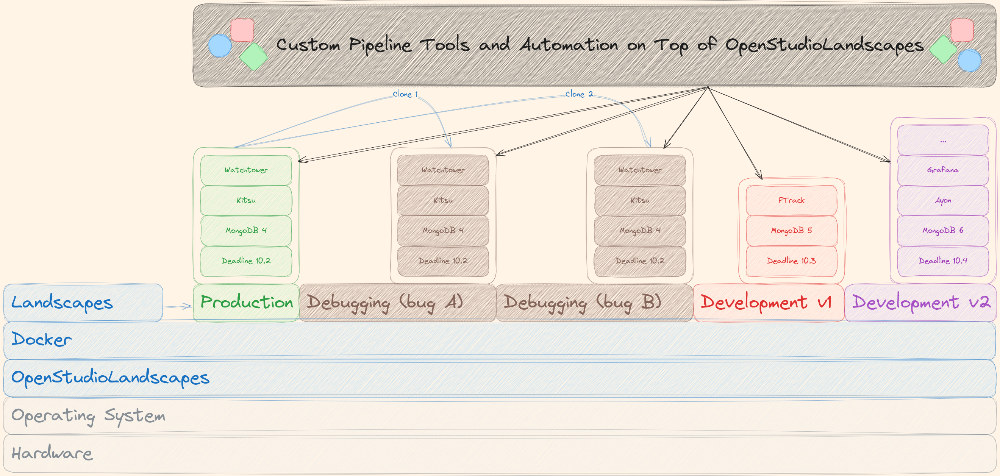
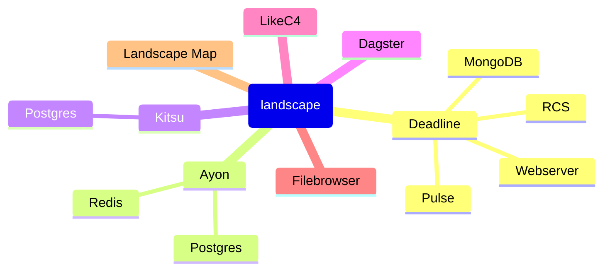
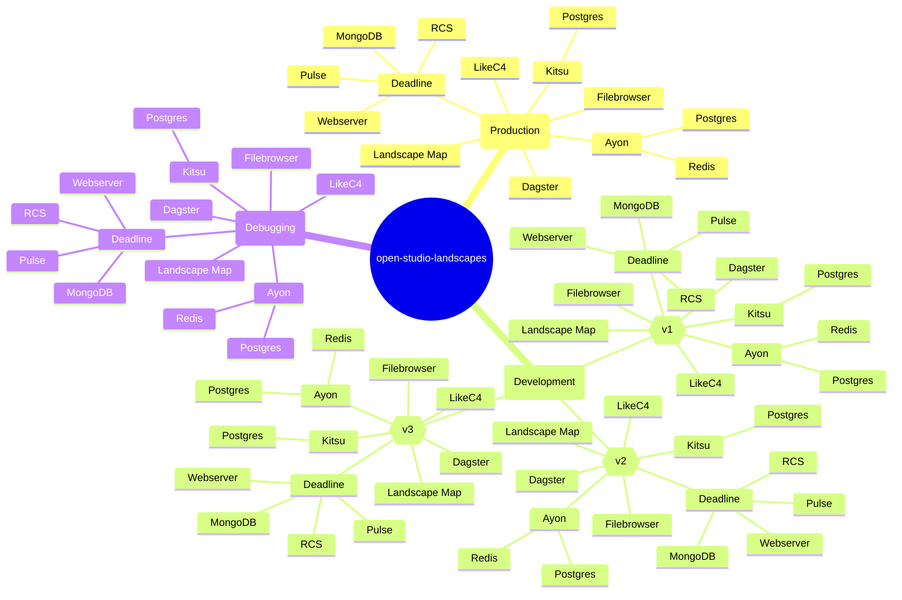
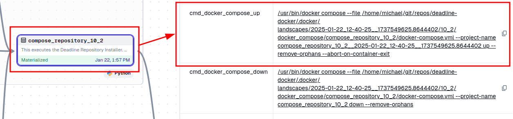
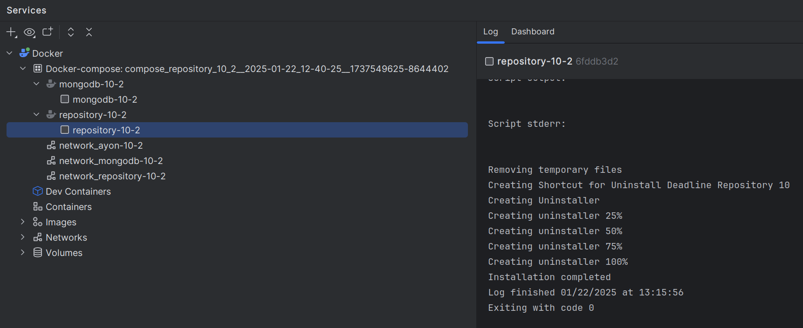
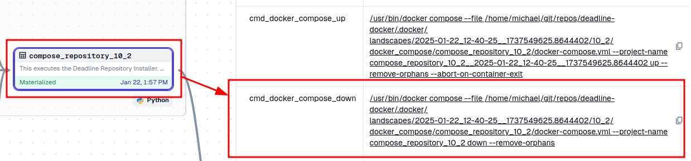
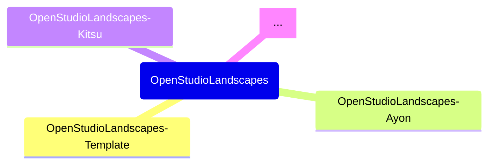

---

<!-- TOC -->
* [OpenStudioLandscapes](#openstudiolandscapes)
  * [Brief](#brief)
  * [Structure](#structure)
  * [Tested on](#tested-on)
  * [About the Author](#about-the-author)
  * [Requirements](#requirements)
    * [Harbor](#harbor)
      * [Harbor DNS](#harbor-dns)
      * [Trust Harbor Registry](#trust-harbor-registry)
      * [Upload Failures](#upload-failures)
    * [Dagster](#dagster)
    * [Ubuntu](#ubuntu)
      * [20.04](#2004)
        * [Python 3.11](#python-311)
      * [Manjaro](#manjaro)
        * [Official](#official)
        * [AUR](#aur)
  * [Limitations](#limitations)
    * [Render Farms](#render-farms)
      * [Deadline](#deadline)
    * [VFX Platform](#vfx-platform)
  * [Secrets](#secrets)
    * [Personal Secrets](#personal-secrets)
    * [Internal Secrets](#internal-secrets)
      * [Workflow "encrypt"](#workflow-encrypt)
      * [Workflow "unlock"](#workflow-unlock)
      * [Remove git History of a Secrets file](#remove-git-history-of-a-secrets-file)
    * [Public](#public)
  * [Integrated Tools](#integrated-tools)
    * [Render Manager](#render-manager)
    * [3rd Party](#3rd-party)
      * [Container Registry](#container-registry)
      * [Completed](#completed)
      * [WIP](#wip)
      * [To Do](#to-do)
  * [Dagster Lineage](#dagster-lineage)
  * [Docker Compose Graph](#docker-compose-graph)
    * [Deadline 10.2](#deadline-102)
    * [Repository-Installer 10.2](#repository-installer-102)
  * [Clone](#clone)
  * [Install](#install)
    * [venv](#venv)
    * [open-studio-landscapes](#open-studio-landscapes)
    * [DeadlineDatabase10](#deadlinedatabase10)
      * [Use Test DB](#use-test-db)
  * [Create Landscape](#create-landscape)
    * [Launch Dagster](#launch-dagster)
    * [Launch Dagster Postgres](#launch-dagster-postgres)
      * [Postgres](#postgres)
      * [Dagster](#dagster-1)
    * [Configure Landscape](#configure-landscape)
    * [Materialize Landscape](#materialize-landscape)
      * [Resulting Files and Directories (aka "Landscape")](#resulting-files-and-directories-aka-landscape)
  * [Run Repository Installer](#run-repository-installer)
  * [Run Deadline Farm](#run-deadline-farm)
  * [Client](#client)
    * [Deadline Monitor](#deadline-monitor)
  * [Docker](#docker)
    * [Clean](#clean)
  * [pre-commit](#pre-commit)
  * [nox](#nox)
  * [Pylint](#pylint)
  * [SBOM](#sbom)
    * [`python3.11`](#python311)
    * [`python3.12`](#python312)
* [Roadmap](#roadmap)
  * [SSH](#ssh)
  * [Todo](#todo)
  * [Docker](#docker-1)
  * [Community](#community)
  * [Generate README.md](#generate-readmemd)
    * [Issues](#issues)
      * [Fix: `pip install -e ../OpenStudioLandscapes/[dev]`](#fix-pip-install--e-openstudiolandscapesdev)
      * [Fix: Enable in `OpenStudioLandscapes.engine.constants`](#fix-enable-in-openstudiolandscapesengineconstants)
      * [Fix: `pip install -e ../OpenStudioLandscapes-Deadline-10-2/[dev]`](#fix-pip-install--e-openstudiolandscapes-deadline-10-2dev)
  * [Sync Files and Directories across Repositories](#sync-files-and-directories-across-repositories)
<!-- TOC -->

---

# OpenStudioLandscapes

## Brief

Setup and launch a render farm - your 3D Animation
and VFX Pipeline backbone - with ease, independence
and scalability.

A toolkit - or a declarative build system
if you will - to easily create reproducible
Render Farm environment setups:
create Landscapes for production,
testing, debugging, development,
migration, DB restore etc.



No more black boxes.
No more path dependencies due to bad decisions
made in the past. Stay flexible and adaptable
with this modular and declarative system by reconfiguring
any production environment with ease:
- Easily add, edit, replace or remove services
- Clone (or modify and clone) entire production Landscapes for testing, debugging or development
- Code as source of truth:
  - Always stay on top of things with maps and node trees of code and Landscapes
  - Limit manual documentation to a bare minimum
- `open-studio-landscapes` is (primarily) powered by [Dagster](https://github.com/dagster-io/) and [Docker](https://github.com/docker)
- Fully Python based

This platform is aimed towards small to medium-sized
studios where only limited resources for Pipeline
Engineers and Technical Directors are available.
This system allows those studios to share a common
underlying system to build arbitrary pipeline tools
on top with the ability to share them among others
without sacrificing the technical freedom to implement
highly studio specific and individual solutions if needed.

The scope of this are users with some technical skills with a
desire for a somewhat pre-made solution to set up their production
services environments. OpenStudioLandscapes is therefore
a somewhat opinionated solution for working environments that
lack the fundamental skills and/or budget to write a solution like
OpenStudioLandscapes by themselves while being flexible enough
for everyone *with* the technical skills to make their way through
configuring a Landscape or even writing their own OpenStudioLandscapes
modules for custom or proprietary services to fully fit their needs.

I guess this is a good starting point to open the project up to
the animation and VFX community to find out where (or where else) 
exactly the needs are to make sure small studios keep growing 
in a (from a technical perspective) healthy way without ending up
in high tech dept dead end.

What problem does OpenStudioLandscapes solve?

What's separating the men from the boys is the production back bone.
Large studio spent years and years of man (and woman) hours and
millions of dineros to build robust automation in their 
production while smaller ones are (in those regards - no matter
how recent and advanced the tools they use are) decades behind.
So, in one sense, OpenStudioLandscapes gives you the ability to
jump a few years ahead by giving you a pre-made production environment.

The second problem it is trying to solve is one that you (as a small
company) do not have **yet**. Ideally, before you start to automate things,
you want to have a robust underlying system. What usually happens is that
studio build their systems (again, while they are still small with no 
budget and/or understanding for professional automation) the other way around:
around their small scripts and build everything else on top of that. This
leads inevitably to tech dept in the future when growth has happened - 
a house of cards built upside down. So, you wanna replace or remove your
old little script that you wrote 5 years ago which is being used in so many
places you can't even remember? There you have it. Better don't touch. Better
continue building your system around it. Right? Wrong! OpenStudioLandscapes
is here to make sure your future you is not going to regret decisions you are
making right now!

## Structure

The structure of a Landscape:



The hierarchy of multiple Landscapes
in the context of `open-studio-landscapes`:



## Tested on

- Manjaro Linux

```shell
$ neofetch                                                               INT ✘ 
██████████████████  ████████   michael@lenovo 
██████████████████  ████████   -------------- 
██████████████████  ████████   OS: Manjaro Linux x86_64 
██████████████████  ████████   Host: 82K1 IdeaPad Gaming 3 15IHU6 
████████            ████████   Kernel: 6.12.12-2-MANJARO 
████████  ████████  ████████   Uptime: 2 hours, 45 mins 
████████  ████████  ████████   Packages: 1341 (pacman) 
████████  ████████  ████████   Shell: bash 5.2.37 
████████  ████████  ████████   Resolution: 2560x1080 
████████  ████████  ████████   DE: Plasma 6.2.5 
████████  ████████  ████████   WM: kwin 
████████  ████████  ████████   Theme: Breeze-Dark [GTK2], Breeze [GTK3] 
████████  ████████  ████████   Icons: breeze [GTK2/3] 
████████  ████████  ████████   Terminal: konsole 
                               CPU: 11th Gen Intel i5-11320H (8) @ 4.500GHz 
                               GPU: Intel TigerLake-LP GT2 [Iris Xe Graphics] 
                               GPU: NVIDIA GeForce GTX 1650 Mobile / Max-Q 
                               Memory: 12660MiB / 15776MiB 
```

## About the Author

Michael Mussato
- [LinkedIn](https://www.linkedin.com/in/michael-mussato-815902190/)
- [IMDb](https://www.imdb.com/name/nm5961264/)

Former employers, among others:
- [Netflix Animation Studios](https://www.netflixanimation.com/)
- [Animal Logic](https://animallogic.com/)
- [Trixter](https://www.trixter.de/)
- Axis Animation
- [Elefant Studios](http://www.elefantstudios.ch/)

## Requirements

- `python3.11`
- `graphviz`
- `docker`
- `git`
- `git-crypt`
- [Harbor](https://github.com/goharbor/harbor)

### Harbor

Use offline installer or online installer based
on network availability

Releases: https://github.com/goharbor/harbor/releases

```shell
cd OpenStudioLandscapes/.landscapes/.harbor

export HARBOR_RELEASE=v2.12.2

export HARBOR_INSTALLER=harbor-online-installer-${HARBOR_RELEASE}.tgz
export INSTALLER_ONLINE=https://github.com/goharbor/harbor/releases/download/${HARBOR_RELEASE}/${HARBOR_INSTALLER}
export INSTALLER_OFFLINE=https://github.com/goharbor/harbor/releases/download/${HARBOR_RELEASE}/${HARBOR_INSTALLER}

export TEMP_DIR=$(mktemp --directory)
wget -O ${TEMP_DIR}/${HARBOR_INSTALLER} ${INSTALLER_ONLINE}

tar -xvf --strip-components=1 ${TEMP_DIR}/${HARBOR_INSTALLER} -C ./bin/
```

And then, continue inside Dagster (`compose_Harbor` group) to:
- [configure `harbor.yml`](OpenStudioLandscapes/engine/compose_harbor/assets.py:write_yaml)
- generate `docker-compose.yml`
- generate `docker compose` commands

Once Harbor is running, log in and create a project that reflects the name
of the docker registry repository name that is used to prefix the docker
containers generated by OpenStudioLandscapes (see
[`enums.py`](OpenStudioLandscapes/engine/enums/DockerConfig._REPOSITORY_NAME))
- Public: no Log-In is needed to push/pull
- Private: Log-In is needed to push (pull?)

You can also refer to the Swagger UI
- http://harbor.farm.evil/devcenter-api-2.0

#### Harbor DNS

In order for Harbor to remain persistent as a trusted
insecure (HTTP) registry - provided we don't provide it
with a static IP and/or don't have a local DNS server 
running - we add/edit an entry in `/etc/hosts`:

```shell
sudo bash -c 'cat > /etc/hosts << EOF
# Standard host addresses
127.0.0.1  localhost
::1        localhost ip6-localhost ip6-loopback
ff02::1    ip6-allnodes
ff02::2    ip6-allrouters
# This host address
127.0.1.1  lenovo

# OpenStudioLandscapes
# # Harbor
# 192.168.1.164  harbor.farm.evil
127.0.0.1  harbor.farm.evil
# # Postgres
127.0.0.1  postgres-dagster.farm.evil

# Deadline 10.2
127.0.0.1  deadline-rcs-runner-10-2.farm.evil
127.0.0.1  mongo-express-10-2.farm.evil
127.0.0.1  mongodb-10-2.farm.evil
127.0.0.1  deadline-pulse-runner-10-2.farm.evil
127.0.0.1  repository-installer-10-2.farm.evil  # ephemeral
127.0.0.1  deadline-webservice-runner-10-2.farm.evil
127.0.0.1  deadline-worker-runner-10-2.farm.evil
# 127.0.0.1  deadline-10-2-pulse-worker-XX.farm.evil

# filebrowser
127.0.0.1  filebrowser.farm.evil

# Kitsu
127.0.0.1  kitsu-init-db.farm.evil  # ephemeral
127.0.0.1  kitsu.farm.evil

# Syncthing
127.0.0.1  syncthing.farm.evil

# SESI
127.0.0.1  sesi-gcc-9-3-houdini-20.farm.evil

# RLM
127.0.0.1  nuke-rlm-8.farm.evil

# Dagster
127.0.0.1  dagster.farm.evil

# Ayon
127.0.0.1  ayon-server.farm.evil

# Template
# 127.0.0.1  template.farm.evil

EOF

chmod 0644 /etc/hosts
chown root:root /etc/hosts'
```

#### Trust Harbor Registry

Furthermore, in order to use Harbor as an insecure
registry to push to and pull from, we need to tell
the local docker daemon that it is a trusted resource:

```shell
sudo bash -c 'mkdir -p /etc/docker

cat > /etc/docker/daemon.json << EOF
{
  "insecure-registries" : [
    "http://harbor.farm.evil:80",
  ]
}

EOF'

sudo systemctl daemon-reload
sudo systemctl restart docker
```

#### Upload Failures

If we get timeout because of too many parallel blob uploads,
we can limit the concurrent uploads:

```shell
sudo bash -c 'mkdir -p /etc/docker

cat > /etc/docker/daemon.json << EOF
{
  "max-concurrent-uploads": 1,
}

EOF'

sudo systemctl daemon-reload
sudo systemctl restart docker
```

### Dagster

Todo
- [ ] `dagster dev` is not for production (https://docs.dagster.io/guides/deploy/deployment-options)

### Ubuntu

#### 20.04

```
sudo apt-key adv --refresh-keys
```

https://docs.docker.com/engine/install/ubuntu/#install-using-the-repository
```
# Add Docker's official GPG key:
sudo apt-get update
sudo apt-get -y install ca-certificates curl
sudo install -m 0755 -d /etc/apt/keyrings
sudo curl -fsSL https://download.docker.com/linux/ubuntu/gpg -o /etc/apt/keyrings/docker.asc
sudo chmod a+r /etc/apt/keyrings/docker.asc

# Add the repository to Apt sources:
echo \
  "deb [arch=$(dpkg --print-architecture) signed-by=/etc/apt/keyrings/docker.asc] https://download.docker.com/linux/ubuntu \
  $(. /etc/os-release && echo "${UBUNTU_CODENAME:-$VERSION_CODENAME}") stable" | \
  sudo tee /etc/apt/sources.list.d/docker.list > /dev/null
sudo apt-get update
```

```
sudo apt-get -y install docker.io graphviz git git-crypt
```

```
sudo systemctl enable --now docker
```

##### Python 3.11

```
sudo apt-get -y install \
    build-essential \
    pkg-config \
    zlib1g-dev \
    libncurses5-dev \
    libgdbm-dev \
    libnss3-dev \
    libssl-dev \
    libreadline-dev \
    libffi-dev \
    libsqlite3-dev \
    libbz2-dev \
    iproute2

apt-get clean
```

```    
pushd $(mktemp -d)

export PYTHON_MAJ=3
export PYTHON_MIN=11
export PYTHON_PAT=11

curl "https://www.python.org/ftp/python/${PYTHON_MAJ}.${PYTHON_MIN}.${PYTHON_PAT}/Python-${PYTHON_MAJ}.${PYTHON_MIN}.${PYTHON_PAT}.tgz" -o Python-${PYTHON_MAJ}.${PYTHON_MIN}.${PYTHON_PAT}.tgz
file Python-${PYTHON_MAJ}.${PYTHON_MIN}.${PYTHON_PAT}.tgz
tar -xvf Python-${PYTHON_MAJ}.${PYTHON_MIN}.${PYTHON_PAT}.tgz

cd Python-${PYTHON_MAJ}.${PYTHON_MIN}.${PYTHON_PAT} 
./configure --enable-optimizations  # Todo: --prefix  # https://stackoverflow.com/questions/11307465/destdir-and-prefix-of-make
make -j $(nproc)
make altinstall  # altinstall instead of install because the later command will overwrite the default system python3 binary.

python${PYTHON_MAJ}.${PYTHON_MIN} -m pip install pip --upgrade

rm -rf $(pwd) && popd
```

#### Manjaro

##### Official

```
sudo pacman -Syyu docker docker-buildx docker-compose graphviz git git-crypt
```

```
sudo systemctl enable --now docker
```

If you get something like:

```
ERROR: permission denied while trying to connect to the Docker 
daemon socket at unix:///var/run/docker.sock: 
Head "http://%2Fvar%2Frun%2Fdocker.sock/_ping": 
dial unix /var/run/docker.sock: connect: permission denied
```

Add user `docker` to group `docker`:
- https://stackoverflow.com/questions/48957195/how-to-fix-docker-got-permission-denied-issue

```
sudo groupadd docker
sudo usermod -aG docker $USER
```

##### AUR

```
sudo pamac install python311
```


- local
  - Manjaro: `libxcrypt-compat`
  - Deadline Client 10.2
    - `libffi6`
  - Deadline Client 10.3

```
System.TypeInitializationException: The type initializer for 'Delegates' threw an exception.
 ---> System.DllNotFoundException: Could not load libpython3.10.so with flags RTLD_NOW | RTLD_GLOBAL: libcrypt.so.1: cannot open shared object file: No such file or directory
   at Python.Runtime.Platform.PosixLoader.Load(String dllToLoad) in C:\thinkbox-conda\conda-bld\dotnet_pythonnet_1709944764012\work\src\runtime\Native\LibraryLoader.cs:line 61
   at Python.Runtime.Runtime.Delegates.GetUnmanagedDll(String libraryName) in C:\thinkbox-conda\conda-bld\dotnet_pythonnet_1709944764012\work\src\runtime\Runtime.Delegates.cs:line 290
   at Python.Runtime.Runtime.Delegates..cctor() in C:\thinkbox-conda\conda-bld\dotnet_pythonnet_1709944764012\work\src\runtime\Runtime.Delegates.cs:line 16
   --- End of inner exception stack trace ---
   at Python.Runtime.Runtime.Delegates.get_Py_GetVersion() in C:\thinkbox-conda\conda-bld\dotnet_pythonnet_1709944764012\work\src\runtime\Runtime.Delegates.cs:line 341
   at Python.Runtime.Runtime.Py_GetVersion() in C:\thinkbox-conda\conda-bld\dotnet_pythonnet_1709944764012\work\src\runtime\Runtime.cs:line 826
   at Python.Runtime.PythonEngine.get_Version() in C:\thinkbox-conda\conda-bld\dotnet_pythonnet_1709944764012\work\src\runtime\PythonEngine.cs:line 143
   at FranticX.Scripting.PythonNetScriptEngine.Initialize(Boolean setUnbufferedStdioFlag, String home, String programName)
Exception on Startup: An Unexpected Error Occurred: Attempted python home: /opt/Thinkbox/Deadline10/bin/python3/../../lib/python3, The type initializer for 'Delegates' threw an exception.

Deadline Launcher will now exit.

```

Manjaro: `libxcrypt-compat`

## Limitations

### Render Farms

The only farm management software that is
currently implemented is Deadline. Others
(as per [this table](#render-manager)) are
(potentially) on the roadmap.

#### Deadline

Currently only for Deadline version 10.2.
Versions 10.3 and 10.4 are WIP and will be
implemented as soon as 10.2 fully works as
a proof of concept.

### VFX Platform

Integration of VFX Platform compatibility
is on the roadmap.

## Secrets

There are many ways to protect sensitive data.
It is `open-studio-landscapes` does not provide a dedicated solution
to protect your secrets - it lets (and wants you to) implement
your own solution or use existing ones if you have something
implemented already. Dagster does handle secrets in
its own way. This approach might be a valid candidate for
`open-studio-landscapes` in the future. More on this here:
https://docs.dagster.io/guides/deploy/using-environment-variables-and-secrets

However, I do have sensitive data myself and I would like to
quickly present my approach to you here. I'm not a security
engineer, hence, I'm coming up with my personal (very basic)
terminology.

I'm suggesting three levels of secrecy, although I'm
only using two in practice:
- Personal
  > Secrets that only certain individuals can know
- Internal
  > Secrets that all individuals within an entity can know
    but not the outside world
- Public
  > Everything that comes with the public `michimussato/open-studio-landscapes`
    Git repository

### Personal Secrets

I'm not concerned about this level of secrecy in my environment.
Integrate/implement your own solution or make suggestions.

### Internal Secrets

I'm protecting secrets from the outside world which need to
be part of the Git repo (version controlled). I've had
very good experience using `git-crypt` which transparently
encrypts files and directories based on a `.gitattributes`
file. The contents of those files are in clear text as
long as the local clone has the key.

My `.gitattributes` file looks as follows:

```
# files starting with __SECRET__
__SECRET__* filter=git-crypt diff=git-crypt
.env filter=git-crypt diff=git-crypt

# folders starting with __SECRET__
*/__SECRET__*/** filter=git-crypt diff=git-crypt
```

You get the idea.

#### Workflow "encrypt"

1. Clone Repo
   ```
   git clone repo
   ```
2. Init `git-crypt`
   ```
   cd repo
   git-crypt init
   ```
3. Export Key
   ```
   git-crypt export-key keyfile.key
   ```
4. Create Filter (`.gitattribtes`)
5. Push Filter
6. Add secrets
7. Push

#### Workflow "unlock"

1. Clone Repo
   ```
   git clone repo
   ```
2. Unlock Repo
   ```
   cd repo
   git-crypt unlock /path/to/keyfile.key
   ```

#### Remove git History of a Secrets file

Requirements:
- `bfg` (https://rtyley.github.io/bfg-repo-cleaner/)

- backup secrets file
- remove secrets file from local repo, commit and push
- `bfg --delete-files __SECRET__* /path/to/repo/.git`
- `git reflog expire --expire=now --all && git gc --prune=now --aggressive`
- `git push --force`

Re-add secrets file with `.gitattributes` filter in place,
commit and push.

More info: https://github.com/AGWA/git-crypt

### Public

You clone (or fork-clone) the repo, make your modification and
push everything publicly.

## Integrated Tools

- [docker-compose-graph](https://github.com/michimussato/docker-compose-graph)

### Render Manager

There are a multitude of managers available
and I had to make a decision to begin with.
In general, `open-studio-landscapes` has the
capability to support arbitrary managers,
however, as of now, only Deadline is considered
integrated. The decision to go with Deadline
was based on the following specs:

- Cross Platform
- Feature rich
- Production proven
- Freely available (not necessarily OSS)
- Scalability (locally and into the cloud)
- Active Development
- Local (no exclusive cloud rendering)
- Python (Python API)
- DCC agnostic

Here's a non-exhaustive list of managers in
comparison:

| Render Manager | Integrated | Cross Platform | Freely Available | Scalability (local and cloud) | Active Development | Local | Python API | DCC agnostic |
|----------------|------------|----------------|------------------|-------------------------------|--------------------|-------|------------|--------------|
| Deadline 10.x  | ✅          | ✅              | ✅                | ✅                             | ❌                  | ✅     | ✅          | ✅            |
| OpenCue        | ✅          | ☐              | ✅                | ☐                             | ❌                  | ✅     | ✅          | ✅            |
| Tractor        | ❌          | ☐              | ❌                | ☐                             | ☐                  | ☐     | ☐          | ☐            |
| Flamenco       | ❌          | ☐              | ☐                | ☐                             | ☐                  | ☐     | ☐          | ❌            |
| RoyalRender    | ❌          | ☐              | ☐                | ☐                             | ☐                  | ☐     | ☐          | ☐            |
| Qube!          | ❌          | ☐              | ❌                | ☐                             | ☐                  | ☐     | ☐          | ☐            |
| AFANASY        | ❌          | ☐              | ☐                | ☐                             | ☐                  | ☐     | ☐          | ☐            |
| Muster         | ❌          | ☐              | ☐                | ☐                             | ☐                  | ☐     | ☐          | ☐            |


### 3rd Party

[Template](https://github.com/michimussato/OpenStudioLandscapes-Template)

#### Container Registry

- [x] Harbor

#### Completed

- [x] [Dagster](https://dagster.io/)
  - https://github.com/michimussato/OpenStudioLandscapes-Dagster
- [x] [Kitsu](https://kitsu.cg-wire.com/)
  - https://github.com/michimussato/OpenStudioLandscapes-Kitsu
- [x] [Ayon](https://ayon.ynput.io/)
  - https://github.com/michimussato/OpenStudioLandscapes-Ayon
- [x] [mongo-express](https://hub.docker.com/_/mongo-express)
- [x] [filebrodockerwser/filebrowser](https://hub.docker.com/r/filebrowser/filebrowser)
  - https://github.com/michimussato/OpenStudioLandscapes-filebrowser
- [x] [Syncthing](https://github.com/syncthing/syncthing/blob/main/README-Docker.md)
  - https://github.com/michimussato/OpenStudioLandscapes-Syncthing
- [x] [SESI Houdini 20](https://www.sidefx.com/docs/houdini/ref/utils/sesinetd.html)
  - https://github.com/michimussato/OpenStudioLandscapes-SESI-gcc-9-3-Houdini-20
- [x] [NukeRLM-8](https://learn.foundry.com/licensing/Content/local-licensing.html)
  - https://github.com/michimussato/OpenStudioLandscapes-NukeRLM-8

#### WIP

- [x] [LikeC4](https://likec4.dev/)
  - https://github.com/michimussato/OpenStudioLandscapes-LikeC4
- [x] [Grafana](https://grafana.com/)
  - https://github.com/michimussato/OpenStudioLandscapes-Grafana
- [x] [OpenCue](https://www.opencue.io/)
  - https://github.com/michimussato/OpenStudioLandscapes-OpenCue

#### To Do

- [ ] [Watchtower](https://watchtower.blender.org/)

## Dagster Lineage


## Docker Compose Graph

Dynamic Docker Compose documentation:
[`docker-compose-graph`](https://github.com/michimussato/docker-compose-graph) creates a visual representation of
`docker-compose.yml` files for every individual
Landscape for quick reference and context.

### Deadline 10.2

`.landscapes/2025-02-01_00-11-08__578595276b424d1ea62550cb0b6f166f/Deadline_10_2/docker_compose/Deadline_10_2__compose_10_2/docker-compose.yml`


Manual (via CLI):

```shell
docker-compose-graph --yaml .landscapes/2025-02-01_00-11-08__578595276b424d1ea62550cb0b6f166f/Deadline_10_2/docker_compose/Deadline_10_2__compose_10_2/docker-compose.yml --outfile Docker_Compose_Graph__docker_compose_graph_10_2.png -f png
```

### Repository-Installer 10.2

`.landscapes/2025-02-01_00-11-08__578595276b424d1ea62550cb0b6f166f/Deadline_10_2/docker_compose/Deadline_10_2__compose_repository_10_2/docker-compose.yml`


Manual (via CLI):

```shell
docker-compose-graph --yaml .landscapes/2025-02-01_00-11-08__578595276b424d1ea62550cb0b6f166f/Deadline_10_2/docker_compose/Deadline_10_2__compose_repository_10_2/docker-compose.yml --outfile Docker_Compose_Graph__docker_compose_graph_repository_10_2.png -f png
```

## Clone

```shell
git clone https://github.com/michimussato/open-studio-landscapes.git
cd open-studio-landscapes
python3 -m venv .venv
source .venv/bin/activate
python -m pip install --upgrade pip setuptools
pip install -e .[dev]
```

## Install

### venv

```shell
python3 -m venv .venv
source .venv/bin/activate
python -m pip install --upgrade pip setuptools
```

### open-studio-landscapes

```shell
python -m pip install git+https://github.com/michimussato/open-studio-landscapes.git@main
```

### DeadlineDatabase10

#### Use Test DB

Make sure that the `DeadlineDatabase10` directory has
appropriate ownership:

```shell
sudo chown -R 101:65534 /path/to/DeadlineDatabase10
```

And in `OpenStudioLandscapes.open_studio_landscapes.Deadline.v10_2.assets.env` set

```python
f"DATABASE_INSTALL_DESTINATION_{KEY}": {
    "default": [...],                     # <-- Set key-value pairs as desired
    "test_db_10_2": pathlib.Path(
        "/path/to/DeadlineDatabase10"
    ).as_posix(),                         # <--
    "another_test_db": [...],  # <--
}["test_db_10_2"]                         # <--- Set to value to be used
```

## Create Landscape

### Launch Dagster

```shell
cd ~/git/repos/OpenStudioLandscapes
source .venv/bin/activate
export DAGSTER_HOME="$(pwd)/.dagster"
dagster dev
```

### Launch Dagster Postgres

This could be useful in case you're hitting a
SQLite concurrency issue like this:

```
sqlalchemy.exc.OperationalError: (sqlite3.OperationalError) database is locked
  [...]
The above exception was caused by the following exception:
sqlite3.OperationalError: database is locked
  [...]
```

Resources:
- https://docs.dagster.io/guides/deploy/dagster-instance-configuration
- https://docs.dagster.io/api/python-api/libraries/dagster-postgres
- https://docs.dagster.io/guides/deploy/deployment-options/docker
- https://github.com/docker-library/docs/blob/master/postgres/README.md
- https://www.getorchestra.io/guides/dagster-open-source-pipelines-postgresql-integration

#### Postgres

```shell
# https://github.com/docker-library/docs/blob/master/postgres/README.md

cd ~/git/repos/OpenStudioLandscapes/.dagster-postgres/

docker run \
    --name postgres-dagster \
    --domainname farm.evil \
    --hostname postgres-dagster.farm.evil \
    --env POSTGRES_USER=postgres \
    --env POSTGRES_PASSWORD=mysecretpassword \
    --env POSTGRES_DB=postgres \
	--env PGDATA=/var/lib/postgresql/data/pgdata \
	--volume ./.postgres:/var/lib/postgresql/data \
	--publish 5432:5432 \
	--rm \
    docker.io/postgres
```

#### Dagster

```shell
cd ~/git/repos/OpenStudioLandscapes
source .venv/bin/activate
export DAGSTER_HOME="$(pwd)/.dagster-postgres"
dagster dev
```

http://0.0.0.0:3000

### Configure Landscape

Edit
- `OpenStudioLandscapes.engine.constants`
- `OpenStudioLandscapes.<third_party_module>.constants`
according to your needs.

### Materialize Landscape


#### Resulting Files and Directories (aka "Landscape")

```shell
$ tree .landscapes/2025-02-28_13-24-43__4ade7f1cc21d4e39bb90b1363f807e79
.landscapes/2025-02-28_13-24-43__4ade7f1cc21d4e39bb90b1363f807e79
├── Ayon__Ayon
│   ├── Ayon__clone_repository
│   │   └── repos
│   │       └── ayon-docker
│   │           └── [...]
│   ├── Ayon__compose_override
│   │   └── docker-compose.override.yml
│   └── Ayon__group_out
│       └── docker_compose
│           ├── Ayon__docker_compose_graph
│           │   ├── Ayon__docker_compose_graph.dot
│           │   ├── Ayon__docker_compose_graph.png
│           │   └── Ayon__docker_compose_graph.svg
│           └── docker-compose.yml
├── Base__Base
│   └── Base__build_docker_image
│       └── Dockerfiles
│           └── Dockerfile
├── Compose__Compose
│   └── Compose__group_out
│       └── docker_compose
│           ├── Compose__docker_compose_graph
│           │   ├── Compose__docker_compose_graph.dot
│           │   ├── Compose__docker_compose_graph.png
│           │   └── Compose__docker_compose_graph.svg
│           └── docker-compose.yml
├── Dagster__Dagster
│   ├── Dagster__build_docker_image
│   │   └── Dockerfiles
│   │       ├── Dockerfile
│   │       └── payload
│   │           ├── dagster.yaml
│   │           └── workspace.yaml
│   └── Dagster__group_out
│       └── docker_compose
│           ├── Dagster__docker_compose_graph
│           │   ├── Dagster__docker_compose_graph.dot
│           │   ├── Dagster__docker_compose_graph.png
│           │   └── Dagster__docker_compose_graph.svg
│           └── docker-compose.yml
├── Deadline_10_2__Deadline_10_2
│   ├── configs
│   │   ├── Deadline10
│   │   │   └── deadline.ini
│   │   └── DeadlineRepository10
│   │       └── settings
│   │           └── connection.ini
│   ├── data
│   │   └── opt
│   │       └── Thinkbox
│   │           └── DeadlineDatabase10
│   ├── Deadline_10_2__build_docker_image
│   │   └── Dockerfiles
│   │       └── Dockerfile
│   ├── Deadline_10_2__build_docker_image_client
│   │   └── Dockerfiles
│   │       └── Dockerfile
│   ├── Deadline_10_2__build_docker_image_repository
│   │   └── Dockerfiles
│   │       └── Dockerfile
│   └── Deadline_10_2__group_out
│       └── docker_compose
│           ├── Deadline_10_2__docker_compose_graph
│           │   ├── Deadline_10_2__docker_compose_graph.dot
│           │   ├── Deadline_10_2__docker_compose_graph.png
│           │   └── Deadline_10_2__docker_compose_graph.svg
│           └── docker-compose.yml
├── filebrowser__filebrowser
│   └── filebrowser__group_out
│       └── docker_compose
│           ├── docker-compose.yml
│           └── filebrowser__docker_compose_graph
│               ├── filebrowser__docker_compose_graph.dot
│               ├── filebrowser__docker_compose_graph.png
│               └── filebrowser__docker_compose_graph.svg
├── Grafana__Grafana
│   └── Grafana__group_out
│       └── docker_compose
│           ├── docker-compose.yml
│           └── Grafana__docker_compose_graph
│               ├── Grafana__docker_compose_graph.dot
│               ├── Grafana__docker_compose_graph.png
│               └── Grafana__docker_compose_graph.svg
├── Kitsu__Kitsu
│   ├── data
│   │   └── kitsu
│   │       ├── postgresql
│   │       └── previews
│   ├── Kitsu__build_docker_image
│   │   └── Dockerfiles
│   │       ├── Dockerfile
│   │       └── scripts
│   │           ├── init_db.sh
│   │           └── postgresql.conf
│   ├── Kitsu__group_out
│   │   └── docker_compose
│   │       ├── docker-compose.yml
│   │       └── Kitsu__docker_compose_graph
│   │           ├── Kitsu__docker_compose_graph.dot
│   │           ├── Kitsu__docker_compose_graph.png
│   │           └── Kitsu__docker_compose_graph.svg
│   └── Kitsu__script_init_db
│       └── init_db.sh
├── LikeC4__LikeC4
│   ├── LikeC4__build_docker_image
│   │   └── Dockerfiles
│   │       ├── Dockerfile
│   │       └── payload
│   │           ├── run.sh
│   │           └── setup.sh
│   └── LikeC4__group_out
│       └── docker_compose
│           ├── docker-compose.yml
│           └── LikeC4__docker_compose_graph
│               ├── LikeC4__docker_compose_graph.dot
│               ├── LikeC4__docker_compose_graph.png
│               └── LikeC4__docker_compose_graph.svg
└── OpenCue__OpenCue
    ├── OpenCue__clone_repository
    │   └── repos
    │       └── OpenCue
    │           └── [...]
    ├── OpenCue__compose_override
    │   └── docker-compose.override.yml
    ├── OpenCue__group_out
    │   └── docker_compose
    │       ├── docker-compose.yml
    │       └── OpenCue__docker_compose_graph
    │           ├── OpenCue__docker_compose_graph.dot
    │           ├── OpenCue__docker_compose_graph.png
    │           └── OpenCue__docker_compose_graph.svg
    └── OpenCue__prepare_volumes
        ├── logs
        └── shots

282 directories, 1310 files
```

## Run Repository Installer

Copy/Paste command, execute and wait for it to finish:





And `docker compose down` eventually:



## Run Deadline Farm

Together with:
- Kitsu
- Ayon
- Dagster
- LikeC4
- ...

Copy/Paste command and execute:


## Client

### Deadline Monitor


## Docker

### Clean

```shell
sudo systemctl stop openstudiolandscapes-registry.service
docker stop $(docker ps -q)
docker container prune -f
docker image prune -a -f
docker volume prune -a -f
docker buildx prune -a -f
docker network prune -f
```

## pre-commit

- https://pre-commit.com/
- https://pre-commit.com/hooks.html

```shell
pre-commit install
```

```shell
pre-commit run --all-files
```

## nox

```shell
nox --no-error-on-missing-interpreters --report .nox/nox-report.json
```

## Pylint

- `# pylint: disable=redefined-outer-name` ([`W0621`](https://pylint.pycqa.org/en/latest/user_guide/messages/warning/redefined-outer-name.html)): Due to Dagsters way of piping
  arguments into assets.

## SBOM

### `python3.11`

- [cyclonedx-bom](https://github.com/michimussato/open-studio-landscapes/tree/main/.sbom/cyclonedx-py.sbom-3.11.json)
- [pipdeptree (Dot)](https://github.com/michimussato/open-studio-landscapes/tree/main/.sbom/pipdeptree.sbom-3.11.dot)
- [pipdeptree (Mermaid)](https://github.com/michimussato/open-studio-landscapes/tree/main/.sbom/pipdeptree.sbom-3.11.mermaid)

### `python3.12`

- [cyclonedx-bom](https://github.com/michimussato/open-studio-landscapes/tree/main/.sbom/cyclonedx-py.sbom-3.12.json)
- [pipdeptree (Dot)](https://github.com/michimussato/open-studio-landscapes/tree/main/.sbom/pipdeptree.sbom-3.12.dot)
- [pipdeptree (Mermaid)](https://github.com/michimussato/open-studio-landscapes/tree/main/.sbom/pipdeptree.sbom-3.12.mermaid)

# Roadmap

- ☐ Landscape generation based on [VFX Reference Platform](https://vfxplatform.com/) spec
- ☐ Integrating [Rez](https://github.com/AcademySoftwareFoundation/rez)
- Integrating Render Managers
  - Deadline
    - ☐ 10.3
    - ☐ 10.4
  - ✅ [OpenCue](https://github.com/AcademySoftwareFoundation/OpenCue)
  - ☐ [Tractor](https://rmanwiki-26.pixar.com/space/TRA)
  - ☐ [Flamenco](https://flamenco.blender.org/)
- Dynamic Documentation
  - ☐ [LikeC4-Map](https://likec4.dev/)
- Third Party Container Integration
  - ☐ [Watchtower](https://watchtower.blender.org/)


## SSH

```shell
eval "$(ssh-agent -s)"
ssh-add ~/.ssh/id_ed25519.HP_2025-02-09
```

## Todo

- [ ] Implement Caddy for HTTPS
  - https://caddyserver.com/
  - https://github.com/caddyserver/caddy
  - https://hub.docker.com/_/caddy

## Docker

Docker caches can take up a lot of disk space. If there 
is only limited space available for Docker caches, here is some
further reading:

- https://docs.docker.com/build/cache/
- https://docs.docker.com/build/cache/backends/
- https://docs.docker.com/build/cache/backends/local/

## Community

- [Discord](https://discord.com/channels/1357343453364748419/1357343454065328202)
- [Slack](https://openstudiolandscapes.slack.com)

## Generate README.md

Todo: This might be better 

```shell
#!/usr/bin/env bash

# This script updates the README.md files
# of all OpenStudioLandscapes-Modules based on
# the template in
# OpenStudioLandscapes/src/OpenStudioLandscapes/engine/utils/markdown.py


SCRIPT_DIR="$( cd "$( dirname "${BASH_SOURCE[0]}" )" && pwd )"
# The script assumes that all module repos live in the same root dir
# as this one


for dir in "${SCRIPT_DIR}"/../OpenStudioLandscapes-*/; do
    pushd "${dir}" || exit
    source .venv/bin/activate
    echo "activated."
    # Updating dev env
    # To make sure we are not running into
    # below (#issues) mentioned problems
    pip install -e ../OpenStudioLandscapes/[dev]
    if [[ -f readme_generator.py ]]; then
        echo "Updating ${dir}README.md..."
        python3.11 readme_generator.py
        echo "Update done."
    else
        echo "ERROR: readme_generator.py does not exist in ${dir}"
    fi;
    deactivate
    echo "deactivated."
    popd || exit
done;
```

### Issues

#### Fix: `pip install -e ../OpenStudioLandscapes/[dev]`

```
Traceback (most recent call last):
  File "/home/michael/git/repos/OpenStudioLandscapes-Deadline-10-2/readme_generator.py", line 1, in <module>
    from OpenStudioLandscapes.engine.utils import markdown
  File "/home/michael/git/repos/OpenStudioLandscapes/src/OpenStudioLandscapes/engine/utils/markdown.py", line 3, in <module>
    import snakemd
ModuleNotFoundError: No module named 'snakemd'
```

```
Traceback (most recent call last):
  File "/home/michael/git/repos/OpenStudioLandscapes-NukeRLM-8/readme_generator.py", line 1, in <module>
    from OpenStudioLandscapes.engine.utils import markdown
ModuleNotFoundError: No module named 'OpenStudioLandscapes.engine'
```

#### Fix: Enable in `OpenStudioLandscapes.engine.constants`

```
Traceback (most recent call last):
  File "/home/michael/git/repos/OpenStudioLandscapes-OpenCue/readme_generator.py", line 5, in <module>
    from OpenStudioLandscapes.OpenCue import constants
  File "/home/michael/git/repos/OpenStudioLandscapes-OpenCue/src/OpenStudioLandscapes/OpenCue/constants.py", line 63, in <module>
    raise Exception("No compose_scope found for module '%s'" % _module)
Exception: No compose_scope found for module 'OpenStudioLandscapes.OpenCue.constants'
```

#### Fix: `pip install -e ../OpenStudioLandscapes-Deadline-10-2/[dev]`

This should not happen anymore once the repos are public and
the dependencies in `setup.cfg` are added and publicly accessible.

```
cd OpenStudioLandscapes-Deadline-10-2-Worker
source .venv/bin/activate
# Hint on zsh:
# $ pip install -e ../OpenStudioLandscapes/[dev]
# zsh: no matches found: ../OpenStudioLandscapes/[dev]
# Solution:
# use bash
pip install -e ../OpenStudioLandscapes/[dev]
pip install -e ../OpenStudioLandscapes-Deadline-10-2/[dev]
```

```
Traceback (most recent call last):
  File "/home/michael/git/repos/OpenStudioLandscapes-Deadline-10-2-Worker/readme_generator.py", line 5, in <module>
    from OpenStudioLandscapes.Deadline_10_2_Worker import constants
  File "/home/michael/git/repos/OpenStudioLandscapes-Deadline-10-2-Worker/src/OpenStudioLandscapes/Deadline_10_2_Worker/constants.py", line 26, in <module>
    from OpenStudioLandscapes.Deadline_10_2.constants import KEY as KEY_MASTER
ModuleNotFoundError: No module named 'OpenStudioLandscapes.Deadline_10_2'
```

#### Fix: 

This should not happen anymore once the repos are public and
the dependencies in `setup.cfg` are added and publicly accessible.

```
cd OpenStudioLandscapes-Watchtower
source .venv/bin/activate
# Hint on zsh:
# $ pip install -e ../OpenStudioLandscapes/[dev]
# zsh: no matches found: ../OpenStudioLandscapes/[dev]
# Solution:
# use bash
pip install -e ../OpenStudioLandscapes/[dev]
pip install -e ../OpenStudioLandscapes-Kitsu/[dev]
```

```
Traceback (most recent call last):
  File "/home/michael/git/repos/OpenStudioLandscapes-Watchtower/readme_generator.py", line 9, in <module>
    from OpenStudioLandscapes.Watchtower import constants
  File "/home/michael/git/repos/OpenStudioLandscapes-Watchtower/src/OpenStudioLandscapes/Watchtower/constants.py", line 26, in <module>
    from OpenStudioLandscapes.Kitsu.constants import KEY as KEY_KITSU
ModuleNotFoundError: No module named 'OpenStudioLandscapes.Kitsu
```

## Sync Files and Directories across Repositories

While syncing files across directories may
seem like a sound thing to do, it could be 
easier to hardlink files across repositories
that are always identical. While the GitHub
repository still treats them as separate files,
on the local file system, both files (inodes)
are pointing to the exact same data. 
Say, if you edit OpenStudioLandscapes/noxfile.py,
that would mean that OpenStudioLandscapes-Ayon/noxfile.py
(which are both hard links) will also receive the edits - 
both inodes reference the exact same data on disk.
Less work to do.
While this works well for files on the same physical drive,
that does neither work for directories in general nor
for inodes that want to point to data which lives on 
a different physical drive.

Example:

```shell
cd OpenStudioLandscapes-Ayon
ln -f ../OpenStudioLandscapes/noxfile.py noxfile.py
# to force if noxfile.py already exists:
# ln -f ../OpenStudioLandscapes/noxfile.py noxfile.py
```

I'm doing that for the following set of files:

From `OpenStudioLandscapes` into every module, except:
- `OpenStudioLandscapes-Template`



```shell
declare -a identical_files=( \
".obsidian/plugins/obsidian-excalidraw-plugin/main.js" \
".obsidian/plugins/obsidian-excalidraw-plugin/manifest.json" \
".obsidian/plugins/obsidian-excalidraw-plugin/styles.css" \
".obsidian/plugins/templater-obsidian/data.json" \
".obsidian/plugins/templater-obsidian/main.js" \
".obsidian/plugins/templater-obsidian/manifest.json" \
".obsidian/plugins/templater-obsidian/styles.css" \
".obsidian/app.json" \
".obsidian/appearance.json" \
".obsidian/canvas.json" \
".obsidian/community-plugins.json" \
".obsidian/core-plugins.json" \
".obsidian/core-plugins-migration.json" \
".obsidian/daily-notes.json" \
".obsidian/graph.json" \
".obsidian/hotkeys.json" \
".obsidian/templates.json" \
".obsidian/types.json" \
".obsidian/workspace.json" \
".obsidian/workspaces.json" \
".gitattributes" \
".gitignore" \
".pre-commit-config.yaml" \
".readthedocs.yml" \
"noxfile.py" \
)


SCRIPT_DIR="$( cd "$( dirname "${BASH_SOURCE[0]}" )" && pwd )"
# The script assumes that all module repos live in the same root dir
# as this one


for dir in "${SCRIPT_DIR}"/../OpenStudioLandscapes-*/; do
  
    echo ""
    echo ""
    echo "################################"
    echo "Current Module: ${dir}"
    echo "################################"
    echo ""
    
    pushd "${dir}" || exit
    
    if [[ $(pwd) == *"/OpenStudioLandscapes-Template"* ]]; then
        echo "$(pwd) skipped."
        popd || exit
        continue
    fi;
    for f in "${identical_files[@]}"; do
        echo "---------------------"
        echo "Current file: ${f}"
        
        cd "${dir}/$(dirname ${f})"
        echo "CWD: $(pwd)"
        echo "---------------------"
        TARGET="${SCRIPT_DIR}/${f}"
        echo "${TARGET}"
        LINK_NAME="${f}"
        # ln --interactive --backup=numbered ${TARGET} $(basename ${LINK_NAME})
        ln --force --backup=numbered ${TARGET} $(basename ${LINK_NAME})
        
    done;
    popd || exit
    
done;
```
