<!-- TOC -->
* [studio-landscapes](#studio-landscapes)
  * [Tested on](#tested-on)
  * [About the Author](#about-the-author)
  * [Requirements](#requirements)
  * [Limitations](#limitations)
    * [Deadline](#deadline)
    * [VFX Platform](#vfx-platform)
  * [Secrets](#secrets)
    * [Personal Secrets](#personal-secrets)
    * [Internal Secrets](#internal-secrets)
      * [Workflow "encrypt"](#workflow-encrypt)
      * [Workflow "unlock"](#workflow-unlock)
      * [Remove git History of a Secrets file](#remove-git-history-of-a-secrets-file)
    * [Public](#public)
  * [Integrated Tools](#integrated-tools)
    * [Render Manager](#render-manager)
    * [3rd Party](#3rd-party)
  * [Dagster Lineage](#dagster-lineage)
  * [Docker Compose Graph](#docker-compose-graph)
    * [Deadline 10.2](#deadline-102)
    * [Repository-Installer 10.2](#repository-installer-102)
  * [Clone](#clone)
  * [Install](#install)
    * [venv](#venv)
    * [studio-landscapes](#studio-landscapes-1)
  * [Create Landscape](#create-landscape)
    * [Launch Dagster](#launch-dagster)
    * [Configure Landscape](#configure-landscape)
    * [Materialize Landscape](#materialize-landscape)
      * [Resulting Files and Directories (aka "Landscape")](#resulting-files-and-directories-aka-landscape)
  * [Run Repository Installer](#run-repository-installer)
  * [Run Deadline Farm](#run-deadline-farm)
  * [Client](#client)
    * [Deadline Monitor](#deadline-monitor)
  * [Docker](#docker)
    * [Clean](#clean)
  * [DeadlineDatabase10](#deadlinedatabase10)
    * [Use Test DB](#use-test-db)
  * [Git Repos](#git-repos)
<!-- TOC -->

---

# studio-landscapes

Setup and launch Deadline - your 3D Animation and VFX
Pipeline backbone - with ease, independence
and scalability.

A toolkit to easily create reproducible 
Deadline Render Farm environment setups:
create setups for production, 
testing, debugging, development, 
migration, DB restore etc.

No more black boxes.
No more path dependencies due to bad decisions
made in the past. Stay flexible and adaptable 
with this modular system by reconfiguring
your production landscape with ease:
- Easily add, replace or remove services
- Clone (or modify and clone) entire production landscapes for testing, debugging or development
- Always stay on top of things with maps and node trees of code and landscapes
- `studio-landscapes` is (primarily) powered by Dagster and Docker
- Fully Python based

This platform is aimed towards small to medium-sized
studios where only limited resources for Pipeline 
Engineers and Technical Directors are available.
This system allows those studios to share a common
underlying system to build arbitrary pipeline tools
on top of with the ability to share them among others 
without sacrificing the technical freedom  
to implement highly studio specific and individual solutions if 
needed.

The structure of a Landscape:

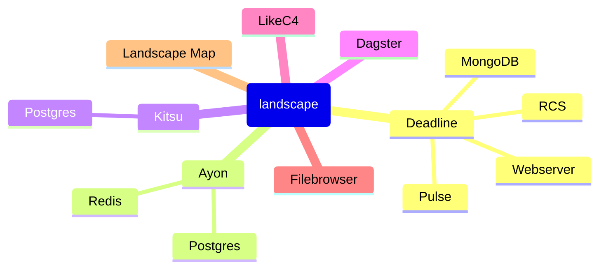

The hierarchy of multiple Landscapes
in the context of `studio-landscapes`:

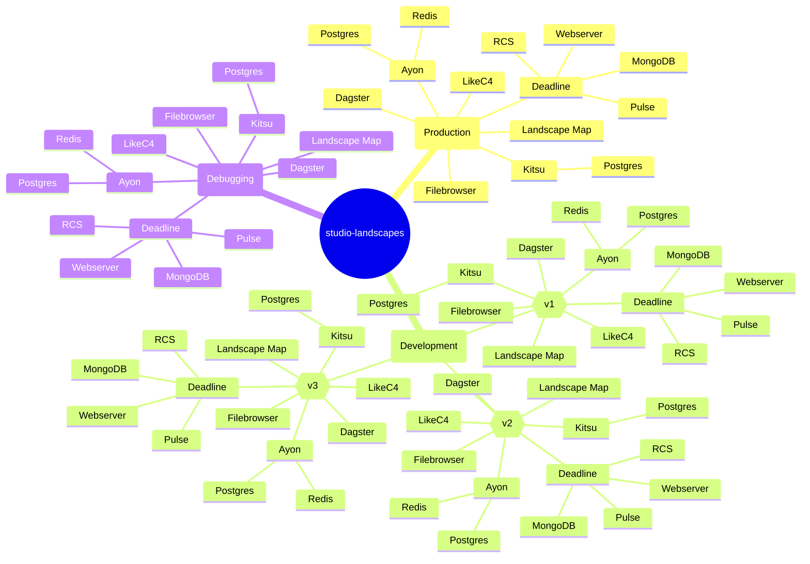

## Tested on

- Manjaro Linux

## About the Author

Michael Mussato
- [LinkedIn](https://www.linkedin.com/in/michael-mussato-815902190/)
- [IMDb](https://www.imdb.com/name/nm5961264/)

Former employers, among others:
- [Netflix Animation Studios](https://www.netflixanimation.com/)
- [Animal Logic](https://animallogic.com/)
- [Trixter](https://www.trixter.de/)
- Axis Animation
- [Elefant Studios](http://www.elefantstudios.ch/)

## Requirements

- `graphviz`
- `sshpass`
- `docker`
- `docker compose`
- `git`
- `python` (3.9 through 3.12)

## Limitations

### Deadline

Currently only for Deadline version 10.2. 
Versions 10.3 and 10.4 are WIP and will be
implemented as soon as 10.2 fully works as
a proof of concept.

Todo:
- [ ] Deadline 10.3
- [ ] Deadline 10.4

### VFX Platform

Integration of VFX Platform compatibility 
is on the roadmap.

Todo:
- [ ] VFX Platform integration

## Secrets

There are many ways to protect sensitive data.
It is `studio-landscapes` does not provide a dedicated solution
to protect your secrets - it lets (and wants you to) implement 
your own solution or use existing ones if you have something
implemented already.

However, I do have sensitive data myself and I would like to 
quickly present my approach to you here. I'm not a security 
engineer, hence, I'm coming up with my personal (very basic)
terminology.

I'm suggesting three levels of secrecy, although I'm
only using two in practice:
- Personal
  - > Secrets that only certain individuals can know
- Internal
  - > Secrets that all individuals within an entity can know
      but not the outside world
- Public
  - > Everything that comes with the public `michimussato/studio-landscapes`
      Git repository

### Personal Secrets

I'm not concerned about this level of secrecy in my environment.
Integrate/implement your own solution or make suggestions.

### Internal Secrets

I'm protecting secrets from the outside world which need to 
be part of the Git repo (version controlled). I've had
very good experience using `git-crypt` which transparently
encrypts files and directories based on a `.gitattributes`
file. The contents of those files are in clear text as
long as the local clone has the key.

My `.gitattributes` file looks as follows:

```
# files starting with __SECRET__
__SECRET__* filter=git-crypt diff=git-crypt
.env filter=git-crypt diff=git-crypt

# folders starting with __SECRET__
*/__SECRET__*/** filter=git-crypt diff=git-crypt
```

You get the idea.

#### Workflow "encrypt"

1. Clone Repo
   ```
   git clone repo
   ```
2. Init `git-crypt`
   ```
   cd repo
   git-crypt init
   ```
3. Export Key
   ```
   git-crypt export-key keyfile.key
   ```
4. Create Filter (`.gitattribtes`)
5. Push Filter
6. Add secrets
7. Push

#### Workflow "unlock"

1. Clone Repo
   ```
   git clone repo
   ```
2. Unlock Repo
   ```
   cd repo
   git-crypt unlock /path/to/keyfile.key
   ```

#### Remove git History of a Secrets file

Requirements:
- `bfg` (https://rtyley.github.io/bfg-repo-cleaner/)

- backup secrets file
- remove secrets file from local repo, commit and push
- `bfg --delete-files __SECRET__* /path/to/repo/.git`
- `git reflog expire --expire=now --all && git gc --prune=now --aggressive`
- `git push --force`

Re-add secrets file with `.gitattributes` filter in place,
commit and push.

More info: https://github.com/AGWA/git-crypt

### Public

You clone (or fork-clone) the repo, make your modification and
push everything publicly.

## Integrated Tools

- [docker-graph](https://github.com/michimussato/docker-graph)
- [deadline-wrapper](https://github.com/michimussato/deadline-wrapper)

### Render Manager

There are a multitude of managers available
and I had to make a decision to begin with. 
In general, `studio-landscapes` has the 
capability to support arbitrary managers, 
however, as of now, only Deadline is considered
integrated. The decision to go with Deadline
was based on the following specs:

- Cross Platform
- Feature rich
- Production proven
- Freely available (not necessarily OSS)
- Scalability (locally and into the cloud)
- Active Development
- Local (no exclusive cloud rendering)
- Python (Python API)
- DCC agnostic

Here's a non-exhaustive list of managers in
comparison:

| Render Manager | Integrated | Cross Platform | Freely Available | Scalability (local and cloud) | Active Development | Local    | Python API | DCC agnostic |
|----------------|------------|----------------|------------------|-------------------------------|--------------------|----------|------------|--------------|
| Deadline 10.x  | &#x2611;   | &#x2611;       | &#x2611;         | &#x2611;                      |                    | &#x2611; | &#x2611;   | &#x2611;     |
| OpenCue        | &#x2610;   |                |                  |                               | &#x2610;           |          |            |              |
| Tractor        | &#x2610;   |                | &#x2610;         |                               |                    |          |            |              |
| Flamenco       | &#x2610;   |                |                  |                               |                    |          |            | &#x2610;     |
| RoyalRender    | &#x2610;   |                |                  |                               |                    |          |            |              |
| Qube!          | &#x2610;   |                | &#x2610;         |                               |                    |          |            |              |
| AFANASY        | &#x2610;   |                |                  |                               |                    |          |            |              |
| Muster         | &#x2610;   |                |                  |                               |                    |          |            |              |


### 3rd Party

- [Dagster](https://dagster.io/)
- [LikeC4](https://likec4.dev/)
- [Kitsu](https://kitsu.cg-wire.com/)
- [Ayon](https://ayon.ynput.io/)
- [mongo-express](https://hub.docker.com/_/mongo-express)
- [filebrowser/filebrowser](https://hub.docker.com/r/filebrowser/filebrowser)

## Dagster Lineage


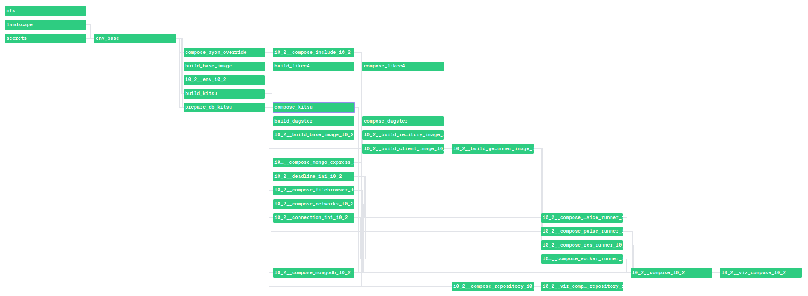

## Docker Compose Graph

Dynamic Docker Compose documentation: 
`docker-graph` creates a visual representation of
`docker-compose.yml` files for every individual
Landscape for quick reference and context.

Todo:
- [ ] LikeC4-Map

### Deadline 10.2

`.docker/landscapes/2025-01-22_12-40-25__1737549625.8644402/10_2/docker_compose/compose_10_2/docker-compose.yml`

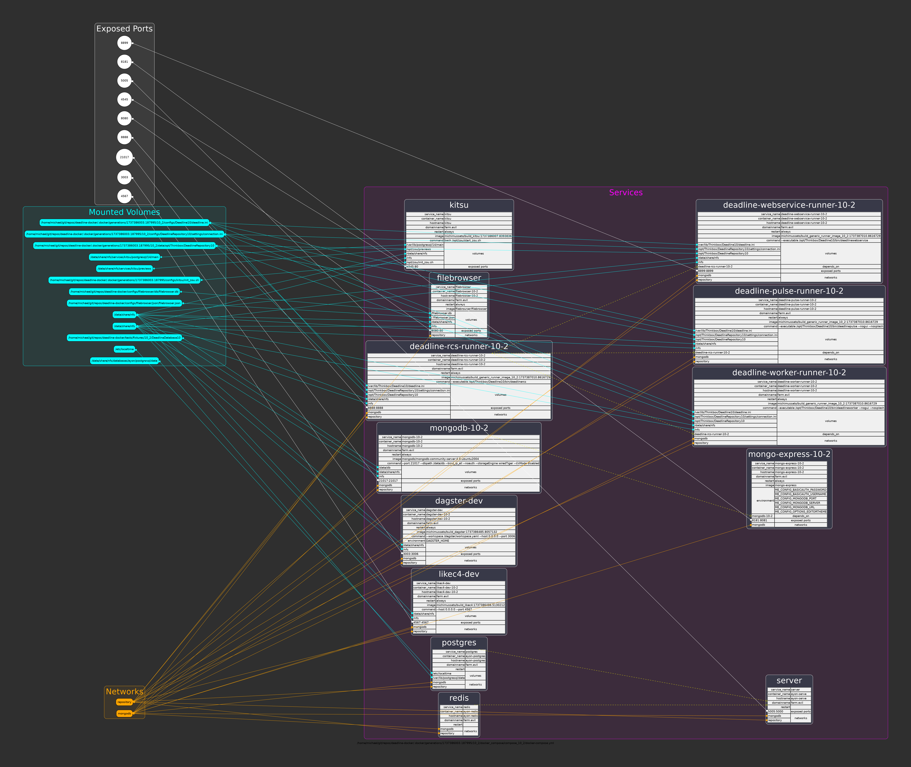

### Repository-Installer 10.2

`.docker/landscapes/2025-01-22_12-40-25__1737549625.8644402/10_2/docker_compose/compose_repository_10_2/docker-compose.yml`

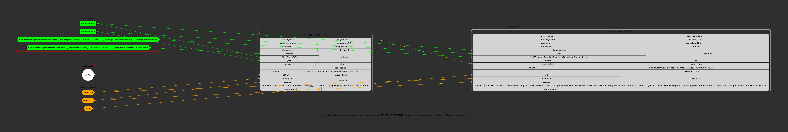

## Clone

```shell
git clone https://github.com/michimussato/studio-landscapes.git
cd studio-landscapes
python3 -m venv .venv
source .venv/bin/activate
python -m pip install --upgrade pip setuptools
pip install -e .[dev]
```

## Install

### venv

```shell
python3 -m venv .venv
source .venv/bin/activate
python -m pip install --upgrade pip setuptools
```

### studio-landscapes

```shell
python -m pip install git+https://github.com/michimussato/studio-landscapes.git@main
```

## Create Landscape

### Launch Dagster

```shell
cd ~/git/repos/studio-landscapes
source .venv/bin/activate
export DAGSTER_HOME="$(pwd)/dagster/materializations"
dagster dev --workspace "$(pwd)/dagster/workspace.yaml" --host 0.0.0.0 --port 3000
```

http://0.0.0.0:3000

### Configure Landscape

Edit `studio_landscapes.assets.env_base` and 
`studio_landscapes.assets.env_10_2` according to your needs.

### Materialize Landscape


#### Resulting Files and Directories (aka "Landscape")

```shell
$ tree .docker/landscapes/2025-01-22_12-40-25__1737549625.8644402
.docker/landscapes/2025-01-22_12-40-25__1737549625.8644402
├── 10_2
│   ├── configs
│   │   ├── Deadline10
│   │   │   └── deadline.ini
│   │   └── DeadlineRepository10
│   │       └── settings
│   │           └── connection.ini
│   ├── data
│   │   └── opt
│   │       └── Thinkbox
│   │           └── DeadlineDatabase10
│   ├── docker_compose
│   │   ├── compose_10_2
│   │   │   ├── docker-compose.yml
│   │   │   └── viz_compose_10_2
│   │   │       ├── viz_compose_10_2.dot
│   │   │       └── viz_compose_10_2.png
│   │   └── compose_repository_10_2
│   │       ├── docker-compose.yml
│   │       └── viz_compose_repository_10_2
│   │           ├── viz_compose_repository_10_2.dot
│   │           └── viz_compose_repository_10_2.png
│   ├── Dockerfiles
│   │   ├── build_base_image_10_2
│   │   │   └── Dockerfile
│   │   ├── build_client_image_10_2
│   │   │   └── Dockerfile
│   │   ├── build_generic_runner_image_10_2
│   │   │   └── Dockerfile
│   │   └── build_repository_image_10_2
│   │       └── Dockerfile
│   ├── env_10_2.json
│   └── scripts
│       └── compose_mongodb_10_2
│           └── compose_mongodb_10_2__chown__vupr52ix.sh
├── configs
│   └── kitsu
│       └── init_zou.sh
├── data
│   └── kitsu
│       ├── postgresql
│       │   └── 14
│       │       └── main  [error opening dir]
│       └── previews
├── Dockerfiles
│   └── build_base_image
│       └── Dockerfile
└── env_base.json

32 directories, 17 files
```

## Run Repository Installer

Copy/Paste command, execute and wait for it to finish:

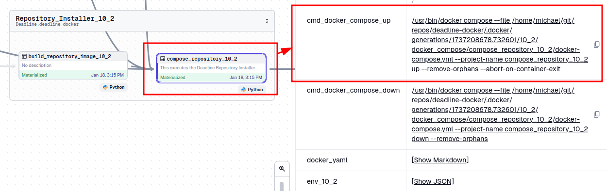

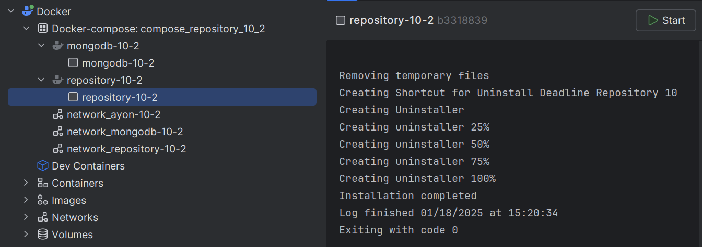

And `docker compose down` eventually:

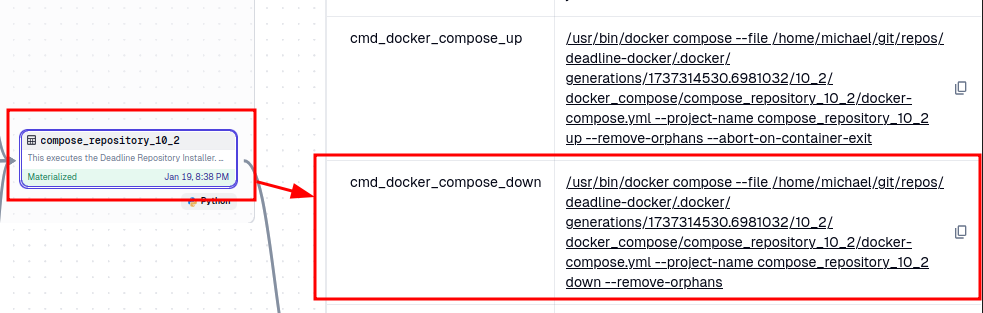

## Run Deadline Farm

Together with:
- Kitsu
- Ayon
- Dagster
- LikeC4
- ...

Copy/Paste command and execute:

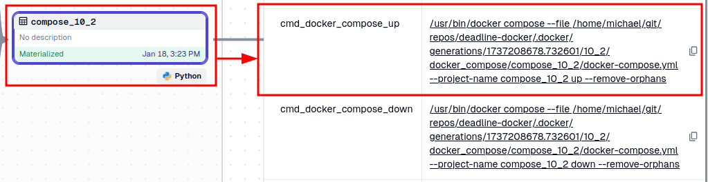

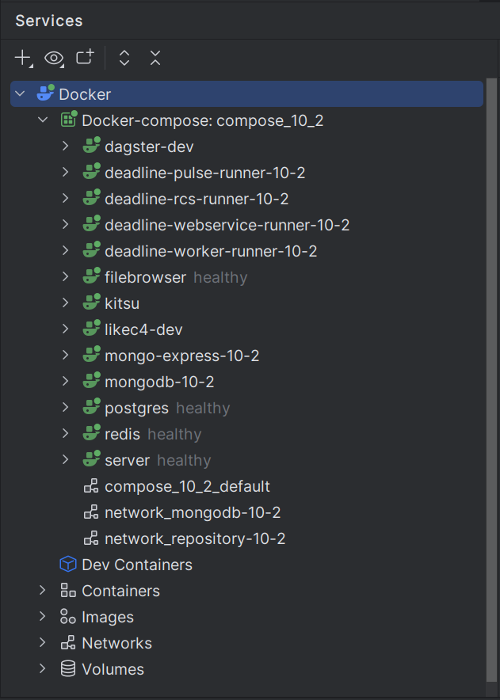

## Client

### Deadline Monitor


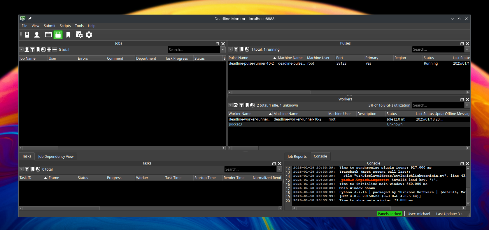

## Docker

### Clean

```shell
docker stop $(docker ps -q)
docker container prune -f
docker image prune -a -f
docker volume prune -a -f
docker buildx prune -f
docker network prune -f
```

## DeadlineDatabase10

### Use Test DB

Todo:
- Section still needed?

```shell
mkdir -p tests/fixtures/10_2/DeadlineDatabase10
tar -xzvf tests/fixtures/DeadlineDatabase10_2.tar.gz -C tests/fixtures/10_2/DeadlineDatabase10
sudo chown -R 101:65534 tests/fixtures/10_2/DeadlineDatabase10
```

And in `studio-landscapes.assets.env_10_2` set

```
f"DATABASE_INSTALL_DESTINATION_{context.asset_key.path[0]}": pathlib.Path(
      f"~/git/repos/studio-landscapes/tests/fixtures/{context.asset_key.path[0]}/DeadlineDatabase10",
  ).expanduser().as_posix()
```

## Git Repos

Todo:

