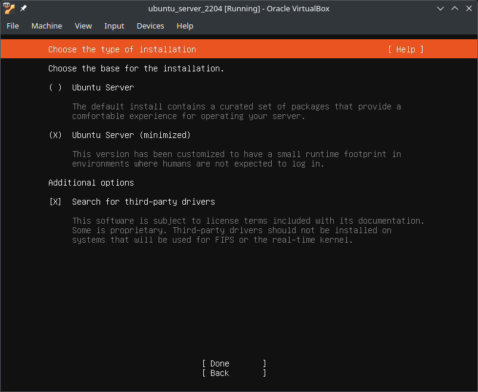
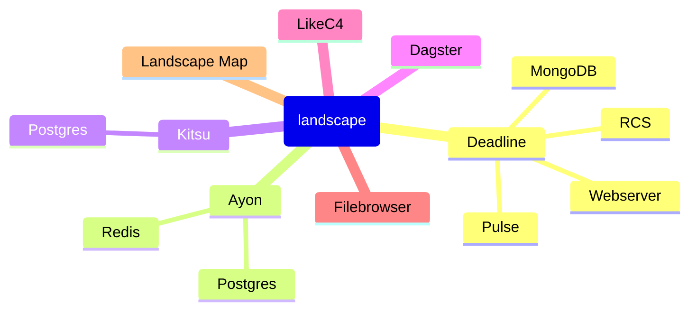
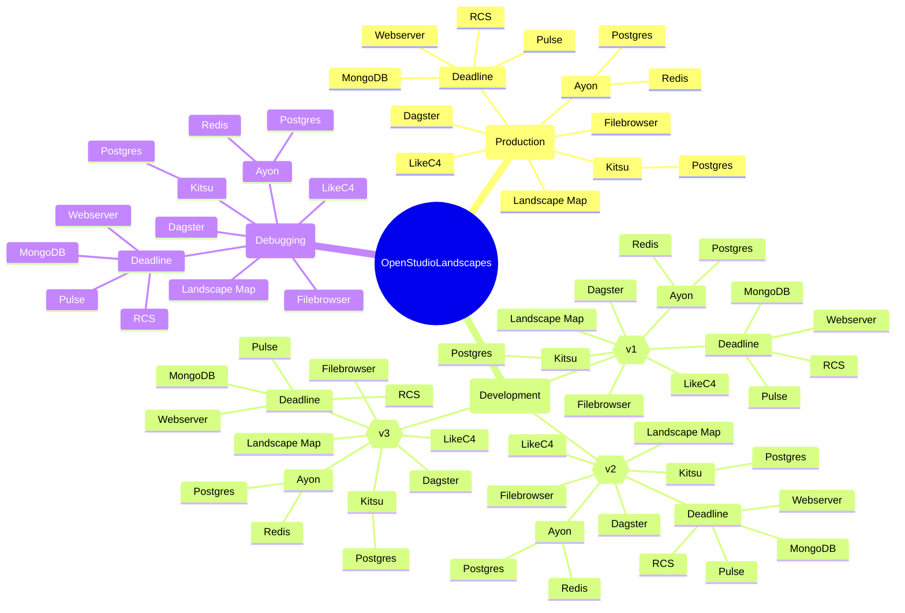

---

<!-- TOC -->
* [OpenStudioLandscapes](#openstudiolandscapes)
  * [Disclaimer](#disclaimer)
  * [About the Author](#about-the-author)
  * [Community](#community)
  * [Brief](#brief)
  * [Quickstart](#quickstart)
    * [Ubuntu Desktop](#ubuntu-desktop)
      * [22.04](#2204)
        * [Desktop](#desktop)
        * [Server](#server)
        * [Requirements](#requirements)
        * [Installation](#installation)
        * [Configure Features](#configure-features)
        * [Run OpenStudioLandscapes](#run-openstudiolandscapes)
  * [Terminology](#terminology)
  * [Structure](#structure)
  * [Requirements](#requirements-1)
  * [Limitations](#limitations)
    * [Render Farms](#render-farms)
      * [Deadline](#deadline)
    * [VFX Platform](#vfx-platform)
  * [Overview](#overview)
    * [Features](#features)
      * [Render Manager](#render-manager)
    * [Dagster Lineage](#dagster-lineage)
    * [Docker Compose Graph](#docker-compose-graph)
    * [Create Landscape](#create-landscape)
      * [Materialize Landscape](#materialize-landscape)
    * [Run Deadline Farm](#run-deadline-farm)
    * [Client](#client)
      * [Deadline Monitor](#deadline-monitor)
  * [nox](#nox)
    * [Current Sessions](#current-sessions)
    * [Python Versions](#python-versions)
    * [SBOM](#sbom)
      * [Python 3.11](#python-311)
      * [Python 3.12](#python-312)
* [Roadmap/Todo](#roadmaptodo)
<!-- TOC -->

---

# OpenStudioLandscapes

## Disclaimer

I'm not 
- a Software Architect
- a Systems Engineer
- a Bash Guru
- a Python Master
by any means.

However, I often did find myself (as a TD) in a juggling - sometimes fun and 
sometimes less fun - game within those realms. This is exactly
where and why this story started.

I tried to apply my very limited knowledge about Python Packaging, Docker Containers,
Git, Linux Shell etc. etc. so I'm sure you might find one or the other 
quirk that is not best practice. If you do, don't hesitate to reach out, 
point it out and suggest a better way to do it.

OpenStudioLandscapes, as such, is not a GUI application. If you don't have
(or are not willing to gain) some basic Linux shell and/or Python skills you might 
struggle a bit - especially in the beginning. 
However, the goal of this project is that everyone *should* be able to 
overcome technical difficulties and to get a Landscape up and running 
in a small amount of time - with guidance, video tutorials and (once 
established) the community.

This project is built using Dagster. Hence, getting familiar with
some Dagster basics is recommended (if not required). Check
out Dagster Labs' [Dagster Essentials](https://courses.dagster.io/courses/dagster-essentials).

This also applies to contributions: Dagster familiarity is a requirement when it 
comes to understanding the structure. However, if you find ways to improve the 
project also in Dagster-unrelated ways, don't hesitate to make a suggestion.

## About the Author

Michael Mussato
- [LinkedIn](https://www.linkedin.com/in/michael-mussato-815902190/)
- [IMDb](https://www.imdb.com/name/nm5961264/)

Former employers, among others:
- [Netflix Animation Studios](https://www.netflixanimation.com/)
- [Animal Logic](https://animallogic.com/)
- [Trixter](https://www.trixter.de/)
- Axis Animation
- [Elefant Studios](http://www.elefantstudios.ch/)

## Community

- [LinkedIn](https://www.linkedin.com/company/106731439/)
  - [#OpenStudioLandscapes](https://www.linkedin.com/search/results/all/?keywords=%23openstudiolandscapes)
- [Discord](https://discord.com/channels/1357343453364748419/1357343454065328202)
- [Slack](https://openstudiolandscapes.slack.com)

## Brief

Setup and launch custom production environments
with Render Farm, Production Tracking, Automation
and more - your 3D Animation
and VFX Pipeline backbone - with ease, independence
and scalability!
The way YOU want it!
YOU only!
Exactly!

An open source toolkit - a declarative build system - to
easily create reproducible production environments based
on your studio (even down to per production) needs: 
create Landscapes for production,
testing, debugging, development,
migration, DB restore etc.


No more black boxes.
No more path dependencies due to bad decisions
made in the past. Stay flexible and adaptable
with this modular and declarative system by reconfiguring
any production environment with ease:
- ✅ Easily add, edit, replace or remove services
- ✅ Clone (or modify and clone) entire production Landscapes for testing, debugging or development
- ✅ Code as source of truth:
  - ✅ Always stay on top of things with Landscape Maps and node tree representations of Python code
  - ✅ Limit manual documentation to a bare minimum
- ✅ `OpenStudioLandscapes` is (primarily) powered by [Dagster](https://github.com/dagster-io/) and [Docker](https://github.com/docker)
- ✅ Fully Python based
- ✅ Build your studio automation on top of your studio services
  - ✅ not the other way around
  - ✅ share your studio automation (scripts, packages) among Landscapes
- ✅ Do you like project based studio services?
  - ✅ No problem with OpenStudioLandscapes

This platform is aimed towards small to medium-sized
studios where only limited resources for Pipeline
Engineers and Technical Directors are available.
This system allows those studios to share a common
underlying system to build arbitrary pipeline tools
on top with the ability to share them among others
without sacrificing the technical freedom to implement
highly studio specific and individual solutions if needed.

The scope of this project are users with some technical skills with a
desire for a pre-made solution to set up their production
services and environments. OpenStudioLandscapes is therefore
a somewhat opinionated solution for working environments that
lack the fundamental skills and/or budgets to write a solution like
OpenStudioLandscapes by themselves while being flexible enough
for everyone *with* the technical skills to make their way through
configuring a Landscape or even writing their own OpenStudioLandscapes
Features for custom or proprietary services to fully fit their needs.

I guess this is a good starting point to open the project up to
the animation and VFX community to find out where (or where else) 
exactly the needs are to make sure small studios keep growing 
in a (from a technical perspective) healthy way without ending up
in a high "tech dept" dead end.

What problem does OpenStudioLandscapes solve?

What's separating the men from the boys is the production back bone.
Large studios spent years and years of man (and woman) hours and
millions of dollars to build robust automation to support their 
production while smaller ones are (in those regards - no matter
how recent and advanced the tools they use are) decades behind.
So, in one sense, OpenStudioLandscapes is a time machine by giving you 
the ability to jump a few years ahead of yourself by giving you a 
pre-made production environment at zero cost.

The second problem it is trying to solve is one that you (as a small
company) do not have **yet**. Ideally, before you start thinking about
automating processes, you want to have a robust underlying system. 
However, what usually happens is that
studios build their systems (again, while they are still small with no 
budget and/or understanding for professional automation) the other way around:
they write their small scripts and build everything else on top of that. This
almost inevitably leads to tech dept in the future after growth has happened - 
a house of cards built upside down. So, you wanna replace or remove your
old little script that you wrote 5 years ago which is being used in so many
places you can't even remember? There you have it. Better don't touch it. Better
continue building your system around it. Right? Wrong! OpenStudioLandscapes
is here to change that by making sure your future you is not going to 
regret decisions of its past you!

## Quickstart

The setup script **WILL** change your system. 
It is recommended you start with a vanilla OS.

For now, the `OpenStudioLandscapes` installer _officially_ only supports
Ubuntu Desktop 22.04. More Linux distros will come based on requests.

| Distro  | Base   | Version | Tested | Supported |
|---------|--------|---------|--------|-----------|
| Ubuntu  | Debian | 22.04   | ☑      | ☑         |
| Manjaro | Arch   |         | ☒      | ☐         |
|         |        |         |        |           |

[//]: # (☑)
[//]: # (☐)
[//]: # (☒)

### Ubuntu Desktop

> [!NOTE] 
> The installation process can be time-consuming. Tests show that 
> the setup routine will download between 2-3 GB of data.
> And this applies only to the basic installation. Using
> OpenStudioLandscapes implies even more data transfers.

#### 22.04

##### Desktop


If you see the following, select all except `none of the above`:

```
Restarting services...
Daemons using outdated libraries
--------------------------------

  1. dbus.service                 5. ssh.service
  2. multipathd.service           6. systemd-logind.service
  3. networkd-dispatcher.service  7. user@1000.service
  4. polkit.service               8. none of the above

(Enter the items or ranges you want to select, separated by spaces.)

Which services should be restarted? 1-7
```

##### Server



##### Requirements

```bash
sudo apt-get install -y curl python3 sudo
```

##### Installation

```bash
python3 <(curl --header 'Cache-Control: no-cache, no-store' --silent https://raw.githubusercontent.com/michimussato/OpenStudioLandscapes-Temp/refs/heads/main/ubuntu/22.04/install_ubuntu_2204.py)
# Todo:
#  - [ ] python3 <(curl --header 'Cache-Control: no-cache, no-store' --silent https://raw.githubusercontent.com/michimussato/OpenStudioLandscapes/refs/heads/main/ubuntu/22.04/install_ubuntu_2204.py)
```

> [!IMPORTANT]
> The first thing the installer checks is whether `$USER` is a member of the group `docker`.
> If the user isn't, the installer makes sure the user is. It is **mandatory** to perform
> a reboot after that. Otherwise, the installer will produce errors when installing 
> the latest Docker binaries. Just reboot here if you are being asked to and 
> then re-run above command.

Go through the setup process all the way to the end and reboot your machine.
Log in with the user who performed the installation.

##### Configure Features

By default, only
- `OpenStudioLandscapes-Dagster`
- `OpenStudioLandscapes-Ayon`
- `OpenStudioLandscapes-Kitsu`
are enabled. Others might need individual configuration
and do not work out of the box. More info in the
`README.md` files of the Feature.

Nevertheless, whether a Feature is enabled or not can be 
specified in:
`OpenStudioLandscapes.engine.constants.FEATURES`

##### Run OpenStudioLandscapes

```bash
openstudiolandscapes
```

Open the Dagster UI: [http://<ip_openstudiolandscapes_host>:3000/asset-groups]()

Next steps:
- [Understanding the Daster Linage](#dagster-lineage)
- [Landscape Map: `docker-compose-graph`](#docker-compose-graph)
- [Create Landscape](#create-landscape)

## Terminology

| **Term**            | **Explanation**                                                                                                                                                                                                                      |
|---------------------|--------------------------------------------------------------------------------------------------------------------------------------------------------------------------------------------------------------------------------------|
| **Landscape**       | A Landscape is an arbitrary composition of services.                                                                                                                                                                                 |
| **Feature**         | A Feature is a discoverable extension (module) for OpenStudioLandscapes. A Landscape is made of one or more Features.                                                                                                                |
| **Registry**        | Registry is a repository where `docker` can push to and pull from. OpenStudioLandscapes relies on a local Harbor installation as its registry.                                                                                       |
| **Compose Context** | A Landscape can be broken up into multiple Compose Contexts. For example, a render client will run on a different machine than the render manager - they are part of the same Langscape but belong to separate docker compose files. |
| **Landscape Map**   | [docker-compose-graph](#docker-compose-graph) is a `pip` installable package to turn `docker-compose.yaml` files into Graphviz diagrams, which, in turn, is a Landscape Map.                                                         |


## Structure

The structure of a Landscape:



The hierarchy of multiple Landscapes
in the context of `OpenStudioLandscapes`:



## Requirements

- `python3`
- `curl`
- `sudo`

## Limitations

### Render Farms

The only farm management software that is
currently implemented is Deadline. Others
(as per [this table](#render-manager)) are
(potentially) on the roadmap.

#### Deadline

Currently only for Deadline version 10.2.
Versions 10.3 and 10.4 are WIP and will be
implemented as soon as 10.2 fully works as
a proof of concept.

### VFX Platform

System specification as per VFX Platform compatibility
is on the roadmap.

## Overview

### Features

| Feature                                      | Repository                                                                       | Vendor                                                                                               |
|----------------------------------------------|----------------------------------------------------------------------------------|------------------------------------------------------------------------------------------------------|
| OpenStudiolandscapes-Ayon                    | [https://github.com/michimussato/OpenStudioLandscapes-Ayon]()                    | [Ayon](https://ayon.ynput.io/)                                                                       |
| OpenStudiolandscapes-Dagster                 | [https://github.com/michimussato/OpenStudioLandscapes-Dagster]()                 | [Dagster](https://dagster.io/)                                                                       |
| OpenStudiolandscapes-Deadline-10-2           | [https://github.com/michimussato/OpenStudioLandscapes-Deadline-10-2]()           | [Deadline 10.2](https://docs.thinkboxsoftware.com/products/deadline/10.2/1_User%20Manual/index.html) |
| OpenStudiolandscapes-Deadline-10-2-Worker    | [https://github.com/michimussato/OpenStudioLandscapes-Deadline-10-2-Worker]()    | [Deadline 10.2](https://docs.thinkboxsoftware.com/products/deadline/10.2/1_User%20Manual/index.html) |
| OpenStudiolandscapes-filebrowser             | [https://github.com/michimussato/OpenStudioLandscapes-filebrowser]()             | [filebrodockerwser/filebrowser](https://hub.docker.com/r/filebrowser/filebrowser)                    |
| OpenStudiolandscapes-Grafana                 | [https://github.com/michimussato/OpenStudioLandscapes-Grafana]()                 | [Grafana](https://grafana.com/)                                                                      |
| OpenStudiolandscapes-Kitsu                   | [https://github.com/michimussato/OpenStudioLandscapes-Kitsu]()                   | [Kitsu](https://kitsu.cg-wire.com/)                                                                  |
| OpenStudiolandscapes-LikeC4                  | [https://github.com/michimussato/OpenStudioLandscapes-LikeC4]()                  | [LikeC4](https://likec4.dev/)                                                                        |
| OpenStudiolandscapes-NukeRLM-8               | [https://github.com/michimussato/OpenStudioLandscapes-NukeRLM-8]()               | [NukeRLM-8](https://learn.foundry.com/licensing/Content/local-licensing.html)                        |
| OpenStudiolandscapes-OpenCue                 | [https://github.com/michimussato/OpenStudioLandscapes-OpenCue]()                 | [OpenCue](https://www.opencue.io/)                                                                   |
| OpenStudiolandscapes-SESI-gcc-9-3-Houdini-20 | [https://github.com/michimussato/OpenStudioLandscapes-SESI-gcc-9-3-Houdini-20]() | [SESI Houdini 20](https://www.sidefx.com/docs/houdini/ref/utils/sesinetd.html)                       |
| OpenStudiolandscapes-Syncthing               | [https://github.com/michimussato/OpenStudioLandscapes-Syncthing]()               | [Syncthing](https://github.com/syncthing/syncthing/blob/main/README-Docker.md)                       |
| OpenStudiolandscapes-Watchtower              | [https://github.com/michimussato/OpenStudioLandscapes-Watchtower]()              | [Watchtower](https://watchtower.blender.org/)                                                        |

#### Render Manager

There are a multitude of managers available
and I had to make a decision to begin with.
In general, `OpenStudioLandscapes` has the
capability to support arbitrary managers,
however, as of now, only Deadline is considered
integrated. The decision to go with Deadline
was based on the following specs:

- Cross Platform
- Feature rich
- Production proven
- Freely available (not necessarily OSS)
- Scalability (locally and into the cloud)
- Active Development
- Local (no exclusive cloud rendering)
- Python (Python API)
- DCC agnostic

Here's a non-exhaustive list of managers in
comparison:

| Render Manager | Feature Available | Cross Platform | Freely Available | Scalability (local and cloud) | Active Development | Local | Python API | DCC agnostic |
|----------------|-------------------|----------------|------------------|-------------------------------|--------------------|-------|------------|--------------|
| Deadline 10.x  | ✅                 | ✅              | ✅                | ✅                             | ❌                  | ✅     | ✅          | ✅            |
| OpenCue        | ✅                 | ☐              | ✅                | ☐                             | ❌                  | ✅     | ✅          | ✅            |
| Tractor        | ❌                 | ☐              | ❌                | ☐                             | ☐                  | ☐     | ☐          | ☐            |
| Flamenco       | ❌                 | ☐              | ☐                | ☐                             | ☐                  | ☐     | ☐          | ❌            |
| RoyalRender    | ❌                 | ☐              | ☐                | ☐                             | ☐                  | ☐     | ☐          | ☐            |
| Qube!          | ❌                 | ☐              | ❌                | ☐                             | ☐                  | ☐     | ☐          | ☐            |
| AFANASY        | ❌                 | ☐              | ☐                | ☐                             | ☐                  | ☐     | ☐          | ☐            |
| Muster         | ❌                 | ☐              | ☐                | ☐                             | ☐                  | ☐     | ☐          | ☐            |

### Dagster Lineage


### Docker Compose Graph

Dynamic Docker Compose documentation:
[docker-compose-graph](https://github.com/michimussato/docker-compose-graph) creates a visual representation of
`docker-compose.yml` files for every individual
Landscape for quick reference and context.

For individual elements of a Landscape (Features)

`.landscapes/2025-02-01_00-11-08__578595276b424d1ea62550cb0b6f166f/Deadline_10_2/docker_compose/Deadline_10_2__compose_repository_10_2/docker-compose.yml`


as well as for the entire Landscape

`.landscapes/2025-02-01_00-11-08__578595276b424d1ea62550cb0b6f166f/Deadline_10_2/docker_compose/Deadline_10_2__compose_10_2/docker-compose.yml`


### Create Landscape

#### Materialize Landscape


### Run Deadline Farm

Together with:
- Kitsu
- Ayon
- Dagster
- LikeC4
- ...

Copy/Paste command and execute:


### Client

#### Deadline Monitor


## nox

```shell
nox --help
```

### Current Sessions

```shell
OpenStudioLandscapes git:[main]
nox --list-sessions
Sessions defined in OpenStudioLandscapes/noxfile.py:

- clone_features -> `git clone` all listed (REPOS_FEATURE) Features into .features. Performs `git pull` if repos already exist.
- readme_all -> Create README.md for all listed (REPOS_FEATURE) Features.
- stash_features -> `git stash` all listed (REPOS_FEATURE) Features.
- stash_apply_features -> `git stash apply` all listed (REPOS_FEATURE) Features.
- pull_engine -> `git pull` engine.
- stash_engine -> `git stash` engine.
- stash_apply_engine -> `git stash apply` engine.
- create_venv_features -> Create a `venv`s in .features/<Feature> after `nox --session clone_features` and installing the Feature into its own `.venv`.
- install_features_into_engine -> Installs the Features after `nox --session clone_features` into the engine `.venv`.
- fix_hardlinks_in_features -> See https://github.com/michimussato/OpenStudioLandscapes?tab=readme-ov-file#hard-links-sync-files-and-directories-across-repositories-de-duplication
- pi_hole_up -> Start Pi-hole in attached mode.
- pi_hole_prepare -> Prepare Pi-hole in attached mode.
- pi_hole_clear -> Clear Pi-hole with `sudo`. WARNING: DATA LOSS!
- pi_hole_up_detach -> Start Pi-hole in detached mode.
- pi_hole_down -> Shut down Pi-hole.
- harbor_prepare -> Prepare Harbor with `sudo`.
- harbor_clear -> Clear Harbor with `sudo`.
- harbor_up -> Start Harbor with `sudo` in attached mode.
- harbor_up_detach -> Start Harbor with `sudo` in detached mode.
- harbor_down -> Stop Harbor with `sudo`.
- dagster_postgres_up -> Start Postgres backend for Dagster in attached mode.
- dagster_postgres_clear -> Clear Dagster-Postgres with `sudo`. WARNING: DATA LOSS!
- dagster_postgres_up_detach -> Start Postgres backend for Dagster in detached mode.
- dagster_postgres_down -> Shut down Postgres backend for Dagster.
- dagster_postgres -> Start Dagster with Postgres as backend after `nox --session dagster_postgres_up_detach`.
- dagster_mysql -> Start Dagster with MySQL as backend (not recommended).
* sbom-3.11 -> Runs Software Bill of Materials (SBOM).
* sbom-3.12 -> Runs Software Bill of Materials (SBOM).
* coverage-3.11 -> Runs coverage
* coverage-3.12 -> Runs coverage
* lint-3.11 -> Runs linters and fixers
* lint-3.12 -> Runs linters and fixers
* testing-3.11 -> Runs pytests.
* testing-3.12 -> Runs pytests.
* readme -> Generate dynamically created README.md file for OpenStudioLandscapes modules.
- release-3.11 -> Build and release to a repository
- release-3.12 -> Build and release to a repository
* docs -> Creates Sphinx documentation.

sessions marked with * are selected, sessions marked with - are skipped.
```

### Python Versions

- `python3.11`
- `python3.12`

### SBOM

#### Python 3.11

- [cyclonedx-bom](https://github.com/michimussato/OpenStudioLandscapes/tree/main/.sbom/cyclonedx-py.sbom-3.11.json)
- [pipdeptree (Dot)](https://github.com/michimussato/OpenStudioLandscapes/tree/main/.sbom/pipdeptree.sbom-3.11.dot)
- [pipdeptree (Mermaid)](https://github.com/michimussato/OpenStudioLandscapes/tree/main/.sbom/pipdeptree.sbom-3.11.mermaid)

#### Python 3.12

- [cyclonedx-bom](https://github.com/michimussato/OpenStudioLandscapes/tree/main/.sbom/cyclonedx-py.sbom-3.12.json)
- [pipdeptree (Dot)](https://github.com/michimussato/OpenStudioLandscapes/tree/main/.sbom/pipdeptree.sbom-3.12.dot)
- [pipdeptree (Mermaid)](https://github.com/michimussato/OpenStudioLandscapes/tree/main/.sbom/pipdeptree.sbom-3.12.mermaid)

---

# Roadmap/Todo

- [ ] Landscape generation based on [VFX Reference Platform](https://vfxplatform.com/) spec?
- [ ] Integrating [Rez](https://github.com/AcademySoftwareFoundation/rez)?
- Integrating Render Managers
  - Deadline
    - [x] 10.2
    - [ ] 10.3
    - [ ] 10.4
  - [x] [OpenCue](https://github.com/AcademySoftwareFoundation/OpenCue)
  - [ ] [Tractor](https://rmanwiki-26.pixar.com/space/TRA)
  - [ ] [Flamenco](https://flamenco.blender.org/)
- Dynamic Documentation
  - [ ] [LikeC4-Map](https://likec4.dev/)
- Third Party Container Integration
  - [x] [Watchtower](https://watchtower.blender.org/)
- [ ] Implement Caddy for HTTPS
  - https://caddyserver.com/
  - https://github.com/caddyserver/caddy
  - https://hub.docker.com/_/caddy
- [x] Create a `.blend` video template file
      for screen recordings.
- [ ] A weekly video with instructions
- [x] Integrate Harbor
- [ ] Clean up this `README.md`
  - Separate Readme from Documentation (Sphinx)
- [ ] Implement tests (`noxfile.py`)
- [x] Improve Feature discovery
- [ ] Implement framework-wide terminology and glossary:
  - [x] "Feature"
  - [x] "Landscape"
  - [ ] "Engine"
- [ ] Jump-Start / Quick-Start
- [x] Separate README.md content
  - [x] Batch stuff to OpenStudioLandscapes README.md
  - [x] Non batch stuff (single lines) to Feature README.md
- [ ] Migrate to `pyproject.toml` exclusively?
- [x] Quote `pip install`s (`zsh: no matches found: .[dev]`)
  - `pip install ".[dev]"` works in `zsh`
- [ ] Make procedural `/home/michael/git/repos/OpenStudioLandscapes/.features` -> `{DOT_FEATURES}`:
  - From Kitsu README:
    ```
    KITSU_POSTGRES_CONF	str	/home/michael/git/repos/OpenStudioLandscapes/.features/OpenStudioLandscapes-Kitsu/.payload/config/etc/postgresql/14/main/postgresql.conf
    ```
- [x] Replace `python-on-whales` with something more lightweight/reliable
- [ ] Restrict Ubuntu 20.04 dependency to Deadline (the reason for this restriction
- [ ] Strategy to version control dynamically created files like
  - `.landscapes/.pi-hole/etc-pihole/pihole.toml`
  - `.dagster-postgres/dagster.yaml`
  - `.dagster-postgres/docker-compose.yml`
  - etc.
- [ ] Remove `SECRETS` and implement `.env` or something similar
- [x] Remove `michimussato@gmail.com` as default Kitsu account
- [ ] Add VPN Server?
- [x] Use Harbor API to create Project `openstudiolandscapes` by default
- [ ] Investigate OpenStudioLandscapes Docker image
- Linux Distro Installer
  - [x] Ubuntu Desktop 22.04
  - [ ] Ubuntu Server 22.04
