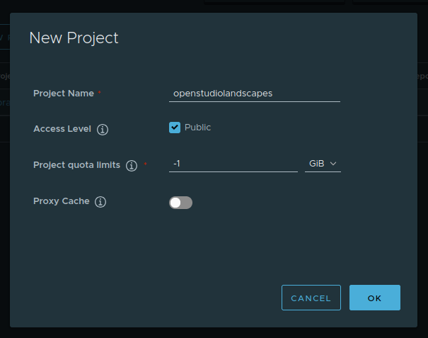
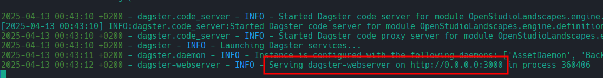
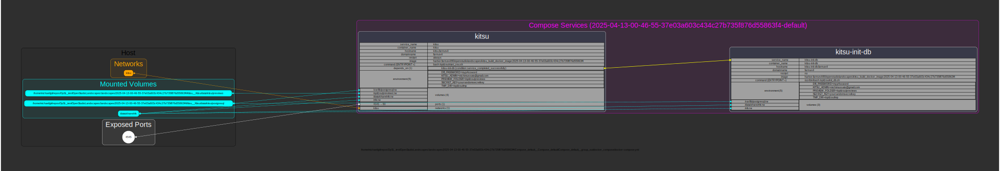
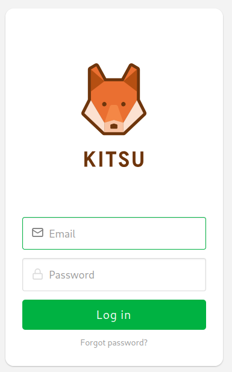
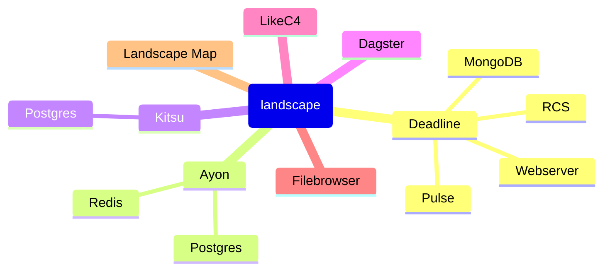
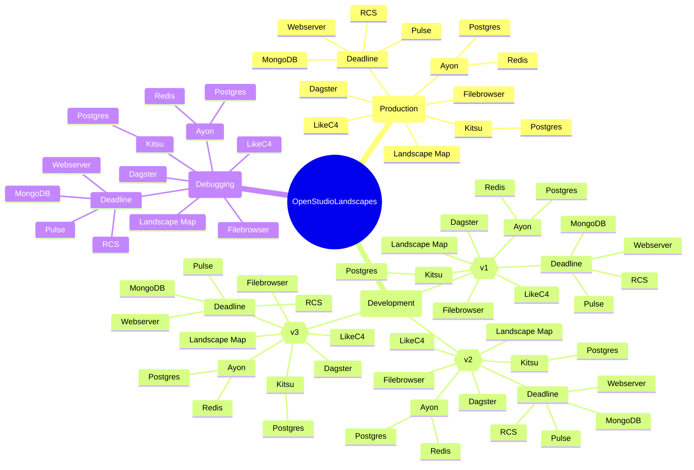
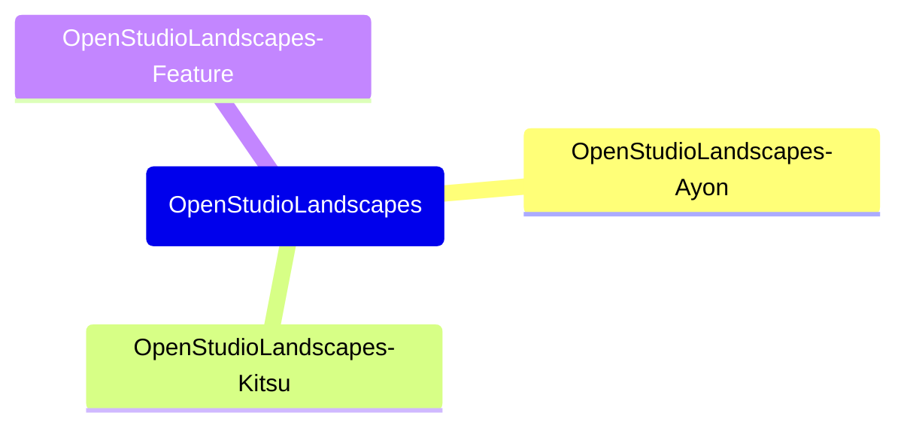

---

<!-- TOC -->
* [OpenStudioLandscapes](#openstudiolandscapes)
  * [TL;DR - Jump Start with Feature "OpenStudioLandscapes-Kitsu"](#tldr---jump-start-with-feature-openstudiolandscapes-kitsu)
  * [Brief](#brief)
  * [Terminology](#terminology)
  * [Structure](#structure)
  * [Tested on](#tested-on)
  * [About the Author](#about-the-author)
  * [Requirements](#requirements)
    * [Create `venv` with `nox`](#create-venv-with-nox)
    * [Pi-hole](#pi-hole)
      * [Installation](#installation)
        * [Prepare Pi-hole](#prepare-pi-hole)
        * [Run Pi-hole](#run-pi-hole)
        * [Shut down Pi-hole](#shut-down-pi-hole)
      * [Configure Pi-hole](#configure-pi-hole)
        * [Rate Limits](#rate-limits)
    * [Harbor](#harbor)
      * [Installation](#installation-1)
        * [Prepare Harbor](#prepare-harbor)
        * [Run Harbor](#run-harbor)
        * [Shut down Harbor](#shut-down-harbor)
      * [Configure Harbor](#configure-harbor)
        * [Create Project](#create-project)
        * [Harbor DNS](#harbor-dns)
        * [Trust Harbor Registry](#trust-harbor-registry)
      * [Upload Failures](#upload-failures)
    * [Dagster](#dagster)
    * [Ubuntu](#ubuntu)
      * [20.04](#2004)
        * [Python 3.11](#python-311)
      * [Manjaro](#manjaro)
        * [Official](#official)
        * [AUR](#aur)
  * [Limitations](#limitations)
    * [Render Farms](#render-farms)
      * [Deadline](#deadline)
    * [VFX Platform](#vfx-platform)
  * [Secrets](#secrets)
    * [Personal Secrets](#personal-secrets)
    * [Internal Secrets](#internal-secrets)
      * [Workflow "encrypt"](#workflow-encrypt)
      * [Workflow "unlock"](#workflow-unlock)
      * [Remove git History of a Secrets file](#remove-git-history-of-a-secrets-file)
    * [Public](#public)
  * [Overview](#overview)
    * [Integrated Tools](#integrated-tools)
      * [Render Manager](#render-manager)
      * [3rd Party](#3rd-party)
        * [Container Registry](#container-registry)
        * [Completed](#completed)
        * [WIP](#wip)
        * [Planned](#planned)
    * [Dagster Lineage](#dagster-lineage)
    * [Docker Compose Graph](#docker-compose-graph)
      * [Deadline 10.2](#deadline-102)
      * [Repository-Installer 10.2](#repository-installer-102)
    * [Clone](#clone)
    * [Install](#install)
      * [venv](#venv)
      * [OpenStudioLandscapes](#openstudiolandscapes-1)
      * [DeadlineDatabase10](#deadlinedatabase10)
        * [Use Test DB](#use-test-db)
    * [Create Landscape](#create-landscape)
      * [Launch Dagster](#launch-dagster)
      * [Launch Dagster Postgres](#launch-dagster-postgres)
      * [Configure Landscape](#configure-landscape)
      * [Materialize Landscape](#materialize-landscape)
        * [Resulting Files and Directories (aka "Landscape")](#resulting-files-and-directories-aka-landscape)
    * [Run Repository Installer](#run-repository-installer)
    * [Run Deadline Farm](#run-deadline-farm)
    * [Client](#client)
      * [Deadline Monitor](#deadline-monitor)
  * [Guides](#guides)
    * [Github: SSH Authentication](#github-ssh-authentication)
    * [Hard Links: Sync Files and Directories across Repositories (De-Duplication)](#hard-links-sync-files-and-directories-across-repositories-de-duplication)
    * [OBS Studio](#obs-studio)
      * [Background Removal](#background-removal)
      * [Load Settings](#load-settings)
        * [Profile](#profile)
        * [Scene Collection](#scene-collection)
    * [Docker](#docker)
      * [Clean](#clean)
    * [Blender](#blender)
      * [Masking](#masking)
  * [Community](#community)
  * [pre-commit](#pre-commit)
    * [Install](#install-1)
    * [Run](#run)
  * [nox](#nox)
    * [OpenStudioLandscapes Quick Start](#openstudiolandscapes-quick-start)
    * [Current Sessions](#current-sessions)
    * [Generate Report](#generate-report)
    * [Python Versions](#python-versions)
    * [Engine](#engine)
      * [Harbor](#harbor-1)
        * [harbor_up](#harbor_up)
        * [harbor_up_detach](#harbor_up_detach)
        * [harbor_prepare](#harbor_prepare)
        * [harbor_clear](#harbor_clear)
        * [harbor_down](#harbor_down)
      * [Pi Hole](#pi-hole-1)
        * [pi_hole_up](#pi_hole_up)
        * [pi_hole_up_detach](#pi_hole_up_detach)
        * [pi_hole_prepare](#pi_hole_prepare)
        * [pi_hole_clear](#pi_hole_clear)
        * [pi_hole_down](#pi_hole_down)
      * [Dagster](#dagster-1)
        * [MySQL](#mysql)
        * [Postgres](#postgres)
      * [SBOM](#sbom)
        * [Python 3.11](#python-311-1)
        * [Python 3.12](#python-312)
      * [Coverage](#coverage)
      * [Lint (pylint)](#lint-pylint)
      * [Testing (pytest)](#testing-pytest)
      * [Readme](#readme)
      * [Readme All](#readme-all)
      * [Release](#release)
      * [Docs](#docs)
    * [Batch Jobs (for Features)](#batch-jobs-for-features)
      * [Clone Features](#clone-features)
      * [Setup Feature-`venv` (`[dev]`)](#setup-feature-venv-dev)
      * [Generate README.md for Features](#generate-readmemd-for-features)
      * [nox Documentation](#nox-documentation)
      * [nox Report](#nox-report)
      * [Issues](#issues)
        * [Fix: `pip install -e "../OpenStudioLandscapes/[dev]"`](#fix-pip-install--e-openstudiolandscapesdev)
        * [Fix: Enable in `OpenStudioLandscapes.engine.constants`](#fix-enable-in-openstudiolandscapesengineconstants)
  * [Documentation (Sphinx)](#documentation-sphinx)
    * [Builders](#builders)
    * [Markdown Support](#markdown-support)
      * [Install `myst-parser`](#install-myst-parser)
    * [Mermaid Support](#mermaid-support)
    * [Graphviz Support](#graphviz-support)
      * [Install](#install-2)
      * [Embed Graphviz Graph](#embed-graphviz-graph)
      * [Reference Graphviz Graph](#reference-graphviz-graph)
  * [Development](#development)
    * [Adding new Python dependencies](#adding-new-python-dependencies)
    * [Unit testing](#unit-testing)
    * [Schedules and sensors](#schedules-and-sensors)
  * [Deploy on Dagster Cloud](#deploy-on-dagster-cloud)
* [Roadmap/Todo](#roadmaptodo)
<!-- TOC -->

---

# OpenStudioLandscapes

## TL;DR - Jump Start with Feature "OpenStudioLandscapes-Kitsu"

Requirements:
- `python3.11`
- `git`
- `graphviz`
- `docker`
- `docker compose`

```shell
git clone https://github.com/michimussato/OpenStudioLandscapes
git -C OpenStudioLandscapes/.features/ clone https://github.com/michimussato/OpenStudioLandscapes-Kitsu

cd OpenStudioLandscapes

nox --session create_venv_engine  # installs OpenStudioLandscapes[dev] into venv
nox --session install_features_into_engine

nox --session harbor_prepare
nox --session harbor_up_detach
```

Open Harbor URL:
http://localhost:80

Create `[x] Public` project `openstudiolandscapes`.
(You can delete `library`)




```shell
nox --session dagster_postgres
```



Open Dagster URL:
http://localhost:3000/asset-groups


In Dagster, click `Materialize All`, and we will be presented with the following
Landscape Map eventually:



alongside the following command:

```shell
/usr/bin/docker compose --file /home/michael/git/repos/OpSL_test/OpenStudioLandscapes/.landscapes/2025-04-13-00-46-55-37e03a603c434c27b735f876d55863f4/Compose_default__Compose_default/Compose_default__group_out/docker_compose/docker-compose.yml --project-name 2025-04-13-00-46-55-37e03a603c434c27b735f876d55863f4-default up --remove-orphans
```

Visit http://localhost:4545; lo and behold:



## Brief

Setup and launch a render farm - your 3D Animation
and VFX Pipeline backbone - with ease, independence
and scalability.

A toolkit - or a declarative build system
if you will - to easily create reproducible
Render Farm environment setups:
create Landscapes for production,
testing, debugging, development,
migration, DB restore etc.


No more black boxes.
No more path dependencies due to bad decisions
made in the past. Stay flexible and adaptable
with this modular and declarative system by reconfiguring
any production environment with ease:
- Easily add, edit, replace or remove services
- Clone (or modify and clone) entire production Landscapes for testing, debugging or development
- Code as source of truth:
  - Always stay on top of things with maps and node trees of code and Landscapes
  - Limit manual documentation to a bare minimum
- `OpenStudioLandscapes` is (primarily) powered by [Dagster](https://github.com/dagster-io/) and [Docker](https://github.com/docker)
- Fully Python based

This platform is aimed towards small to medium-sized
studios where only limited resources for Pipeline
Engineers and Technical Directors are available.
This system allows those studios to share a common
underlying system to build arbitrary pipeline tools
on top with the ability to share them among others
without sacrificing the technical freedom to implement
highly studio specific and individual solutions if needed.

The scope of this are users with some technical skills with a
desire for a somewhat pre-made solution to set up their production
services environments. OpenStudioLandscapes is therefore
a somewhat opinionated solution for working environments that
lack the fundamental skills and/or budget to write a solution like
OpenStudioLandscapes by themselves while being flexible enough
for everyone *with* the technical skills to make their way through
configuring a Landscape or even writing their own OpenStudioLandscapes
Features for custom or proprietary services to fully fit their needs.

I guess this is a good starting point to open the project up to
the animation and VFX community to find out where (or where else) 
exactly the needs are to make sure small studios keep growing 
in a (from a technical perspective) healthy way without ending up
in high tech dept dead end.

What problem does OpenStudioLandscapes solve?

What's separating the men from the boys is the production back bone.
Large studio spent years and years of man (and woman) hours and
millions of dineros to build robust automation in their 
production while smaller ones are (in those regards - no matter
how recent and advanced the tools they use are) decades behind.
So, in one sense, OpenStudioLandscapes gives you the ability to
jump a few years ahead by giving you a pre-made production environment.

The second problem it is trying to solve is one that you (as a small
company) do not have **yet**. Ideally, before you start to automate things,
you want to have a robust underlying system. What usually happens is that
studio build their systems (again, while they are still small with no 
budget and/or understanding for professional automation) the other way around:
around their small scripts and build everything else on top of that. This
leads inevitably to tech dept in the future when growth has happened - 
a house of cards built upside down. So, you wanna replace or remove your
old little script that you wrote 5 years ago which is being used in so many
places you can't even remember? There you have it. Better don't touch. Better
continue building your system around it. Right? Wrong! OpenStudioLandscapes
is here to make sure your future you is not going to regret decisions you are
making right now!

## Terminology

| **Term**      |   |   |   |
|---------------|---|---|---|
| **Landscape** |   |   |   |
| **Feature**   |   |   |   |
| **Registry**  |   |   |   |
| **...**       |   |   |   |


## Structure

The structure of a Landscape:



The hierarchy of multiple Landscapes
in the context of `OpenStudioLandscapes`:



## Tested on

- Manjaro Linux

```shell
$ neofetch                                                               INT ✘ 
██████████████████  ████████   michael@lenovo 
██████████████████  ████████   -------------- 
██████████████████  ████████   OS: Manjaro Linux x86_64 
██████████████████  ████████   Host: 82K1 IdeaPad Gaming 3 15IHU6 
████████            ████████   Kernel: 6.12.12-2-MANJARO 
████████  ████████  ████████   Uptime: 2 hours, 45 mins 
████████  ████████  ████████   Packages: 1341 (pacman) 
████████  ████████  ████████   Shell: bash 5.2.37 
████████  ████████  ████████   Resolution: 2560x1080 
████████  ████████  ████████   DE: Plasma 6.2.5 
████████  ████████  ████████   WM: kwin 
████████  ████████  ████████   Theme: Breeze-Dark [GTK2], Breeze [GTK3] 
████████  ████████  ████████   Icons: breeze [GTK2/3] 
████████  ████████  ████████   Terminal: konsole 
                               CPU: 11th Gen Intel i5-11320H (8) @ 4.500GHz 
                               GPU: Intel TigerLake-LP GT2 [Iris Xe Graphics] 
                               GPU: NVIDIA GeForce GTX 1650 Mobile / Max-Q 
                               Memory: 12660MiB / 15776MiB 
```

## About the Author

Michael Mussato
- [LinkedIn](https://www.linkedin.com/in/michael-mussato-815902190/)
- [IMDb](https://www.imdb.com/name/nm5961264/)

Former employers, among others:
- [Netflix Animation Studios](https://www.netflixanimation.com/)
- [Animal Logic](https://animallogic.com/)
- [Trixter](https://www.trixter.de/)
- Axis Animation
- [Elefant Studios](http://www.elefantstudios.ch/)

## Requirements

- `python3.11`
- `graphviz`
- `docker`
- `git`
- `git-crypt`
- `nox`
- `venv`
- [Pi-hole](https://pi-hole.net/)
- [Harbor](https://github.com/goharbor/harbor)

### Create `venv` with `nox`

```shell
python3.11 -m venv .venv
source .venv/bin/activate
pip install -e ".[dev]"
```

### Pi-hole

_Todo_

Notes:

- https://discourse.pi-hole.net/t/setting-up-a-reverse-proxy-with-pi-hole/77100/8

#### Installation

_Todo_

##### Prepare Pi-hole

_Todo_

##### Run Pi-hole

_Todo_

##### Shut down Pi-hole

_Todo_

#### Configure Pi-hole

_Todo_

##### Rate Limits

Set both `dns.rateLimit.count` and `dns.rateLimit.interval`
to `0` (disable). With limits enabled I ran into issues of Postgres
queries from Dagster getting blocked by Pi-hole which is undesirable.

```
WARNING:root:Retrying failed database connection: (psycopg2.OperationalError) could not translate host name "postgres-dagster.farm.evil" to address: Name or service not known
```

### Harbor

Requires `sudo`.

#### Installation

Use offline installer or online installer based
on network availability. You can specify `["online"]` 
or `["offline"]` for `ENVIRONMENT_HARBOR["HARBOR_INSTALLER"]` 
in `noxfile.py` .

Releases: https://github.com/goharbor/harbor/releases

##### Prepare Harbor

See [`nox --session harbor_prepare`](#harbor_prepare)

To start over (warning: data loss!)

See [`nox --session harbor_clear`](#harbor_clear)

##### Run Harbor

See [`nox --session harbor_up`](#harbor_up)

Detached:

See [`nox --session harbor_up_detach`](#harbor_up_detach)

##### Shut down Harbor

See [`nox --session harbor_down`](#harbor_down)

#### Configure Harbor

##### Create Project

[Once Harbor is running](#start-harbor), log in and create a project that reflects the name
of the docker registry repository name that is used to prefix the docker
containers generated by OpenStudioLandscapes (see
[`enums.py`](OpenStudioLandscapes/engine/enums/DockerConfig._REPOSITORY_NAME))
- Public: no Log-In is needed to push/pull
- Private: Log-In is needed to push (pull?)

You can also refer to the Swagger UI
- http://harbor.farm.evil/devcenter-api-2.0

##### Harbor DNS

In order for Harbor to remain persistent as a trusted
insecure (HTTP) registry - provided we don't provide it
with a static IP and/or don't have a local DNS server 
running - we add/edit an entry in `/etc/hosts`:

```shell
sudo nano /etc/hosts
```

and add, then save:

```
# OpenStudioLandscapes
# # Harbor
127.0.0.1  harbor.farm.evil
```

##### Trust Harbor Registry

Furthermore, in order to use Harbor as an insecure
registry to push to and pull from, we need to tell
the local docker daemon that it is a trusted resource:

```shell
sudo nano /etc/docker/daemon.json
```

and add, then save:

```
# Todo
#  - [ ] move to `nox`?
{
  [...],
  "insecure-registries" : [
    "http://harbor.farm.evil:80",
  ],
  [...],
}
```

Then, reload and restart the `systemd` unit:

```shell
sudo systemctl daemon-reload
sudo systemctl restart docker
```

#### Upload Failures

If we get timeout because of too many parallel blob uploads,
we can limit the concurrent uploads:

```shell
sudo nano /etc/docker/daemon.json
```

and set, then save:

```
{
  [...],
  "max-concurrent-uploads": 1,
  [...],
}
```

Then, reload and restart the `systemd` unit:

```shell
sudo systemctl daemon-reload
sudo systemctl restart docker
```

### Dagster

Todo
- [ ] `dagster dev` is not for production (https://docs.dagster.io/guides/deploy/deployment-options)

### Ubuntu

#### 20.04

```
sudo apt-key adv --refresh-keys
```

https://docs.docker.com/engine/install/ubuntu/#install-using-the-repository
```
# Add Docker's official GPG key:
sudo apt-get update
sudo apt-get -y install ca-certificates curl
sudo install -m 0755 -d /etc/apt/keyrings
sudo curl -fsSL https://download.docker.com/linux/ubuntu/gpg -o /etc/apt/keyrings/docker.asc
sudo chmod a+r /etc/apt/keyrings/docker.asc

# Add the repository to Apt sources:
echo \
  "deb [arch=$(dpkg --print-architecture) signed-by=/etc/apt/keyrings/docker.asc] https://download.docker.com/linux/ubuntu \
  $(. /etc/os-release && echo "${UBUNTU_CODENAME:-$VERSION_CODENAME}") stable" | \
  sudo tee /etc/apt/sources.list.d/docker.list > /dev/null
sudo apt-get update
```

```
sudo apt-get -y install docker.io graphviz git git-crypt
```

```
sudo systemctl enable --now docker
```

##### Python 3.11

```
sudo apt-get -y install \
    build-essential \
    pkg-config \
    zlib1g-dev \
    libncurses5-dev \
    libgdbm-dev \
    libnss3-dev \
    libssl-dev \
    libreadline-dev \
    libffi-dev \
    libsqlite3-dev \
    libbz2-dev \
    iproute2

apt-get clean
```

```    
pushd $(mktemp -d)

export PYTHON_MAJ=3
export PYTHON_MIN=11
export PYTHON_PAT=11

curl "https://www.python.org/ftp/python/${PYTHON_MAJ}.${PYTHON_MIN}.${PYTHON_PAT}/Python-${PYTHON_MAJ}.${PYTHON_MIN}.${PYTHON_PAT}.tgz" -o Python-${PYTHON_MAJ}.${PYTHON_MIN}.${PYTHON_PAT}.tgz
file Python-${PYTHON_MAJ}.${PYTHON_MIN}.${PYTHON_PAT}.tgz
tar -xvf Python-${PYTHON_MAJ}.${PYTHON_MIN}.${PYTHON_PAT}.tgz

cd Python-${PYTHON_MAJ}.${PYTHON_MIN}.${PYTHON_PAT} 
./configure --enable-optimizations  # Todo: --prefix  # https://stackoverflow.com/questions/11307465/destdir-and-prefix-of-make
make -j $(nproc)
make altinstall  # altinstall instead of install because the later command will overwrite the default system python3 binary.

python${PYTHON_MAJ}.${PYTHON_MIN} -m pip install pip --upgrade

rm -rf $(pwd) && popd
```

#### Manjaro

##### Official

```
sudo pacman -Syyu docker docker-buildx docker-compose graphviz git git-crypt
```

```
sudo systemctl enable --now docker
```

If you get something like:

```
ERROR: permission denied while trying to connect to the Docker 
daemon socket at unix:///var/run/docker.sock: 
Head "http://%2Fvar%2Frun%2Fdocker.sock/_ping": 
dial unix /var/run/docker.sock: connect: permission denied
```

Add user `docker` to group `docker`:
- https://stackoverflow.com/questions/48957195/how-to-fix-docker-got-permission-denied-issue

```
sudo groupadd docker
sudo usermod -aG docker $USER
```

##### AUR

```
sudo pamac install python311
```


- local
  - Manjaro: `libxcrypt-compat`
  - Deadline Client 10.2
    - `libffi6`
  - Deadline Client 10.3

```
System.TypeInitializationException: The type initializer for 'Delegates' threw an exception.
 ---> System.DllNotFoundException: Could not load libpython3.10.so with flags RTLD_NOW | RTLD_GLOBAL: libcrypt.so.1: cannot open shared object file: No such file or directory
   at Python.Runtime.Platform.PosixLoader.Load(String dllToLoad) in C:\thinkbox-conda\conda-bld\dotnet_pythonnet_1709944764012\work\src\runtime\Native\LibraryLoader.cs:line 61
   at Python.Runtime.Runtime.Delegates.GetUnmanagedDll(String libraryName) in C:\thinkbox-conda\conda-bld\dotnet_pythonnet_1709944764012\work\src\runtime\Runtime.Delegates.cs:line 290
   at Python.Runtime.Runtime.Delegates..cctor() in C:\thinkbox-conda\conda-bld\dotnet_pythonnet_1709944764012\work\src\runtime\Runtime.Delegates.cs:line 16
   --- End of inner exception stack trace ---
   at Python.Runtime.Runtime.Delegates.get_Py_GetVersion() in C:\thinkbox-conda\conda-bld\dotnet_pythonnet_1709944764012\work\src\runtime\Runtime.Delegates.cs:line 341
   at Python.Runtime.Runtime.Py_GetVersion() in C:\thinkbox-conda\conda-bld\dotnet_pythonnet_1709944764012\work\src\runtime\Runtime.cs:line 826
   at Python.Runtime.PythonEngine.get_Version() in C:\thinkbox-conda\conda-bld\dotnet_pythonnet_1709944764012\work\src\runtime\PythonEngine.cs:line 143
   at FranticX.Scripting.PythonNetScriptEngine.Initialize(Boolean setUnbufferedStdioFlag, String home, String programName)
Exception on Startup: An Unexpected Error Occurred: Attempted python home: /opt/Thinkbox/Deadline10/bin/python3/../../lib/python3, The type initializer for 'Delegates' threw an exception.

Deadline Launcher will now exit.

```

Manjaro: `libxcrypt-compat`

## Limitations

### Render Farms

The only farm management software that is
currently implemented is Deadline. Others
(as per [this table](#render-manager)) are
(potentially) on the roadmap.

#### Deadline

Currently only for Deadline version 10.2.
Versions 10.3 and 10.4 are WIP and will be
implemented as soon as 10.2 fully works as
a proof of concept.

### VFX Platform

Integration of VFX Platform compatibility
is on the roadmap.

## Secrets

There are many ways to protect sensitive data.
It is `OpenStudioLandscapes` does not provide a dedicated solution
to protect your secrets - it lets (and wants you to) implement
your own solution or use existing ones if you have something
implemented already. Dagster does handle secrets in
its own way. This approach might be a valid candidate for
`OpenStudioLandscapes` in the future. More on this here:
https://docs.dagster.io/guides/deploy/using-environment-variables-and-secrets

However, I do have sensitive data myself and I would like to
quickly present my approach to you here. I'm not a security
engineer, hence, I'm coming up with my personal (very basic)
terminology.

I'm suggesting three levels of secrecy, although I'm
only using two in practice:
- Personal
  > Secrets that only certain individuals can know
- Internal
  > Secrets that all individuals within an entity can know
    but not the outside world
- Public
  > Everything that comes with the public `michimussato/OpenStudioLandscapes`
    Git repository

### Personal Secrets

I'm not concerned about this level of secrecy in my environment.
Integrate/implement your own solution or make suggestions.

### Internal Secrets

I'm protecting secrets from the outside world which need to
be part of the Git repo (version controlled). I've had
very good experience using `git-crypt` which transparently
encrypts files and directories based on a `.gitattributes`
file. The contents of those files are in clear text as
long as the local clone has the key.

My `.gitattributes` file looks as follows:

```
# files starting with __SECRET__
__SECRET__* filter=git-crypt diff=git-crypt
.env filter=git-crypt diff=git-crypt

# folders starting with __SECRET__
*/__SECRET__*/** filter=git-crypt diff=git-crypt
```

You get the idea.

#### Workflow "encrypt"

1. Clone Repo
   ```
   git clone repo
   ```
2. Init `git-crypt`
   ```
   cd repo
   git-crypt init
   ```
3. Export Key
   ```
   git-crypt export-key keyfile.key
   ```
4. Create Filter (`.gitattribtes`)
5. Push Filter
6. Add secrets
7. Push

#### Workflow "unlock"

1. Clone Repo
   ```
   git clone repo
   ```
2. Unlock Repo
   ```
   cd repo
   git-crypt unlock /path/to/keyfile.key
   ```

#### Remove git History of a Secrets file

Requirements:
- `bfg` (https://rtyley.github.io/bfg-repo-cleaner/)

- backup secrets file
- remove secrets file from local repo, commit and push
- `bfg --delete-files __SECRET__* /path/to/repo/.git`
- `git reflog expire --expire=now --all && git gc --prune=now --aggressive`
- `git push --force`

Re-add secrets file with `.gitattributes` filter in place,
commit and push.

More info: https://github.com/AGWA/git-crypt

### Public

You clone (or fork-clone) the repo, make your modification and
push everything publicly.

## Overview

### Integrated Tools

- [docker-compose-graph](https://github.com/michimussato/docker-compose-graph)

#### Render Manager

There are a multitude of managers available
and I had to make a decision to begin with.
In general, `OpenStudioLandscapes` has the
capability to support arbitrary managers,
however, as of now, only Deadline is considered
integrated. The decision to go with Deadline
was based on the following specs:

- Cross Platform
- Feature rich
- Production proven
- Freely available (not necessarily OSS)
- Scalability (locally and into the cloud)
- Active Development
- Local (no exclusive cloud rendering)
- Python (Python API)
- DCC agnostic

Here's a non-exhaustive list of managers in
comparison:

| Render Manager | Integrated | Cross Platform | Freely Available | Scalability (local and cloud) | Active Development | Local | Python API | DCC agnostic |
|----------------|------------|----------------|------------------|-------------------------------|--------------------|-------|------------|--------------|
| Deadline 10.x  | ✅          | ✅              | ✅                | ✅                             | ❌                  | ✅     | ✅          | ✅            |
| OpenCue        | ✅          | ☐              | ✅                | ☐                             | ❌                  | ✅     | ✅          | ✅            |
| Tractor        | ❌          | ☐              | ❌                | ☐                             | ☐                  | ☐     | ☐          | ☐            |
| Flamenco       | ❌          | ☐              | ☐                | ☐                             | ☐                  | ☐     | ☐          | ❌            |
| RoyalRender    | ❌          | ☐              | ☐                | ☐                             | ☐                  | ☐     | ☐          | ☐            |
| Qube!          | ❌          | ☐              | ❌                | ☐                             | ☐                  | ☐     | ☐          | ☐            |
| AFANASY        | ❌          | ☐              | ☐                | ☐                             | ☐                  | ☐     | ☐          | ☐            |
| Muster         | ❌          | ☐              | ☐                | ☐                             | ☐                  | ☐     | ☐          | ☐            |


#### 3rd Party

[Template](https://github.com/michimussato/OpenStudioLandscapes-Template)

##### Container Registry

- [x] [Harbor](#harbor)

##### Completed

- [x] [Dagster](https://dagster.io/)
  - https://github.com/michimussato/OpenStudioLandscapes-Dagster
- [x] [Kitsu](https://kitsu.cg-wire.com/)
  - https://github.com/michimussato/OpenStudioLandscapes-Kitsu
- [x] [Ayon](https://ayon.ynput.io/)
  - https://github.com/michimussato/OpenStudioLandscapes-Ayon
- [x] [mongo-express](https://hub.docker.com/_/mongo-express)
- [x] [filebrodockerwser/filebrowser](https://hub.docker.com/r/filebrowser/filebrowser)
  - https://github.com/michimussato/OpenStudioLandscapes-filebrowser
- [x] [Syncthing](https://github.com/syncthing/syncthing/blob/main/README-Docker.md)
  - https://github.com/michimussato/OpenStudioLandscapes-Syncthing
- [x] [SESI Houdini 20](https://www.sidefx.com/docs/houdini/ref/utils/sesinetd.html)
  - https://github.com/michimussato/OpenStudioLandscapes-SESI-gcc-9-3-Houdini-20
- [x] [NukeRLM-8](https://learn.foundry.com/licensing/Content/local-licensing.html)
  - https://github.com/michimussato/OpenStudioLandscapes-NukeRLM-8

##### WIP

- [LikeC4](https://likec4.dev/)
  - https://github.com/michimussato/OpenStudioLandscapes-LikeC4
- [Grafana](https://grafana.com/)
  - https://github.com/michimussato/OpenStudioLandscapes-Grafana
- [OpenCue](https://www.opencue.io/)
  - https://github.com/michimussato/OpenStudioLandscapes-OpenCue
- [Watchtower](https://watchtower.blender.org/)
  - https://github.com/michimussato/OpenStudioLandscapes-Watchtower

##### Planned

None

### Dagster Lineage


### Docker Compose Graph

Dynamic Docker Compose documentation:
[`docker-compose-graph`](https://github.com/michimussato/docker-compose-graph) creates a visual representation of
`docker-compose.yml` files for every individual
Landscape for quick reference and context.

#### Deadline 10.2

`.landscapes/2025-02-01_00-11-08__578595276b424d1ea62550cb0b6f166f/Deadline_10_2/docker_compose/Deadline_10_2__compose_10_2/docker-compose.yml`


Manual (via CLI):

```shell
docker-compose-graph --yaml .landscapes/2025-02-01_00-11-08__578595276b424d1ea62550cb0b6f166f/Deadline_10_2/docker_compose/Deadline_10_2__compose_10_2/docker-compose.yml --outfile Docker_Compose_Graph__docker_compose_graph_10_2.png -f png
```

#### Repository-Installer 10.2

`.landscapes/2025-02-01_00-11-08__578595276b424d1ea62550cb0b6f166f/Deadline_10_2/docker_compose/Deadline_10_2__compose_repository_10_2/docker-compose.yml`


Manual (via CLI):

```shell
docker-compose-graph --yaml .landscapes/2025-02-01_00-11-08__578595276b424d1ea62550cb0b6f166f/Deadline_10_2/docker_compose/Deadline_10_2__compose_repository_10_2/docker-compose.yml --outfile Docker_Compose_Graph__docker_compose_graph_repository_10_2.png -f png
```

### Clone

```shell
git clone https://github.com/michimussato/OpenStudioLandscapes.git
cd OpenStudioLandscapes
python3 -m venv .venv
source .venv/bin/activate
python -m pip install --upgrade pip setuptools
pip install -e ".[dev]"
```

### Install

#### venv

```shell
python3 -m venv .venv
source .venv/bin/activate
python -m pip install --upgrade pip setuptools
```

#### OpenStudioLandscapes

```shell
python -m pip install "git+https://github.com/michimussato/OpenStudioLandscapes.git@main"
```

#### DeadlineDatabase10

##### Use Test DB

Make sure that the `DeadlineDatabase10` directory has
appropriate ownership:

```shell
sudo chown -R 101:65534 /path/to/DeadlineDatabase10
```

And in `OpenStudioLandscapes.open_studio_landscapes.Deadline.v10_2.assets.env` set

```python
f"DATABASE_INSTALL_DESTINATION_{KEY}": {
    "default": [...],                     # <-- Set key-value pairs as desired
    "test_db_10_2": pathlib.Path(
        "/path/to/DeadlineDatabase10"
    ).as_posix(),                         # <--
    "another_test_db": [...],  # <--
}["test_db_10_2"]                         # <--- Set to value to be used
```

### Create Landscape

#### Launch Dagster

```shell
nox --session dagster_mysql
```

#### Launch Dagster Postgres

This could be useful in case you're hitting a
SQLite concurrency issue like this:

```
sqlalchemy.exc.OperationalError: (sqlite3.OperationalError) database is locked
  [...]
The above exception was caused by the following exception:
sqlite3.OperationalError: database is locked
  [...]
```

So, launching Dagster in this way __should__ be the default.

Resources:
- https://docs.dagster.io/guides/deploy/dagster-instance-configuration
- https://docs.dagster.io/api/python-api/libraries/dagster-postgres
- https://docs.dagster.io/guides/deploy/deployment-options/docker
- https://github.com/docker-library/docs/blob/master/postgres/README.md
- https://www.getorchestra.io/guides/dagster-open-source-pipelines-postgresql-integration

```shell
nox --session dagster_postgres
```

http://0.0.0.0:3000

#### Configure Landscape

Clone the Feature into `.features`:

```shell
cd OpenStudioLandscapes
git -C ./.features/ https://github.com/michimussato/OpenStudioLandscapes-<Feature>
```

Install Feature(s) into Engine`venv`:

```shell
cd OpenStudioLandscapes
nox --session install_features_into_engine
```

Edit
- `OpenStudioLandscapes.engine.constants.THIRD_PARTY`
- `OpenStudioLandscapes.<Feature>.constants`
according to your needs.

#### Materialize Landscape


##### Resulting Files and Directories (aka "Landscape")

```shell
$ tree .landscapes/2025-02-28_13-24-43__4ade7f1cc21d4e39bb90b1363f807e79
.landscapes/2025-02-28_13-24-43__4ade7f1cc21d4e39bb90b1363f807e79
├── Ayon__Ayon
│   ├── Ayon__clone_repository
│   │   └── repos
│   │       └── ayon-docker
│   │           └── [...]
│   ├── Ayon__compose_override
│   │   └── docker-compose.override.yml
│   └── Ayon__group_out
│       └── docker_compose
│           ├── Ayon__docker_compose_graph
│           │   ├── Ayon__docker_compose_graph.dot
│           │   ├── Ayon__docker_compose_graph.png
│           │   └── Ayon__docker_compose_graph.svg
│           └── docker-compose.yml
├── Base__Base
│   └── Base__build_docker_image
│       └── Dockerfiles
│           └── Dockerfile
├── Compose__Compose
│   └── Compose__group_out
│       └── docker_compose
│           ├── Compose__docker_compose_graph
│           │   ├── Compose__docker_compose_graph.dot
│           │   ├── Compose__docker_compose_graph.png
│           │   └── Compose__docker_compose_graph.svg
│           └── docker-compose.yml
├── Dagster__Dagster
│   ├── Dagster__build_docker_image
│   │   └── Dockerfiles
│   │       ├── Dockerfile
│   │       └── payload
│   │           ├── dagster.yaml
│   │           └── workspace.yaml
│   └── Dagster__group_out
│       └── docker_compose
│           ├── Dagster__docker_compose_graph
│           │   ├── Dagster__docker_compose_graph.dot
│           │   ├── Dagster__docker_compose_graph.png
│           │   └── Dagster__docker_compose_graph.svg
│           └── docker-compose.yml
├── Deadline_10_2__Deadline_10_2
│   ├── configs
│   │   ├── Deadline10
│   │   │   └── deadline.ini
│   │   └── DeadlineRepository10
│   │       └── settings
│   │           └── connection.ini
│   ├── data
│   │   └── opt
│   │       └── Thinkbox
│   │           └── DeadlineDatabase10
│   ├── Deadline_10_2__build_docker_image
│   │   └── Dockerfiles
│   │       └── Dockerfile
│   ├── Deadline_10_2__build_docker_image_client
│   │   └── Dockerfiles
│   │       └── Dockerfile
│   ├── Deadline_10_2__build_docker_image_repository
│   │   └── Dockerfiles
│   │       └── Dockerfile
│   └── Deadline_10_2__group_out
│       └── docker_compose
│           ├── Deadline_10_2__docker_compose_graph
│           │   ├── Deadline_10_2__docker_compose_graph.dot
│           │   ├── Deadline_10_2__docker_compose_graph.png
│           │   └── Deadline_10_2__docker_compose_graph.svg
│           └── docker-compose.yml
├── filebrowser__filebrowser
│   └── filebrowser__group_out
│       └── docker_compose
│           ├── docker-compose.yml
│           └── filebrowser__docker_compose_graph
│               ├── filebrowser__docker_compose_graph.dot
│               ├── filebrowser__docker_compose_graph.png
│               └── filebrowser__docker_compose_graph.svg
├── Grafana__Grafana
│   └── Grafana__group_out
│       └── docker_compose
│           ├── docker-compose.yml
│           └── Grafana__docker_compose_graph
│               ├── Grafana__docker_compose_graph.dot
│               ├── Grafana__docker_compose_graph.png
│               └── Grafana__docker_compose_graph.svg
├── Kitsu__Kitsu
│   ├── data
│   │   └── kitsu
│   │       ├── postgresql
│   │       └── previews
│   ├── Kitsu__build_docker_image
│   │   └── Dockerfiles
│   │       ├── Dockerfile
│   │       └── scripts
│   │           ├── init_db.sh
│   │           └── postgresql.conf
│   ├── Kitsu__group_out
│   │   └── docker_compose
│   │       ├── docker-compose.yml
│   │       └── Kitsu__docker_compose_graph
│   │           ├── Kitsu__docker_compose_graph.dot
│   │           ├── Kitsu__docker_compose_graph.png
│   │           └── Kitsu__docker_compose_graph.svg
│   └── Kitsu__script_init_db
│       └── init_db.sh
├── LikeC4__LikeC4
│   ├── LikeC4__build_docker_image
│   │   └── Dockerfiles
│   │       ├── Dockerfile
│   │       └── payload
│   │           ├── run.sh
│   │           └── setup.sh
│   └── LikeC4__group_out
│       └── docker_compose
│           ├── docker-compose.yml
│           └── LikeC4__docker_compose_graph
│               ├── LikeC4__docker_compose_graph.dot
│               ├── LikeC4__docker_compose_graph.png
│               └── LikeC4__docker_compose_graph.svg
└── OpenCue__OpenCue
    ├── OpenCue__clone_repository
    │   └── repos
    │       └── OpenCue
    │           └── [...]
    ├── OpenCue__compose_override
    │   └── docker-compose.override.yml
    ├── OpenCue__group_out
    │   └── docker_compose
    │       ├── docker-compose.yml
    │       └── OpenCue__docker_compose_graph
    │           ├── OpenCue__docker_compose_graph.dot
    │           ├── OpenCue__docker_compose_graph.png
    │           └── OpenCue__docker_compose_graph.svg
    └── OpenCue__prepare_volumes
        ├── logs
        └── shots

282 directories, 1310 files
```

### Run Repository Installer

Copy/Paste command, execute and wait for it to finish:


And `docker compose down` eventually:


### Run Deadline Farm

Together with:
- Kitsu
- Ayon
- Dagster
- LikeC4
- ...

Copy/Paste command and execute:


### Client

#### Deadline Monitor


## Guides

### Github: SSH Authentication

1. https://docs.github.com/en/authentication/connecting-to-github-with-ssh/generating-a-new-ssh-key-and-adding-it-to-the-ssh-agent
2. https://docs.github.com/en/authentication/connecting-to-github-with-ssh/adding-a-new-ssh-key-to-your-github-account
3. https://github.com/settings/keys

### Hard Links: Sync Files and Directories across Repositories (De-Duplication)

While syncing files across directories may
seem like a sound thing to do, it could be 
easier to hardlink files across repositories
that are always identical. While the GitHub
repository still treats them as separate files,
on the local file system, both files (inodes)
are pointing to the exact same data. 
Say, if you edit OpenStudioLandscapes/noxfile.py,
that would mean that OpenStudioLandscapes-Ayon/noxfile.py
(which are both hard links) will also receive the edits - 
both inodes reference the exact same data on disk.
Less work to do.
While this works well for files on the same physical drive,
that does neither work for directories in general nor
for inodes that want to point to data which lives on 
a different physical drive.

Example:

```shell
cd .features/OpenStudioLandscapes-Ayon
ln ../../../OpenStudioLandscapes/noxfile.py noxfile.py
# to force if noxfile.py already exists:
# ln -f ../../../OpenStudioLandscapes/noxfile.py  noxfile.py
```

I'm doing that for the following list of files:

```python
IDENTICAL_FILES = [
    ".obsidian/plugins/obsidian-excalidraw-plugin/main.js",
    ".obsidian/plugins/obsidian-excalidraw-plugin/manifest.json",
    ".obsidian/plugins/obsidian-excalidraw-plugin/styles.css",
    ".obsidian/plugins/templater-obsidian/data.json",
    ".obsidian/plugins/templater-obsidian/main.js",
    ".obsidian/plugins/templater-obsidian/manifest.json",
    ".obsidian/plugins/templater-obsidian/styles.css",
    ".obsidian/app.json",
    ".obsidian/appearance.json",
    ".obsidian/canvas.json",
    ".obsidian/community-plugins.json",
    ".obsidian/core-plugins.json",
    ".obsidian/core-plugins-migration.json",
    ".obsidian/daily-notes.json",
    ".obsidian/graph.json",
    ".obsidian/hotkeys.json",
    ".obsidian/templates.json",
    ".obsidian/types.json",
    ".obsidian/workspace.json",
    ".obsidian/workspaces.json",
    ".gitattributes",
    ".gitignore",
    ".pre-commit-config.yaml",
    ".readthedocs.yml",
    "noxfile.py",
]
```

From `OpenStudioLandscapes` into every Feature, except:
- `OpenStudioLandscapes-Template`



```shell
nox --session fix_hardlinks_in_features
```

### OBS Studio

Version: [`31.0.1 (64 bit)`](https://github.com/obsproject/obs-studio/releases/31.0.1)

#### Background Removal

Plugins
- [x] [obs-backgroundremoval](https://github.com/locaal-ai/obs-backgroundremoval)
  - https://www.youtube.com/watch?v=veqNEsMqEE0&ab_channel=RoyShilkrot
  - https://obsproject.com/forum/resources/background-removal-virtual-green-screen-low-light-enhance.1260/

#### Load Settings

##### Profile

Import Profile:

OBS -> Profile -> Import -> OpenStudioLandscapes/media/OBS/Profiles/Profile_OpenStuidioLandscapes

##### Scene Collection

Import Scene Collection:

OBS -> Scene Collection -> Add or Import -> OpenStudioLandscapes/media/OBS/Profiles/SceneCollection_OpenStuidioLandscapes

### Docker

Docker caches can take up a lot of disk space. If there 
is only limited space available for Docker caches, here is some
further reading:

- https://docs.docker.com/build/cache/
- https://docs.docker.com/build/cache/backends/
- https://docs.docker.com/build/cache/backends/local/

#### Clean

Clean filesystem from Docker items (quick and dirty)

```shell
# Todo
#  - [ ] move to `nox`
# sudo systemctl stop openstudiolandscapes-registry.service
docker stop $(docker ps -q)
docker container prune -f
docker image prune -a -f
docker volume prune -a -f
docker buildx prune -a -f
docker network prune -f
```

### Blender

#### Masking

- https://www.youtube.com/watch?v=Gi3gbuipUJQ&ab_channel=MichaelChu
- https://www.youtube.com/watch?v=wGjmNkjl5BM&ab_channel=MichaelChu
- https://www.youtube.com/watch?v=30DkcuQnO5s&ab_channel=MichaelChu

- https://www.youtube.com/watch?v=4-MmX0AVAUY&ab_channel=BlenderFrenzy

## Community

- [Discord](https://discord.com/channels/1357343453364748419/1357343454065328202)
- [Slack](https://openstudiolandscapes.slack.com)

## pre-commit

- https://pre-commit.com/
- https://pre-commit.com/hooks.html

### Install

```shell
pre-commit install
```

For all Features:

```shell
# Todo
#  - [ ] move to `nox`
pushd .features || exit

for dir in */; do
    pushd "${dir}" || exit
    
    if [ ! -d .venv ]; then
        python3.11 -m venv .venv
    fi;
    
    source .venv/bin/activate
    echo "venv activated."
    
    echo "Installing pre-commit in ${dir}..."
    pre-commit install
    echo "Installed."
    
    deactivate
    echo "deactivated."

    popd || exit
done;

popd || exit
```

### Run

```shell
pre-commit run --all-files
```

## nox

```shell
nox --help
```

### OpenStudioLandscapes Quick Start

```shell
nox --sessions harbor_up_detach pi_hole_up_detach dagster_postgres_up_detach dagster_postgres
```

### Current Sessions

```shell
OpenStudioLandscapes git:[main]
nox --list-sessions
Sessions defined in OpenStudioLandscapes/noxfile.py:

- clone_features -> `git clone` all listed (REPOS_FEATURE) Features into .features.
- pull_features -> `git pull` all listed (REPOS_FEATURE) Features.
- readme_all -> Create README.md for all listed (REPOS_FEATURE) Features.
- stash_features -> `git stash` all listed (REPOS_FEATURE) Features.
- stash_apply_features -> `git stash apply` all listed (REPOS_FEATURE) Features.
- pull_engine -> `git pull` engine.
- stash_engine -> `git stash` engine.
- stash_apply_engine -> `git stash apply` engine.
- create_venv_features -> Create a `venv`s in .features/<Feature> after `nox --session clone_features` and installing the Feature into its own `.venv`.
- install_features_into_engine -> Installs the Features after `nox --session clone_features` into the engine `.venv`.
- fix_hardlinks_in_features -> See https://github.com/michimussato/OpenStudioLandscapes?tab=readme-ov-file#hard-links-sync-files-and-directories-across-repositories-de-duplication
- pi_hole_up -> Start Pi-hole in attached mode.
- pi_hole_prepare -> Prepare Pi-hole in attached mode.
- pi_hole_clear -> Clear Pi-hole with `sudo`. WARNING: DATA LOSS!
- pi_hole_up_detach -> Start Pi-hole in detached mode.
- pi_hole_down -> Shut down Pi-hole.
- harbor_prepare -> Prepare Harbor with `sudo`.
- harbor_clear -> Clear Harbor with `sudo`.
- harbor_up -> Start Harbor with `sudo` in attached mode.
- harbor_up_detach -> Start Harbor with `sudo` in detached mode.
- harbor_down -> Stop Harbor with `sudo`.
- dagster_postgres_up -> Start Postgres backend for Dagster in attached mode.
- dagster_postgres_clear -> Clear Dagster-Postgres with `sudo`. WARNING: DATA LOSS!
- dagster_postgres_up_detach -> Start Postgres backend for Dagster in detached mode.
- dagster_postgres_down -> Shut down Postgres backend for Dagster.
- dagster_postgres -> Start Dagster with Postgres as backend after `nox --session dagster_postgres_up_detach`.
* sbom-3.11 -> Runs Software Bill of Materials (SBOM).
* sbom-3.12 -> Runs Software Bill of Materials (SBOM).
* coverage-3.11 -> Runs coverage
* coverage-3.12 -> Runs coverage
* lint-3.11 -> Runs linters and fixers
* lint-3.12 -> Runs linters and fixers
* testing-3.11 -> Runs pytests.
* testing-3.12 -> Runs pytests.
* readme -> Generate dynamically created README.md file for OpenStudioLandscapes modules.
- release-3.11 -> Build and release to a repository
- release-3.12 -> Build and release to a repository
* docs -> Creates Sphinx documentation.

sessions marked with * are selected, sessions marked with - are skipped.
```

### Generate Report

```shell
nox --no-error-on-missing-interpreters --report .nox/nox-report.json
```

Scope:
- [x] Engine
- [x] Features

### Python Versions

- `python3.11`
- `python3.12`

### Engine

#### Harbor

##### harbor_up

```shell
nox --session harbor_up
```

Scope:
- [x] Engine
- [ ] Features

##### harbor_up_detach

```shell
nox --session harbor_up_detach
```

Scope:
- [x] Engine
- [ ] Features

##### harbor_prepare

```shell
nox --session harbor_prepare
```

Scope:
- [x] Engine
- [ ] Features

##### harbor_clear

```shell
nox --session harbor_clear
```

Scope:
- [x] Engine
- [ ] Features

##### harbor_down

```shell
nox --session harbor_down
```
    
Scope:
- [x] Engine
- [ ] Features

#### Pi Hole

##### pi_hole_up

```shell
nox --session pi_hole_up
```

Scope:
- [x] Engine
- [ ] Features

##### pi_hole_up_detach

```shell
nox --session pi_hole_up_detach
```

Scope:
- [x] Engine
- [ ] Features

##### pi_hole_prepare

```shell
nox --session pi_hole_prepare
```

Scope:
- [x] Engine
- [ ] Features

##### pi_hole_clear

```shell
nox --session pi_hole_clear
```

Scope:
- [x] Engine
- [ ] Features

##### pi_hole_down

```shell
nox --session pi_hole_down
```
    
Scope:
- [x] Engine
- [ ] Features

#### Dagster

##### MySQL

```shell
nox --session dagster_mysql
```
    
Scope:
- [x] Engine
- [ ] Features

##### Postgres

```shell
nox --session dagster_postgres
```
    
Scope:
- [x] Engine
- [ ] Features

#### SBOM

```shell
nox --session sbom
```
    
Scope:
- [x] Engine
- [x] Features

##### Python 3.11

- [cyclonedx-bom](https://github.com/michimussato/OpenStudioLandscapes/tree/main/.sbom/cyclonedx-py.sbom-3.11.json)
- [pipdeptree (Dot)](https://github.com/michimussato/OpenStudioLandscapes/tree/main/.sbom/pipdeptree.sbom-3.11.dot)
- [pipdeptree (Mermaid)](https://github.com/michimussato/OpenStudioLandscapes/tree/main/.sbom/pipdeptree.sbom-3.11.mermaid)

##### Python 3.12

- [cyclonedx-bom](https://github.com/michimussato/OpenStudioLandscapes/tree/main/.sbom/cyclonedx-py.sbom-3.12.json)
- [pipdeptree (Dot)](https://github.com/michimussato/OpenStudioLandscapes/tree/main/.sbom/pipdeptree.sbom-3.12.dot)
- [pipdeptree (Mermaid)](https://github.com/michimussato/OpenStudioLandscapes/tree/main/.sbom/pipdeptree.sbom-3.12.mermaid)

#### Coverage

```shell
nox --session coverage
```
    
Scope:
- [x] Engine
- [x] Features

#### Lint (pylint)

```shell
nox --session lint
```
    
Scope:
- [x] Engine
- [x] Features

- `# pylint: disable=redefined-outer-name` ([`W0621`](https://pylint.pycqa.org/en/latest/user_guide/messages/warning/redefined-outer-name.html)): Due to Dagsters way of piping
  arguments into assets.

#### Testing (pytest)

```shell
nox --session testing
```
    
Scope:
- [x] Engine
- [x] Features

#### Readme

```shell
nox --session readme
```
    
Scope:
- [ ] Engine
- [x] Features

#### Readme All

```shell
nox --session readme_all
```
    
Scope:
- [x] Engine
- [ ] Features

#### Release

Not implemented.

```shell
nox --session release
```
    
Scope:
- [x] Engine
- [x] Features

#### Docs

```shell
nox --session docs
```
    
Scope:
- [x] Engine
- [x] Features

### Batch Jobs (for Features)

#### Clone Features

```shell
nox --session clone_features
```

#### Setup Feature-`venv` (`[dev]`)

Create `.feature/<Feature>/.venv` and 
`pip install --editable .feature/<Feature>`
into it:

```shell
nox --session create_venv_features
```

#### Generate README.md for Features

The Feature-README.md's all follow the same basic
structure, hence, they are created programmatically.

Every Feature has a nox `readme` session.
To create a `README.md` for a single Feature, run:

```shell
cd .features/OpenStudioLandscape-Feature

nox --session readme
```

To create a batch job for all Features, run:

```shell
# Todo
#  - [ ] move to `nox`
pushd .features || exit

for dir in */; do
    pushd "${dir}" || exit
    
    if [ ! -d .venv ]; then
        python3.11 -m venv .venv
    fi;
    
    source .venv/bin/activate
    echo "venv activated."
    
    echo "Generating README.md in ${dir}..."
    nox --session readme
    echo "nox (readme) done."
    
    deactivate
    echo "deactivated."

    popd || exit
done;

popd || exit
```

#### nox Documentation

```shell
# Todo
#  - [ ] move to `nox`
pushd .features || exit

for dir in */; do
    pushd "${dir}" || exit
    
    if [ ! -d .venv ]; then
        python3.11 -m venv .venv
    fi;
    
    source .venv/bin/activate
    echo "venv activated."
    
    echo "Running nox in ${dir}..."
    nox --session docs
    echo "nox (docs) done."
    
    deactivate
    echo "deactivated."

    popd || exit
done;

popd || exit
```

#### nox Report

To update the `nox-report.json`, run

```shell
nox --no-error-on-missing-interpreters --report .nox/nox-report.json
```

on each Feature:

```shell
# Todo
#  - [ ] move to `nox`
pushd .features || exit

for dir in */; do
    pushd "${dir}" || exit
    
    if [ ! -d .venv ]; then
        python3.11 -m venv .venv
    fi;
    
    source .venv/bin/activate
    echo "venv activated."
    
    echo "Running nox in ${dir}..."
    nox --no-error-on-missing-interpreters --report .nox/nox-report.json
    echo "nox done."
    
    deactivate
    echo "deactivated."

    popd || exit
done;

popd || exit
```

#### Issues

##### Fix: `pip install -e "../OpenStudioLandscapes/[dev]"`

```
Traceback (most recent call last):
  File "/home/michael/git/repos/OpenStudioLandscapes-Deadline-10-2/readme_generator.py", line 1, in <module>
    from OpenStudioLandscapes.engine.utils import markdown
  File "/home/michael/git/repos/OpenStudioLandscapes/src/OpenStudioLandscapes/engine/utils/markdown.py", line 3, in <module>
    import snakemd
ModuleNotFoundError: No module named 'snakemd'
```

```
Traceback (most recent call last):
  File "/home/michael/git/repos/OpenStudioLandscapes-NukeRLM-8/readme_generator.py", line 1, in <module>
    from OpenStudioLandscapes.engine.utils import markdown
ModuleNotFoundError: No module named 'OpenStudioLandscapes.engine'
```

##### Fix: Enable in `OpenStudioLandscapes.engine.constants`

```
Traceback (most recent call last):
  File "/home/michael/git/repos/OpenStudioLandscapes-OpenCue/readme_generator.py", line 5, in <module>
    from OpenStudioLandscapes.OpenCue import constants
  File "/home/michael/git/repos/OpenStudioLandscapes-OpenCue/src/OpenStudioLandscapes/OpenCue/constants.py", line 63, in <module>
    raise Exception("No compose_scope found for module '%s'" % _module)
Exception: No compose_scope found for module 'OpenStudioLandscapes.OpenCue.constants'
```

## Documentation (Sphinx)

### Builders

The different types of builders are listed here:
https://www.sphinx-doc.org/en/master/usage/builders/index.html#builders

### Markdown Support

Sphinx does not support `markdown` natively. 
To use contents from `README.md` files directly in ReST
(they come in `markdown`), the `myst-parser` extension
needs to be installed:
https://www.sphinx-doc.org/en/master/usage/markdown.html

It looks like we can't reference this Markdown
if it lives in a parent directory - this seems
to be working for `.rst` with the
`.. include:: ../MyFile.rst` directive.

#### Install `myst-parser`

```shell
pip install myst-parser
```

1. Add `"myst_parser"` to `docs/conf.py:extensions`
2. Edit `docs/conf.py:souce_suffix = {".rst": "restructuredtext", ".md": "markdown"}`
  - https://www.sphinx-doc.org/en/master/usage/configuration.html#confval-source_suffix

Optional: (configure `myst-parser`)[https://myst-parser.readthedocs.io/en/latest/syntax/optional.html]

### Mermaid Support

https://github.com/mgaitan/sphinxcontrib-mermaid

### Graphviz Support

https://www.sphinx-doc.org/en/master/usage/extensions/graphviz.html#module-sphinx.ext.graphviz

#### Install

Add `"sphinx.ext.graphviz"` to `docs/conf.py:extensions`

#### Embed Graphviz Graph

```
.. graphviz::

   digraph foo {
      "bar" -> "baz";
   }
```

#### Reference Graphviz Graph

Reference:

```
.. graphviz:: external.dot
```

## Development

### Adding new Python dependencies

You can specify new Python dependencies in `setup.py`.

### Unit testing

Tests are in the `my_skeleton_mackage_tests` 
directory and you can run tests using `pytest`:

```bash
pytest my_skeleton_mackage_tests
```

```bash
nox -s test
```

### Schedules and sensors

If you want to enable Dagster [Schedules](https://docs.dagster.io/concepts/partitions-schedules-sensors/schedules) 
or [Sensors](https://docs.dagster.io/concepts/partitions-schedules-sensors/sensors) for your jobs, the [Dagster Daemon](https://docs.dagster.io/deployment/dagster-daemon) 
process must be running. This is done automatically 
when you run `dagster dev`.

Once your Dagster Daemon is running, you can start 
turning on schedules and sensors for your jobs.

## Deploy on Dagster Cloud

The easiest way to deploy your Dagster project is 
to use Dagster Cloud.

Check out the [Dagster Cloud Documentation](https://docs.dagster.cloud) 
to learn more.

# Roadmap/Todo

- [ ] Landscape generation based on [VFX Reference Platform](https://vfxplatform.com/) spec?
- [ ] Integrating [Rez](https://github.com/AcademySoftwareFoundation/rez)?
- Integrating Render Managers
  - Deadline
    - [x] 10.2
    - [ ] 10.3
    - [ ] 10.4
  - [x] [OpenCue](https://github.com/AcademySoftwareFoundation/OpenCue)
  - [ ] [Tractor](https://rmanwiki-26.pixar.com/space/TRA)
  - [ ] [Flamenco](https://flamenco.blender.org/)
- Dynamic Documentation
  - [ ] [LikeC4-Map](https://likec4.dev/)
- Third Party Container Integration
  - [x] [Watchtower](https://watchtower.blender.org/)
- [ ] Implement Caddy for HTTPS
  - https://caddyserver.com/
  - https://github.com/caddyserver/caddy
  - https://hub.docker.com/_/caddy
- [x] Create a `.blend` video template file
      for screen recordings.
- [ ] A weekly video with instructions
- [x] Integrate Harbor
- [ ] Clean up this `README.md`
- [ ] Implement tests (`noxfile.py`)
- [x] Improve Feature discovery
- [ ] Implement framework-wide terminology and glossary:
  - [x] "Feature"
  - [x] "Landscape"
  - [ ] "Engine"
- [ ] Jump-Start / Quick-Start
- [x] Separate README.md content
  - [x] Batch stuff to OpenStudioLandscapes README.md
  - [x] Non batch stuff (single lines) to Feature README.md
- [ ] Migrate to `pyproject.toml` exclusively?
- [x] Quote `pip install`s (`zsh: no matches found: .[dev]`)
  - `pip install ".[dev]"` works in `zsh`

---

```shell
nox --session harbor_prepare
nox --session harbor_up
nox --session dagster_postgres


nox --session pi_hole_up
```
