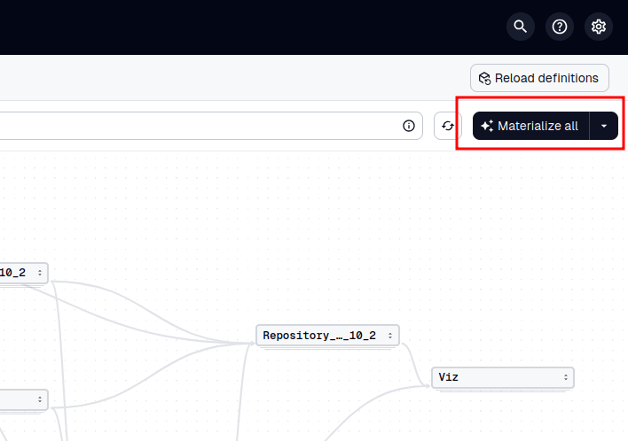
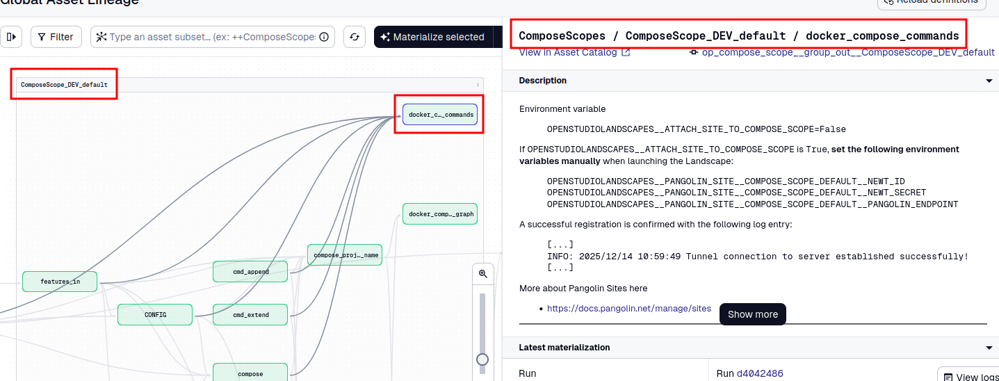
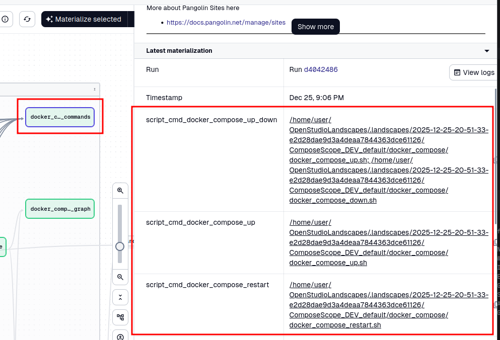

---

<!-- TOC -->
* [OpenStudioLandscapes](#openstudiolandscapes)
  * [Brief](#brief)
* [Get started](#get-started)
  * [Clone Repository](#clone-repository)
  * [Install Dependencies](#install-dependencies)
  * [Install OpenStudioLandscapes](#install-openstudiolandscapes)
  * [Add Features](#add-features)
  * [Run OpenStudioLandscapes](#run-openstudiolandscapes)
  * [Create Landscape](#create-landscape)
  * [Launch the Landscape](#launch-the-landscape)
  * [Shut the Landscape down](#shut-the-landscape-down)
  * [Configure OpenStudioLandscapes](#configure-openstudiolandscapes)
    * [Environment Variables and Secrets](#environment-variables-and-secrets)
  * [Update OpenStudioLandscapes Engine and Features](#update-openstudiolandscapes-engine-and-features)
* [Q&A](#qa)
  * [Who is OpenStudioLandscapes for?](#who-is-openstudiolandscapes-for)
  * [Can OpenStudioLandscapes provide a solution for distributed teams?](#can-openstudiolandscapes-provide-a-solution-for-distributed-teams)
    * [OK, now I'm hooked...](#ok-now-im-hooked)
  * [I don't see a lot of documentation for OpenStudioLandscapes. How can I gain insight?](#i-dont-see-a-lot-of-documentation-for-openstudiolandscapes-how-can-i-gain-insight)
  * [What problem does OpenStudioLandscapes solve?](#what-problem-does-openstudiolandscapes-solve)
  * [So, tell me! What exactly does it produce?](#so-tell-me-what-exactly-does-it-produce)
  * [OpenStudioLandscapes long term dependency hell: out of the frying pan into the fire?](#openstudiolandscapes-long-term-dependency-hell-out-of-the-frying-pan-into-the-fire)
  * [I have zero understanding for bugs! Who can I blame?](#i-have-zero-understanding-for-bugs-who-can-i-blame)
    * [Issues and feature requests](#issues-and-feature-requests)
* [Documentation](#documentation)
* [Community](#community)
* [Current Feature Statuses](#current-feature-statuses)
<!-- TOC -->

---

# OpenStudioLandscapes

## Brief

Setup and launch custom production environments
with Render Farm, Production Tracking, Automation
and more - your 3D Animation
and VFX Pipeline backbone - with ease, independence
and scalability!
The way YOU want it!

> [!TIP]
> 
> This is not another Pipeline Tool. It is a tool
> to build a structured foundation for any Pipeline Tool
> you might decide to use at some point in your studio.

An open source toolkit - a declarative build system - to
easily create reproducible production environments based
on your studio (even down to per production) needs: 
create Landscapes for production,
testing, debugging, development,
migration, DB restore etc.


No more black boxes.
No more path dependencies due to bad decisions
made in the past. Stay flexible and adaptable
with this modular and declarative system by reconfiguring
any production environment with ease:
- ✅ Easily add, edit, replace or remove services
- ✅ Duplicate entire production Landscapes for testing, debugging or development
- ✅ Code as source of truth:
  - ✅ Always stay on top of things with Landscape Maps and node tree representations of Python code
  - ✅ Limit manual documentation to a bare minimum
  - ✅ Git controlled config store
- ✅ `OpenStudioLandscapes` is (primarily) powered by [Dagster](https://github.com/dagster-io/) and [Docker](https://github.com/docker)
- ✅ Fully Python based
- ✅ Build your own studio automation
  - ✅ and share it (scripts, packages etc.) across Landscapes
- ✅ Do you like project based studio services?
  - ✅ No problem with OpenStudioLandscapes
- ✅ Landscapes can run on a single host as well as on multiple hosts

> [!IMPORTANT]
> 
> [Disclaimer](wiki/disclaimer.md)

# Get started

> [!WARNING]
> 
> The following installation process **_will_** modify your system!

The reference system is [Ubuntu 22.04 LTS (Jammy Jellyfish)](wiki/installation/reference_system.md).

Other distros do work (OpenStudioLandscapes was developed on an
Arch based Linux distro), however, the installation process **will** be
different.

> [!CAUTION]
> 
> Installation and execution of OpenStudioLandscapes as **must
> be performed as normal (unprivileged) user**.
> Doing so as user `root` may result in a non-functional 
> setup ([https://github.com/michimussato/OpenStudioLandscapes/issues/2]()).
> 
> > Error message:
> > ```
> > "root" execution of the PostgreSQL server is not permitted.
> > The server must be started under an unprivileged user ID to prevent
> > possible system security compromise.  See the documentation for
> > more information on how to properly start the server.
> > ```

> [!TIP]
> 
> You might have to install `git` and `make` first.
> On Ubuntu: 
> ```shell
> sudo apt update && sudo apt install -y git make
> ```

## Clone Repository

```shell
git clone https://github.com/michimussato/OpenStudioLandscapes.git \
    && cd OpenStudioLandscapes
# Check out a specific branch by:
# List branches: 
# git branch -a
# Checkout branch: 
# git checkout <branch>
```

## Install Dependencies

```shell
make sys_deps_install
```

> [!TIP]
> 
> Messages like:
> ```
> E: Could not get lock /var/lib/dpkg/lock-frontend. It is held by process 5198 (unattended-upgr)
> N: Be aware that removing the lock file is not a solution and may break your system.
> E: Unable to acquire the dpkg frontend lock (/var/lib/dpkg/lock-frontend), is another process using it?
> ```
> or
> ```
> Waiting for cache lock: Could not get lock /var/lib/dpkg/lock-frontend. It is held by process 3450 (unattended-upgr)
> ```
> indicates that Ubuntu is running an unattended (automatic) system update in 
> the background. Take a look at the [Reference System](wiki/installation/reference_system.md#unattended-upgrades)

```shell
sudo reboot
```

> [!IMPORTANT]
> 
> And verify that the user is member of the `docker` group:
> 
> ```
> $ groups ${USER}
> user adm cdrom sudo dip plugdev lpadmin lxd sambashare docker
> ```

> [!TIP]
> 
> If you get error(s) similar to these:
> ```
> [...]
> unable to get image 'docker.io/postgres:17': permission denied while trying to connect to the Docker daemon socket at unix:///var/run/docker.sock: Get "http://%2Fvar%2Frun%2Fdocker.sock/v1.51/images/docker.io/postgres:17/json": dial unix /var/run/docker.sock: connect: permission denied
> [...]
> ```
> or
> ```
> permission denied while trying to connect to the Docker daemon socket at unix:///var/run/docker.sock: Get "http://%2Fvar%2Frun%2Fdocker.sock/v1.51/containers/json?all=1&filters=%7B%22label%22%3A%7B%22com.docker.compose.config-hash%22%3Atrue%2C%22com.docker.compose.oneoff%3DFalse%22%3Atrue%2C%22com.docker.compose.project%3Dopenstudiolandscapes-dagster-postgres%22%3Atrue%7D%7D": dial unix /var/run/docker.sock: connect: permission denied
> ```
> you probably forgot to reboot your system - just reboot to fix this.
> 
> Background: adding a user to a group (namely `docker`) takes effect
> only _**after**_ the next successful login.

## Install OpenStudioLandscapes

```shell
# Make sure you are back in the repository directory: 
# cd OpenStudioLandscapes
make openstudiolandscapes_install
```

## Add Features

Documentation is broken out into the individual Features.
You will find direction on the `README.md` file of the Feature you're interested in.
For example here: [OpenStudioLandscapes-Kitsu](https://github.com/michimussato/OpenStudioLandscapes-Kitsu?tab=readme-ov-file#install)

A full list of available Features is available [here](#current-feature-statuses)

## Run OpenStudioLandscapes

```shell
# cd OpenStudioLandscapes
source .venv/bin/activate
openstudiolandscapes
```

> If you see an error like this one:
> 
> ```shell
> (Background on this error at: https://sqlalche.me/e/20/e3q8)
> WARNING:root:Retrying failed database connection: (psycopg2.OperationalError) connection to server at "openstudiolandscapes-dagster-postgres.openstudiolandscapes.lan" (192.168.178.195), port 2345 failed: Connection refused
> 	Is the server running on that host and accepting TCP/IP connections?
> ```
> 
> This indicates that PostgreSQL server is not reachable by its DNS name.
> Todo: no obvious need to expose PostgreSQL server in Docker Compose.
> 
> You can add the following entries to your `/etc/hosts` file:
> 
> ```shell
> 127.0.0.1       openstudiolandscapes-dagster.openstudiolandscapes.lan
> 127.0.0.1       openstudiolandscapes-dagster-postgres.openstudiolandscapes.lan
> ```

## Create Landscape

And head over to the Dagster Dev web UI:

[http://127.0.0.1:3000/asset-groups]()

> [!IMPORTANT]
> 
> If Dagster web UI is running on a different port
> (default: `3000`), just make sure this is reflected in 
> the URL you are trying to access.

And click **Materialize All**.



## Launch the Landscape

Navigate the Compose Scope Group (for example `default`) and select the
`docker_compose_commands` Asset:



and click the command to copy it to the clipboard:



This command can then be pasted directly into a terminal 
and executed ("up" script):

```
user@user-VirtualBox:~/OpenStudioLandscapes$ /home/user/OpenStudioLandscapes/.landscapes/2025-12-25-20-51-33-e2d28dae9d3a4deaa7844363dce61126/ComposeScope_DEV_default/docker_compose/docker_compose_up.sh
~/OpenStudioLandscapes/.landscapes/2025-12-25-20-51-33-e2d28dae9d3a4deaa7844363dce61126/ComposeScope_DEV_default/docker_compose ~/OpenStudioLandscapes
Working Directory: /home/user/OpenStudioLandscapes/.landscapes/2025-12-25-20-51-33-e2d28dae9d3a4deaa7844363dce61126/ComposeScope_DEV_default/docker_compose
 Network OpenStudioLandscapes_Kitsu.compose_networks_network.2025-12-25-20-51-33-e2d28dae9d3a4deaa7844363dce61126 Creating 
 Network OpenStudioLandscapes_Kitsu.compose_networks_network.2025-12-25-20-51-33-e2d28dae9d3a4deaa7844363dce61126 Created 
 Network 2025-12-25-20-51-33-e2d28dae9d3a4deaa7844363dce61126-default_default Creating 
 Network 2025-12-25-20-51-33-e2d28dae9d3a4deaa7844363dce61126-default_default Created 
 Container kitsu-init-db.2025-12-25-20-51-33-e2d28dae9d3a4deaa7844363dce61126 Creating 
 Container kitsu-init-db.2025-12-25-20-51-33-e2d28dae9d3a4deaa7844363dce61126 Created 
 Container kitsu.2025-12-25-20-51-33-e2d28dae9d3a4deaa7844363dce61126 Creating 
 Container kitsu.2025-12-25-20-51-33-e2d28dae9d3a4deaa7844363dce61126 Created 
 Container kitsu-init-db.2025-12-25-20-51-33-e2d28dae9d3a4deaa7844363dce61126 Starting 
 Container kitsu-init-db.2025-12-25-20-51-33-e2d28dae9d3a4deaa7844363dce61126 Started 
 Container kitsu-init-db.2025-12-25-20-51-33-e2d28dae9d3a4deaa7844363dce61126 Waiting 
 Container kitsu-init-db.2025-12-25-20-51-33-e2d28dae9d3a4deaa7844363dce61126 Exited 
 Container kitsu.2025-12-25-20-51-33-e2d28dae9d3a4deaa7844363dce61126 Starting 
 Container kitsu.2025-12-25-20-51-33-e2d28dae9d3a4deaa7844363dce61126 Started 
kitsu.2025-12-25-20-51-33-e2d28dae9d3a4deaa7844363dce61126  | Running Zou...
[...]
```

## Shut the Landscape down

("down" script)

```
user@user-VirtualBox:~/OpenStudioLandscapes$ /home/user/OpenStudioLandscapes/.landscapes/2025-12-25-20-51-33-e2d28dae9d3a4deaa7844363dce61126/ComposeScope_DEV_default/docker_compose/docker_compose_down.sh 
~/OpenStudioLandscapes/.landscapes/2025-12-25-20-51-33-e2d28dae9d3a4deaa7844363dce61126/ComposeScope_DEV_default/docker_compose ~/OpenStudioLandscapes
Working Directory: /home/user/OpenStudioLandscapes/.landscapes/2025-12-25-20-51-33-e2d28dae9d3a4deaa7844363dce61126/ComposeScope_DEV_default/docker_compose
 Container kitsu.2025-12-25-20-51-33-e2d28dae9d3a4deaa7844363dce61126 Stopping 
 Container kitsu.2025-12-25-20-51-33-e2d28dae9d3a4deaa7844363dce61126 Stopped 
 Container kitsu.2025-12-25-20-51-33-e2d28dae9d3a4deaa7844363dce61126 Removing 
 Container kitsu.2025-12-25-20-51-33-e2d28dae9d3a4deaa7844363dce61126 Removed 
 Container kitsu-init-db.2025-12-25-20-51-33-e2d28dae9d3a4deaa7844363dce61126 Stopping 
 Container kitsu-init-db.2025-12-25-20-51-33-e2d28dae9d3a4deaa7844363dce61126 Stopped 
 Container kitsu-init-db.2025-12-25-20-51-33-e2d28dae9d3a4deaa7844363dce61126 Removing 
 Container kitsu-init-db.2025-12-25-20-51-33-e2d28dae9d3a4deaa7844363dce61126 Removed 
 Network OpenStudioLandscapes_Kitsu.compose_networks_network.2025-12-25-20-51-33-e2d28dae9d3a4deaa7844363dce61126 Removing 
 Network 2025-12-25-20-51-33-e2d28dae9d3a4deaa7844363dce61126-default_default Removing 
 Network OpenStudioLandscapes_Kitsu.compose_networks_network.2025-12-25-20-51-33-e2d28dae9d3a4deaa7844363dce61126 Removed 
 Network 2025-12-25-20-51-33-e2d28dae9d3a4deaa7844363dce61126-default_default Removed
```

## Configure OpenStudioLandscapes

By default, OpenStudioLandscapes creates 
`~/.config/OpenStudioLandscapes` when `openstudiolandscapes` 
is executed. All `config.yml` files
will be placed inside this default config store.

> [!TIP]
> 
> You can change the default config store location
> by setting `OPENSTUDIOLANDSCAPES__CONFIGSTORE_ROOT`.

### Environment Variables and Secrets

Dagster (and therefore OpenStudioLandscapes) reads a local
`.env` file at the root of the OpenStudioLandscapes Git
repository directory.

## Update OpenStudioLandscapes Engine and Features

To update OpenStudioLandscapes and all your Features,
you can run the following code snippet. This is a work in progress
solution and the update process is planned
to be facilitated with future updates.

```shell
# cd OpenStudioLandscapes
git pull

pushd .features || exit 1

for d in ./*; do
    git -C ${d} pull;
done

popd || exit 1
```

# Q&A

## Who is OpenStudioLandscapes for?

This platform is aimed towards students, one-man-shows and
small to medium-sized studios where only limited resources for Pipeline
Engineers and Technical Directors are available.
This system allows those studios to share a common
underlying system. And whatever your individual pipeline needs are, 
you can then build your tools on top of this common, stable, flexible and
scalable system.

The scope of this project are users with some technical skills. 
OpenStudioLandscapes is intended to run on a Linux based 
system and will remain to do so. However, if you are able to install
Ubuntu as a virtual machine on a Windows PC, you're pretty much good to go.

## Can OpenStudioLandscapes provide a solution for distributed teams?

Sure it can! OpenStudioLandscapes together with Pangolin can allow you
to grant remote users access to your locally (or wherever your 
[Landscape](wiki/terminology.md#table-of-contents) 
will be running) hosted production tracking system
for example.

> [!TIP]
> 
> Acting as a service provider (which is what you are in this case) 
> has its own unique set of challenges. 
> [OpenStudioLandscapesHub](https://github.com/michimussato/openStudioLandscapesHub) 
> is an attempt (WIP) to give you a basic infrastructure to minimize the barrier down
> to a minimum.

### OK, now I'm hooked...

[Pangolin](https://docs.pangolin.net/) allows for 
[Features](wiki/terminology.md#table-of-contents) of a single 
[Landscape](wiki/terminology.md#table-of-contents) to be distributed 
across different sites via SSH tunnels (see also 
[OpenStudioLandscapes Compose Scopes](wiki/terminology.md#table-of-contents)).

For example, to wrap a Landscape with a 
[Pangoline Site](https://docs.pangolin.net/manage/sites/understanding-sites), 
you can provide the required secrets as follows:

> [!IMPORTANT]
> 
> Please note that Pangolin Sites can only wrap full Compose Scopes.
> Compose Scopes can have arbitrary names, like `license_server` or
> `production_tracking` for example.
> Therefore, a dynamic Compose Scope name will also be assigned to 
> the environment varibles that carry the secrets.
> 
> More about the relevant values here:
> [Pangolin NEWT Variables](https://docs.pangolin.net/manage/sites/install-site#docker-compose)

```shell
# The PANGOLIN_ENDPOINT variable for the compose scope `license_server`:
OPENSTUDIOLANDSCAPES__PANGOLIN_SITE__COMPOSE_SCOPE_LICENSE_SERVER__PANGOLIN_ENDPOINT="https://app.pangolin.net"

# The NEWT_ID variable for the compose scope `license_server`:
OPENSTUDIOLANDSCAPES__PANGOLIN_SITE__COMPOSE_SCOPE_LICENSE_SERVER__NEWT_ID="2ix2t8xk22ubpfy"

# The NEWT_SECRET variable for the compose scope `license_server`:
OPENSTUDIOLANDSCAPES__PANGOLIN_SITE__COMPOSE_SCOPE_LICENSE_SERVER__NEWT_SECRET="nnisrfsdfc7prqsp9ewo1dvtvci50j5uiqotez00dgap0ii2"
```

So, let's take the ComposeScope `license_server` for example.
It provides three services:
- `sesi-gcc-9-3-houdini-20`: A license server for Houdini
- `nuke-rlm-8`: A license server for Nuke
- `newt_service.compose_scope-license_server.2025-12-23-19-19-03-4346bdbc4d1c45c4a8a91948275b2086`: the Pangolin NEWT service that wraps the two license servers


The resulting command to launch a Landscape that will connect as a Pangolin Site provided
by Dagster:

```shell
OPENSTUDIOLANDSCAPES__PANGOLIN_SITE__COMPOSE_SCOPE_LICENSE_SERVER__PANGOLIN_ENDPOINT="https://app.pangolin.net" \
    && OPENSTUDIOLANDSCAPES__PANGOLIN_SITE__COMPOSE_SCOPE_LICENSE_SERVER__NEWT_ID="2ix2t8xk22ubpfy" \
    && OPENSTUDIOLANDSCAPES__PANGOLIN_SITE__COMPOSE_SCOPE_LICENSE_SERVER__NEWT_SECRET="nnisrfsdfc7prqsp9ewo1dvtvci50j5uiqotez00dgap0ii2" \
    && path/to/.landscapes/<LANDSCAPE_ID>/ComposeScope_license_server/docker_compose/docker_compose_up.sh
```

A successfully established connection and registration as a Pangolin Site will
be presented in the Pangolin Admin Web UI:


The Pangolin Resources above Site provides will be shown on
the Resources page:


And will populate the provided services (RLM license server
in this case):


The RLM web UI is listening on port `4041` (actually the container
port is the relevant one here):


And voilà! SSL encrypted RLM license server web UI
accessible from the internet with user based authentication
(provided by Pangolin):


## I don't see a lot of documentation for OpenStudioLandscapes. How can I gain insight?

OpenStudioLandscapes is build on [Dagster](https://docs.dagster.io/). 
Dagster itself offers Markdown compatible
descriptions for [Assets](https://docs.dagster.io/guides/build/assets/defining-assets).
OpenStudioLandscapes aims to leverage this capability wherever possible.

> [!IMPORTANT]
> 
> This allows for dynamic documentation without having the need to compile static
> documentation. Another good side effect is that you will find documentation and
> information where you need it.
> 
> Example:
> 
> 

A bit more context about the how and why can be found [here](wiki/README.md#a-word-about-documentation).

> [!TIP]
> 
> More Dagster related information and references to resources can be found directly on the 
> [OpenStudioLandscapes-Dagster Feature README](https://github.com/michimussato/OpenStudioLandscapes-Dagster#external-resources).
> 
> To get a good understanding of how to work with Dagster, the
> [Getting Started with Dagster](https://github.com/michimussato/OpenStudioLandscapes-Dagster##getting-started-with-dagster)
> section in particular is a good place to start.

## What problem does OpenStudioLandscapes solve?

What's separating the men from the boys is the production back bone.
Large studios spent years and years of man (and woman) hours and
millions of dollars to build robust automation to support their 
production while smaller ones are (in those regards - no matter
how recent and advanced the tools they use are) decades behind.
So, in one sense, OpenStudioLandscapes is a time machine by giving you 
the ability to jump a few years ahead of yourself by giving you a 
pre-made on-prem production environment at very little cost.

The second problem it is trying to solve is one that you (as a small
company) do not have **yet**. Ideally, before you start thinking about
automating processes, you want to have a robust underlying system. 
However, what usually happens is that studios skip this crucial 
step. This
almost inevitably leads to tech dept in the future after growth has happened - 
a house of cards built upside down. 

> [!CAUTION]
> 
> So, you wanna replace or remove your
> old little script that you wrote 5 years ago which is being used in so many
> places you can't even remember? There you have it. Better don't touch it. Better
> continue building your system around it. Right? Wrong! 

OpenStudioLandscapes is here to change that by making sure your 
**future you** is not going to regret decisions of its **past you** 
by providing structure while keeping systems and pipeline features 
as isolated (read: portable) as possible!

## So, tell me! What exactly does it produce?

Good you're asking! To get an idea what the actual output 
(or product if you will) of OpenStudioLandscapes
looks like, here's the deal: 
if you're into (like myself) dynamic, worry-free documentation of what
you are actually working with, here's a Landscape Map of a Landscape:


And the cool thing is, Dagster also does it's thing with the Asset
descriptions! You'll be provided with one single command (just click 
it to copy it to your clipboard) to launch the diagrammed Landscape:


## OpenStudioLandscapes long term dependency hell: out of the frying pan into the fire?

In [Brief](#brief) I was writing about staying flexible and independent.
What happens if OpenStudioLandscapes disappears as a project? Can I rely on it
long term? I can't predict the future and we'll see about the projects' adoption. 
OpenStudioLandscapes itself does **not** make you dependent on it as much as you think:
you can run and use your Landscapes without OpenStudioLandscapes. OpenStudioLandscapes
**only** creates them. The Landscapes themselves, however, depend on Docker 
and other third party tools for example. Those tools are _**de facto**_ industry standard.

When we're talking about Features: same thing. For example, Kitsu community is growing 
and being dependent on in long term is becoming less risky. 

> [!IMPORTANT]
> 
> What if there is a new production tracking solution in five years time? Or - like with 
> [Deadline entering "Maintenance Mode"](https://docs.thinkboxsoftware.com/products/deadline/10.4/1_User%20Manual/manual/maintenance-mode-faq.html) - 
> a third party tool gets deprecated?

This is exactly were OpenStudioLandscapes can shine: swap one render manager for another
with minimal effort. Adjust your infrastructure in case you _**want**_ to. And sometimes also
simply because you _**have**_ to. 

> [!TIP]
> 
> A Feature template (work in progress) is provided for developers to integrate new Features:
> [OpenStudioLandscapes-Template](https://github.com/michimussato/OpenStudioLandscapes-Template?tab=readme-ov-file#create-new-feature-from-this-template).

## I have zero understanding for bugs! Who can I blame?

Bear in mind: OpenStudioLandscapes is a young project.
There are still many items to be implemented (and potentially bug-fixed).
I lack experience in many fields when it comes to software development. The documentation
is not in a shape I would like to see it in (dynamic, wherever possible). 
So, before adding Features to OpenStudioLandscapes, I plan to work on stability, documentation and support. 
To avoid filling in the wrong gaps, I would like to mainly fill in those 
that are being asked for - and this is your part. Ask anything. Request anything.
Suggest anything. Anything that leads to a better experience - without hiccups and without
too much noise at the same time - from installation to usage. If your field of expertise
can improve this project, please step forward and jump on board!

> [!TIP]
> 
> Now, in case you do feel inclined to blame *somebody*, here's
> some info [About the Author](wiki/about_the_author.md).
> 
> Also, feel free to connect on [Discord](https://discord.com/invite/F6bDRWsHac)
> for exchange.

### Issues and feature requests

Feature requests and general issues can be posted here:
- [Issues and feature requests](https://github.com/michimussato/OpenStudioLandscapes/issues)

If you can isolate an issue to a specific Feature, each Feature has its own
issue tracker as well. For example:
- [Issues and feature requests for Feature OpenStudioLandscapes-Kitsu](https://github.com/michimussato/OpenStudioLandscapes-Kitsu/issues)

# Documentation

Now, it's time to head over to the [Wiki](wiki/README.md)!

# Community

- [](https://youtube.com/@openstudiolandscapes)
- [](https://www.linkedin.com/company/106731439/)
  - [#OpenStudioLandscapes](https://www.linkedin.com/search/results/all/?keywords=%23openstudiolandscapes)
- [](https://discord.gg/F6bDRWsHac)
- Publications
  - [World VFX Day - Spotlight: Michael Mussato, OpenStudioLandscapes](https://worldvfxday.com/2025/10/22/spotlight-michael-mussato-openstudiolandscapes/)

[//]: # (Icons by https://www.iconpacks.net/free-icon-pack/free-social-media-network-logos-icon-pack-197.html)

# Current Feature Statuses

| Feature                                                                                                                      | Public | Maintained | Enabled by default | Default Compose Scope | External Resources |
|------------------------------------------------------------------------------------------------------------------------------|--------|------------|--------------------|-----------------------|--------------------|
| [OpenStudioLandscapes-Ayon](https://github.com/michimussato/OpenStudioLandscapes-Ayon)                                       | ✅      | ✅          | ✅                  | `default`             | ✅                  |
| [OpenStudioLandscapes-Dagster](https://github.com/michimussato/OpenStudioLandscapes-Dagster)                                 | ✅      | ✅          | ✅                  | `default`             | ✅                  |
| [OpenStudioLandscapes-Deadline-10-2](https://github.com/michimussato/OpenStudioLandscapes-Deadline-10-2)                     | ❌      | ✅          | ❌                  | `default`             | ✅                  |
| [OpenStudioLandscapes-Deadline-10-2-Worker](https://github.com/michimussato/OpenStudioLandscapes-Deadline-10-2-Worker)       | ❌      | ✅          | ❌                  | `worker`              | ✅                  |
| [OpenStudioLandscapes-filebrowser](https://github.com/michimussato/OpenStudioLandscapes-filebrowser)                         | ❌      | ✅          | ✅                  | `default`             | ❌                  |
| [OpenStudioLandscapes-Flamenco](https://github.com/michimussato/OpenStudioLandscapes-Flamenco)                               | ✅      | ✅          | ✅                  | `default`             | ✅                  |
| [OpenStudioLandscapes-Flamenco-Worker](https://github.com/michimussato/OpenStudioLandscapes-Flamenco-Worker)                 | ✅      | ✅          | ✅                  | `worker`              | ✅                  |
| [OpenStudioLandscapes-Grafana](https://github.com/michimussato/OpenStudioLandscapes-Grafana)                                 | ❌      | ✅          | ✅                  | `default`             | ✅                  |
| [OpenStudioLandscapes-Kitsu](https://github.com/michimussato/OpenStudioLandscapes-Kitsu)                                     | ✅      | ✅          | ✅                  | `default`             | ✅                  |
| [OpenStudioLandscapes-LikeC4](https://github.com/michimussato/OpenStudioLandscapes-LikeC4)                                   | ❌      | ✅          | ✅                  | `default`             | ❌                  |
| [OpenStudioLandscapes-NukeRLM-8](https://github.com/michimussato/OpenStudioLandscapes-NukeRLM-8)                             | ❌      | ✅          | ❌                  | `license_server`      | ❌                  |
| [OpenStudioLandscapes-OpenCue](https://github.com/michimussato/OpenStudioLandscapes-OpenCue)                                 | ❌      | ✅          | ✅                  | `default`             | ❌                  |
| [OpenStudioLandscapes-OpenCue-Worker](https://github.com/michimussato/OpenStudioLandscapes-OpenCue-Worker)                   | ❌      | ✅          | ✅                  | `worker`              | ❌                  |
| [OpenStudioLandscapes-RustDeskServer](https://github.com/michimussato/OpenStudioLandscapes-RustDeskServer)                   | ✅      | ✅          | ✅                  | `default`             | ✅                  |
| [OpenStudioLandscapes-SESI-gcc-9-3-Houdini-20](https://github.com/michimussato/OpenStudioLandscapes-SESI-gcc-9-3-Houdini-20) | ❌      | ✅          | ❌                  | `license_server`      | ❌                  |
| [OpenStudioLandscapes-Syncthing](https://github.com/michimussato/OpenStudioLandscapes-Syncthing)                             | ❌      | ✅          | ✅                  | `default`             | ❌                  |
| [OpenStudioLandscapes-Teleport](https://github.com/michimussato/OpenStudioLandscapes-Teleport)                               | ✅      | ❌          | ❌                  | `default`             | ✅                  |
| [OpenStudioLandscapes-Twingate](https://github.com/michimussato/OpenStudioLandscapes-Twingate)                               | ❌      | ✅          | ❌                  | `default`             | ✅                  |
| [OpenStudioLandscapes-Watchtower](https://github.com/michimussato/OpenStudioLandscapes-Watchtower)                           | ❌      | ✅          | ❌                  | `default`             | ❌                  |
| [OpenStudioLandscapes-VERT](https://github.com/michimussato/OpenStudioLandscapes-VERT)                                       | ✅      | ✅          | ✅                  | `default`             | ✅                  |
| [OpenStudioLandscapes-Template](https://github.com/michimussato/OpenStudioLandscapes-Template)                               | ✅      | ✅          | ❌                  | `default`              | ✅                  |
