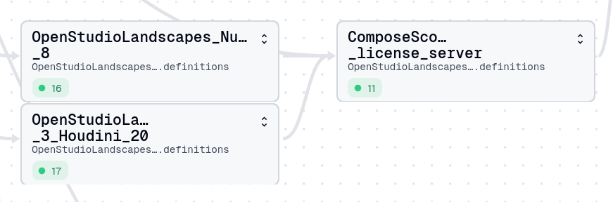
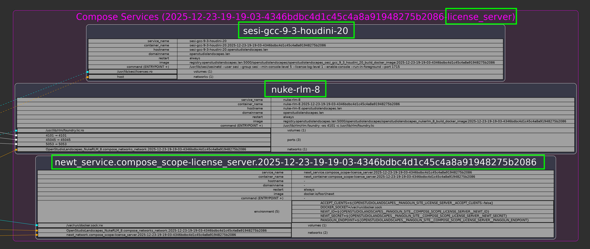
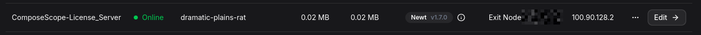
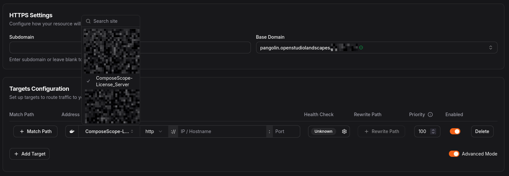
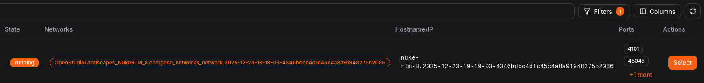
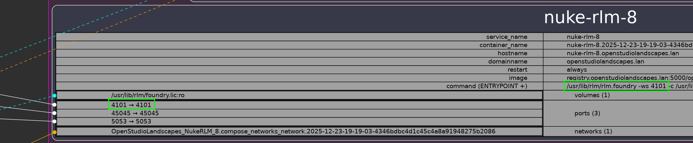
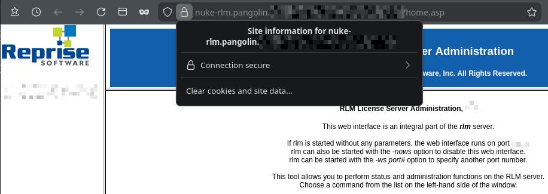
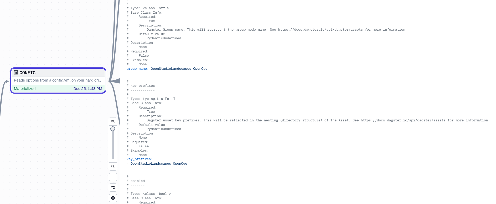
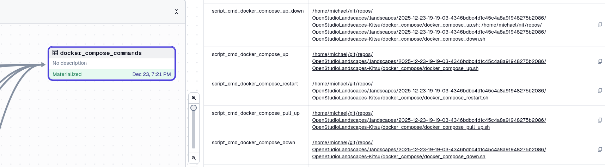

---

<!-- TOC -->
* [OpenStudioLandscapes](#openstudiolandscapes)
  * [Brief](#brief)
* [Get started](#get-started)
  * [Clone Repository](#clone-repository)
  * [Install Dependencies](#install-dependencies)
  * [Install OpenStudioLandscapes](#install-openstudiolandscapes)
  * [Add Features](#add-features)
  * [Run OpenStudioLandscapes](#run-openstudiolandscapes)
  * [Configure OpenStudioLandscapes](#configure-openstudiolandscapes)
    * [Environment Variables and Secrets](#environment-variables-and-secrets)
* [Q&A](#qa)
  * [Who is OpenStudioLandscapes for?](#who-is-openstudiolandscapes-for)
  * [Can OpenStudioLandscapes provide a solution for distributed teams?](#can-openstudiolandscapes-provide-a-solution-for-distributed-teams)
    * [TL; DR](#tl-dr)
    * [OK, now I'm hooked...](#ok-now-im-hooked)
  * [I don't see a lot of documentation for OpenStudioLandscapes. How can I gain insight?](#i-dont-see-a-lot-of-documentation-for-openstudiolandscapes-how-can-i-gain-insight)
* [What problem does OpenStudioLandscapes solve?](#what-problem-does-openstudiolandscapes-solve)
  * [So, tell me! What exactly does it produce?](#so-tell-me-what-exactly-does-it-produce)
  * [I have zero understanding for bugs! Who can I blame?](#i-have-zero-understanding-for-bugs-who-can-i-blame)
    * [Issues and feature requests](#issues-and-feature-requests)
* [Documentation](#documentation)
* [Community](#community)
* [Current Feature Statuses](#current-feature-statuses)
<!-- TOC -->

---

# OpenStudioLandscapes

## Brief

Setup and launch custom production environments
with Render Farm, Production Tracking, Automation
and more - your 3D Animation
and VFX Pipeline backbone - with ease, independence
and scalability!
The way YOU want it!

> [!TIP]
> 
> This is not another Pipeline Tool. It is a tool
> to build a structured foundation for any Pipeline Tool
> you might decide to use at some point in your studio.

An open source toolkit - a declarative build system - to
easily create reproducible production environments based
on your studio (even down to per production) needs: 
create Landscapes for production,
testing, debugging, development,
migration, DB restore etc.


No more black boxes.
No more path dependencies due to bad decisions
made in the past. Stay flexible and adaptable
with this modular and declarative system by reconfiguring
any production environment with ease:
- ✅ Easily add, edit, replace or remove services
- ✅ Duplicate entire production Landscapes for testing, debugging or development
- ✅ Code as source of truth:
  - ✅ Always stay on top of things with Landscape Maps and node tree representations of Python code
  - ✅ Limit manual documentation to a bare minimum
  - ✅ Git controlled config store
- ✅ `OpenStudioLandscapes` is (primarily) powered by [Dagster](https://github.com/dagster-io/) and [Docker](https://github.com/docker)
- ✅ Fully Python based
- ✅ Build your own studio automation
  - ✅ and share it (scripts, packages etc.) across Landscapes
- ✅ Do you like project based studio services?
  - ✅ No problem with OpenStudioLandscapes

# Get started

> [!CAUTION]
> 
> Install and run OpenStudioLandscapes as normal user.
> Doing so as user `root` may result in a non-functional 
> setup.
> 
> > Error message:
> > ```
> > "root" execution of the PostgreSQL server is not permitted.
> > The server must be started under an unprivileged user ID to prevent
> > possible system security compromise.  See the documentation for
> > more information on how to properly start the server.
> > ```

## Clone Repository

```shell
git clone https://github.com/michimussato/OpenStudioLandscapes.git \
    && cd OpenStudioLandscapes
```

## Install Dependencies

```shell
make sys_deps_install
```

## Install OpenStudioLandscapes

```shell
make openstudiolandscapes_install
```

## Add Features

Documentation is broken out into the individual Features.
You will find direction on the `README.md` file of the Feature you're interested in.
For example here: [OpenStudioLandscapes-Kitsu](https://github.com/michimussato/OpenStudioLandscapes-Kitsu?tab=readme-ov-file#install)

A full list of available Features is available [here](#current-feature-statuses)

## Run OpenStudioLandscapes

```shell
openstudiolandscapes
```

And head over to the Dagster Dev web UI:

[http://127.0.0.1:3000/asset-groups]()

> [!IMPORTANT]
> 
> If Dagster web UI is running on a different port
> (default: `3000`), just make sure this is reflected in 
> the URL you are trying to access.

## Configure OpenStudioLandscapes

By default, OpenStudioLandscapes creates 
`~/.config/OpenStudioLandscapes` when `openstudiolandscapes` 
is executed. All `config.yml` files
will be placed inside this default config store.

> [!TIP]
> 
> You can change the default location
> by setting `OPENSTUDIOLANDSCAPES__CONFIGSTORE_ROOT`.

### Environment Variables and Secrets

Dagster (and therefore OpenStudioLandscapes) reads a local
`.env` file at the root of the OpenStudioLandscapes Git
repository directory.

# Q&A

## Who is OpenStudioLandscapes for?

This platform is aimed towards students, one-man-shows and
small to medium-sized studios where only limited resources for Pipeline
Engineers and Technical Directors are available.
This system allows those studios to share a common
underlying system. And whatever your individual pipeline needs are, 
you can then build your tools on top of this common, stable, flexible and
scalable system.

The scope of this project are users with some technical skills. 
OpenStudioLandscapes is intended to run on a Linux based 
system and will remain to do so. However, if you are able to install
Ubuntu as a virtual machine on a Windows PC, you're pretty much good to go.

## Can OpenStudioLandscapes provide a solution for distributed teams?

### TL; DR

Sure it can! OpenStudioLandscapes together with Pangolin can allow you
to grant remote users access to your locally (or wherever your 
[Landscape](wiki/terminology.md#table-of-contents) 
will be running) hosted production tracking system
for example.

> [!TIP]
> 
> Acting as a service provider (which is what you are in this case) 
> has its own unique set of challenges. 
> [OpenStudioLandscapesHub](https://github.com/michimussato/openStudioLandscapesHub) 
> is an attempt (WIP) to give you a basic infrastructure to minimize the barrier down
> to a minimum.

### OK, now I'm hooked...

Pangolin allows for [Features](wiki/terminology.md#table-of-contents) of a single 
[Landscape](wiki/terminology.md#table-of-contents) to be distributed across different
sites via SSH tunnels (see also [OpenStudioLandscapes Compose Scopes](wiki/terminology.md#table-of-contents)).

For example, to wrap a Landscape with a Pangoline Site, you can 
provide the required secrets as follows:

> [!IMPORTANT]
> 
> Please note that Pangolin Sites can only wrap full Compose Scopes.
> Compose Scopes can have arbitrary values, like `license_server` or
> `production_tracking` etc.
> Therefore, a dynamic Compose Scope name will also be assigned to 
> the environment varibles that carry the secrets.
> 
> More about the relevant values here:
> [Pangolin NEWT Variables](https://docs.pangolin.net/manage/sites/install-site#docker-compose)

```shell
# The PANGOLIN_ENDPOINT variable for the compose scope `license_server`:
OPENSTUDIOLANDSCAPES__PANGOLIN_SITE__COMPOSE_SCOPE_LICENSE_SERVER__PANGOLIN_ENDPOINT="https://app.pangolin.net"

# The NEWT_ID variable for the compose scope `license_server`:
OPENSTUDIOLANDSCAPES__PANGOLIN_SITE__COMPOSE_SCOPE_LICENSE_SERVER__NEWT_ID="2ix2t8xk22ubpfy"

# The NEWT_SECRET variable for the compose scope `license_server`:
OPENSTUDIOLANDSCAPES__PANGOLIN_SITE__COMPOSE_SCOPE_LICENSE_SERVER__NEWT_SECRET="nnisrfsdfc7prqsp9ewo1dvtvci50j5uiqotez00dgap0ii2"
```

So, let's take the ComposeScope `license_server` for example.
It provides three services:
- `sesi-gcc-9-3-houdini-20`: A license server for Houdini
- `nuke-rlm-8`: A license server for Nuke
- `newt_service.compose_scope-license_server.2025-12-23-19-19-03-4346bdbc4d1c45c4a8a91948275b2086`: the Pangolin NEWT service that wraps the two license servers





The resulting command to launch a Landscape that will connect as a Pangolin Site provided
by Dagster:

```shell
OPENSTUDIOLANDSCAPES__PANGOLIN_SITE__COMPOSE_SCOPE_LICENSE_SERVER__PANGOLIN_ENDPOINT="https://app.pangolin.net" \
    && OPENSTUDIOLANDSCAPES__PANGOLIN_SITE__COMPOSE_SCOPE_LICENSE_SERVER__NEWT_ID="2ix2t8xk22ubpfy" \
    && OPENSTUDIOLANDSCAPES__PANGOLIN_SITE__COMPOSE_SCOPE_LICENSE_SERVER__NEWT_SECRET="nnisrfsdfc7prqsp9ewo1dvtvci50j5uiqotez00dgap0ii2" \
    && path/to/.landscapes/<LANDSCAPE_ID>/ComposeScope_license_server/docker_compose/docker_compose_up.sh
```

A successfully established connection and registration as a Pangolin Site will
be presented in the Pangolin Admin Web UI:



The Pangolin Resources above Site provides will be shown on
the Resources page:



And will populate the provided services (RLM license server
in this case):



The RLM web UI is listening on port `4041` (actually the container
port is the relevant one here):



And voilà! SSL encrypted RLM license server web UI
accessible from the internet with user based authentication
(provided by Pangolin):



A good place to start to learn about Pangolin Sites are the 
[Pangolin docs](https://docs.pangolin.net/manage/sites/understanding-sites).

## I don't see a lot of documentation for OpenStudioLandscapes. How can I gain insight?

OpenStudioLandscapes is build on [Dagster](https://docs.dagster.io/). 
Dagster itself offers Markdown compatible
descriptions for [Assets](https://docs.dagster.io/guides/build/assets/defining-assets).
OpenStudioLandscapes aims to leverage this capability wherever possible.

> [!IMPORTANT]
> 
> This allows for dynamic documentation without having the need to compile static
> documentation. Another good side effect is that you will find documentation and
> information where you need it.
> 
> Example:
> 
> 

# What problem does OpenStudioLandscapes solve?

What's separating the men from the boys is the production back bone.
Large studios spent years and years of man (and woman) hours and
millions of dollars to build robust automation to support their 
production while smaller ones are (in those regards - no matter
how recent and advanced the tools they use are) decades behind.
So, in one sense, OpenStudioLandscapes is a time machine by giving you 
the ability to jump a few years ahead of yourself by giving you a 
pre-made on-prem production environment at very little cost.

The second problem it is trying to solve is one that you (as a small
company) do not have **yet**. Ideally, before you start thinking about
automating processes, you want to have a robust underlying system. 
However, what usually happens is that studios skip this crucial 
step. This
almost inevitably leads to tech dept in the future after growth has happened - 
a house of cards built upside down. 

> [!CAUTION]
> 
> So, you wanna replace or remove your
> old little script that you wrote 5 years ago which is being used in so many
> places you can't even remember? There you have it. Better don't touch it. Better
> continue building your system around it. Right? Wrong! 

OpenStudioLandscapes is here to change that by making sure your 
**future you** is not going to regret decisions of its **past you** 
by providing structure while keeping systems and pipeline features 
as isolated (read: portable) as possible!

## So, tell me! What exactly does it produce?

Good you're asking! To get an idea what the actual output 
(or product if you will) of OpenStudioLandscapes
looks like, here's the deal: 
if you're into (like myself) dynamic, worry-free documentation of what
you are actually working with, here's a Landscape Map of a Landscape:


And the cool thing is, Dagster also does it's thing with the Asset
descriptions! You'll be provided with one single command (just click 
it to copy it to your clipboard) to launch the diagrammed Landscape:



## I have zero understanding for bugs! Who can I blame?

Bear in mind: OpenStudioLandscapes is a young project.
There are still many items to be implemented (and potentially bug-fixed).
I lack experience in many fields when it comes to software development. The documentation
is not in a shape I would like to see it in (dynamic, wherever possible). 
So, before adding Features to OpenStudioLandscapes, I plan to work on stability, documentation and support. 
To avoid filling in the wrong gaps, I would like to mainly fill in those 
that are being asked for - and this is your part. Ask anything. Request anything.
Suggest anything. Anything that leads to a better experience - without hiccups and without
too much noise at the same time - from installation to usage. If your field of expertise
can improve this project, please step forward and jump on board!

### Issues and feature requests

Feature requests and general issues can be posted here:
- [Issues and feature requests](https://github.com/michimussato/OpenStudioLandscapes/issues)

If you can isolate an issue to a specific Feature, each Feature has its own
issue tracker as well. For example:
- [Issues and feature requests for Feature OpenStudioLandscapes-Kitsu](https://github.com/michimussato/OpenStudioLandscapes-Kitsu/issues)

# Documentation

Now, it's time to head over to the [Wiki](wiki/README.md)!

# Community

- [](https://youtube.com/@openstudiolandscapes)
- [](https://www.linkedin.com/company/106731439/)
  - [#OpenStudioLandscapes](https://www.linkedin.com/search/results/all/?keywords=%23openstudiolandscapes)
- [](https://discord.gg/F6bDRWsHac)

[//]: # (Icons by https://www.iconpacks.net/free-icon-pack/free-social-media-network-logos-icon-pack-197.html)

# Current Feature Statuses

| Feature                                                                                                                      | Public | Maintained |
|------------------------------------------------------------------------------------------------------------------------------|--------|------------|
| [OpenStudioLandscapes-Ayon](https://github.com/michimussato/OpenStudioLandscapes-Ayon)                                       | ✅      | ✅          |
| [OpenStudioLandscapes-Dagster](https://github.com/michimussato/OpenStudioLandscapes-Dagster)                                 | ✅      | ✅          |
| [OpenStudioLandscapes-Deadline-10-2](https://github.com/michimussato/OpenStudioLandscapes-Deadline-10-2)                     | ❌      | ✅          |
| [OpenStudioLandscapes-Deadline-10-2-Worker](https://github.com/michimussato/OpenStudioLandscapes-Deadline-10-2-Worker)       | ❌      | ✅          |
| [OpenStudioLandscapes-filebrowser](https://github.com/michimussato/OpenStudioLandscapes-filebrowser)                         | ❌      | ✅          |
| [OpenStudioLandscapes-Flamenco](https://github.com/michimussato/OpenStudioLandscapes-Flamenco)                               | ✅      | ✅          |
| [OpenStudioLandscapes-Flamenco-Worker](https://github.com/michimussato/OpenStudioLandscapes-Flamenco-Worker)                 | ✅      | ✅          |
| [OpenStudioLandscapes-Grafana](https://github.com/michimussato/OpenStudioLandscapes-Grafana)                                 | ❌      | ✅          |
| [OpenStudioLandscapes-Kitsu](https://github.com/michimussato/OpenStudioLandscapes-Kitsu)                                     | ✅      | ✅          |
| [OpenStudioLandscapes-LikeC4](https://github.com/michimussato/OpenStudioLandscapes-LikeC4)                                   | ❌      | ✅          |
| [OpenStudioLandscapes-NukeRLM-8](https://github.com/michimussato/OpenStudioLandscapes-NukeRLM-8)                             | ❌      | ✅          |
| [OpenStudioLandscapes-OpenCue](https://github.com/michimussato/OpenStudioLandscapes-OpenCue)                                 | ❌      | ✅          |
| [OpenStudioLandscapes-OpenCue-Worker](https://github.com/michimussato/OpenStudioLandscapes-OpenCue-Worker)                   | ❌      | ✅          |
| [OpenStudioLandscapes-RustDeskServer](https://github.com/michimussato/OpenStudioLandscapes-RustDeskServer)                   | ✅      | ✅          |
| [OpenStudioLandscapes-SESI-gcc-9-3-Houdini-20](https://github.com/michimussato/OpenStudioLandscapes-SESI-gcc-9-3-Houdini-20) | ❌      | ✅          |
| [OpenStudioLandscapes-Syncthing](https://github.com/michimussato/OpenStudioLandscapes-Syncthing)                             | ❌      | ✅          |
| [OpenStudioLandscapes-Teleport](https://github.com/michimussato/OpenStudioLandscapes-Teleport)                               | ✅      | ❌          |
| [OpenStudioLandscapes-Twingate](https://github.com/michimussato/OpenStudioLandscapes-Twingate)                               | ❌      | ✅          |
| [OpenStudioLandscapes-Watchtower](https://github.com/michimussato/OpenStudioLandscapes-Watchtower)                           | ❌      | ✅          |
| [OpenStudioLandscapes-VERT](https://github.com/michimussato/OpenStudioLandscapes-VERT)                                       | ✅      | ✅          |
| [OpenStudioLandscapes-Template](https://github.com/michimussato/OpenStudioLandscapes-Template)                               | ✅      | ✅          |
