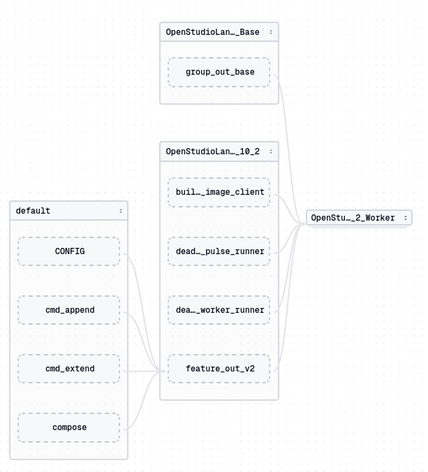
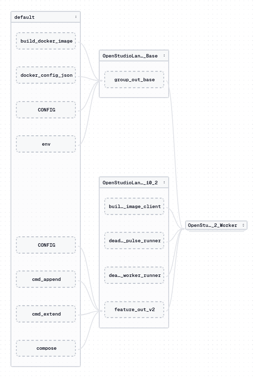

<!-- TOC -->
* [Scratchpad](#scratchpad)
* [Dagster Code Location Reload Performance Improvement](#dagster-code-location-reload-performance-improvement)
<!-- TOC -->

---

# Scratchpad

> [!NOTE]
> 
> This is for random ideas, info and threads.

Todo
- [ ] create global env file
  - [Persistent Environment Variables](https://linuxize.com/post/how-to-set-and-list-environment-variables-in-linux/#persistent-environment-variables)
  - [](https://www.geeksforgeeks.org/linux-unix/environment-variables-in-linux-unix/)
  - [](https://phoenixnap.com/kb/linux-set-environment-variable)
- [ ] Improve Dagster Deployment
  - [Dagster Microservices: Decoupling Infrastructure from User Code for Streamlined Deployments](https://medium.com/@achraf.daabek/dagster-microservices-decoupling-infrastructure-from-user-code-for-streamlined-deployments-1c3819b75470)
- [ ] Investigate Code Locations on remote machines
  - [Scaling Dagster on Kubernetes: Best Practices for 50+ Code Locations](https://u11d.com/blog/scaling-dagster-kubernetes-multi-code-locations/)
  - [Emmanuel Ogunwede - Getting Started with Dagster Code Locations](https://youtu.be/TTK36BedXA4?t=1254)
    - [JesuFemi-O/understanding-dagster-code-locations](https://github.com/JesuFemi-O/understanding-dagster-code-locations)
    - ```yaml
      load_from:
        - grpc_server:
          host: host1.code_locations.com
          port: 4000
          location_name: "My host1 Code Location"
        - grpc_server:
          host: host2.code_locations.com
          port: 4001
          location_name: "My host2 Code Location"
        - grpc_server:
          host: host3.code_locations.com
          port: 4002
          location_name: "My host3 Code Location"
      ```
    - Emmanuel Ogunwede is calling `dagster api grpc` in his [`docker-compose.yml`](https://youtu.be/TTK36BedXA4?t=1271). 
      This might refer to a newer version of Dagster.
      I assume that in Dagster 1.9, the equivalent sub-command would be `code-server`
  - ```
    $ DAGSTER_HOME="/home/michael/git/repos/OpenStudioLandscapes/.dagster-postgres" dagster instance info
    $DAGSTER_HOME: /home/michael/git/repos/OpenStudioLandscapes/.dagster-postgres
    
    
    Instance configuration:
    -----------------------
    local_artifact_storage:
      module: dagster._core.storage.root
      class: LocalArtifactStorage
      config:
        base_dir: /home/michael/git/repos/OpenStudioLandscapes/.dagster-postgres
    run_storage: PostgresRunStorage
    event_log_storage: PostgresEventLogStorage
    compute_logs: NoneType
    schedule_storage: PostgresScheduleStorage
    scheduler:
      module: dagster._core.scheduler
      class: DagsterDaemonScheduler
      config: {}
    run_coordinator: NoneType
    run_launcher:
      module: dagster
      class: DefaultRunLauncher
      config: {}
    auto_materialize:
      enabled: true
      use_sensors: true
    telemetry:
      enabled: false
    
    
    Storage schema state:
    ---------------------
    schema:
      event_log_storage:
        current: 6b7fb194ff9c
        latest: 6b7fb194ff9c
      run_storage:
        current: 6b7fb194ff9c
        latest: 6b7fb194ff9c
      schedule_storage:
        current: 6b7fb194ff9c
        latest: 6b7fb194ff9c
    ```
  - ```
    $ dagster code-server start --help
    Usage: dagster code-server start [OPTIONS]
    
      Start a code server that can serve metadata about a code location and launch runs.
    
    Options:
      -p, --port INTEGER              Port over which to serve. You must pass one and only one of --port/-p or
                                      --socket/-s.
      -s, --socket PATH               Serve over a UDS socket. You must pass one and only one of --port/-p or --socket/-s.
      -h, --host TEXT                 Hostname at which to serve. Default is localhost.
      -n, --max-workers INTEGER       Maximum number of (threaded) workers to use in the code server
      -a, --attribute TEXT            Attribute that is either a 1) repository or job or 2) a function that returns a
                                      repository or job
      --package-name TEXT             Specify Python package where repository or job function lives
      -m, --module-name TEXT          Specify module where dagster definitions reside as top-level symbols/variables and
                                      load the module as a code location in the current python environment.
      -f, --python-file PATH          Specify python file where dagster definitions reside as top-level symbols/variables
                                      and load the file as a code location in the current python environment.
      -d, --working-directory TEXT    Specify working directory to use when loading the repository or job
      --use-python-environment-entry-point
                                      If this flag is set, the server will signal to clients that they should launch
                                      dagster commands using `<this server's python executable> -m dagster`, instead of
                                      the default `dagster` entry point. This is useful when there are multiple Python
                                      environments running in the same machine, so a single `dagster` entry point is not
                                      enough to uniquely determine the environment.
      --fixed-server-id TEXT          [INTERNAL] This option should generally not be used by users. Internal param used by
                                      dagster to spawn a server with the specified server id.
      --log-level [critical|error|warning|info|debug]
                                      Level at which to log output from the code server process  [default: info]
      --log-format [colored|json|rich]
                                      Format of the log output from the code server process  [default: colored]
      --container-image TEXT          Container image to use to run code from this server.
      --container-context TEXT        Serialized JSON with configuration for any containers created to run the code from
                                      this server.
      --inject-env-vars-from-instance
                                      Whether to load env vars from the instance and inject them into the environment.
      --location-name TEXT            Name of the code location this server corresponds to.
      --startup-timeout INTEGER       How long to wait for code to load or reload before timing out. Defaults to no
                                      timeout.
      --heartbeat                     If set, the GRPC server will shut itself down when it fails to receive a heartbeat
                                      after a timeout configurable with --heartbeat-timeout.
      --heartbeat-timeout INTEGER     How long to wait for a heartbeat from the caller before timing out. Only comes into
                                      play if --heartbeat is set. Defaults to 30 seconds.
      --instance-ref TEXT             [INTERNAL] Serialized InstanceRef to use for accessing the instance
      --help                          Show this message and exit.
    ```

```dotenv
OPENSTUDIOLANDSCAPES__USER=openstudiolandscapes
OPENSTUDIOLANDSCAPES__UID=1000
OPENSTUDIOLANDSCAPES__GROUP=openstudiolandscapes
OPENSTUDIOLANDSCAPES__GID=1000
OPENSTUDIOLANDSCAPES__CONFIGSTORE_ROOT=
OPENSTUDIOLANDSCAPES__CONFIGSTORE_VCS=
OPENSTUDIOLANDSCAPES__ATTACH_GRAFANA_ALLOY_TO_COMPOSE_SCOPE=
OPENSTUDIOLANDSCAPES__ATTACH_PANGOLIN_SITE_TO_COMPOSE_SCOPE=
OPENSTUDIOLANDSCAPES__DOMAIN_WAN=
OPENSTUDIOLANDSCAPES__DOT_LANDSCAPES_ROOT=
OPENSTUDIOLANDSCAPES__LANDSCAPE_ID=
```

- [ ] add openstudiolandscapes system user
  - https://superuser.com/questions/77617/how-can-i-create-a-non-login-user
  - `--system`?
  - `--home-dir=`?
  - `--no-create-home`?
  - `--no-user-group`?

# Dagster Code Location Reload Performance Improvement

Todo
- [ ] Implement mechanism to avoid re-scraping (re-discover) every single time
  - a code location is loaded
  - an asset is materialized
  - The current implementation:
    - causes a lot of performance loss because the discovery procedure is quite expensive
    - however, for now it is the safest approach
  - Options
    - [ ] `@functools.cache`?
      - https://www.youtube.com/watch?v=K0Q5twtYxWY
      - https://stackoverflow.com/questions/15585493/store-the-cache-to-a-file-functools-lru-cache-in-python-3-2
        - -> multiple possible solutions here
      - Entrypoint would potentially be [`definitions.py`](src/OpenStudioLandscapes/engine/definitions.py)
- `workspace.yaml`
  - [x] OpenStudioLandscapes-Kitsu
  - [x] OpenStudioLandscapes-Deadline-10-2-Worker
  - [x] OpenStudioLandscapes-Flamenco-Worker
  - [x] OpenStudioLandscapes-OpenCue-Worker
  - [x] OpenStudioLandscapes-Watchtower
  - ...

> [!TIP]
> 
> The visualized DAG is cleaner when using `build_docker_image_spec`
> instead of `build_docker_image.specs` - yet they should be
> equivalent. However, `build_docker_image_spec` requires an 
> `AssetSpec` object, which, in turn, only works on `multi_asset`.
> Bottom line: `build_docker_image.specs` might not look cleaner,
> it's probably way easier to maintain.
> 
> > [!CRITICAL]
> > 
> > And for asset factories it's probably a headache to specify `AssetSpec` first.
> > Let's see if it would make a difference when setting up
> > tests...
> > 
> > Example:
> > ```python
> > from OpenStudioLandscapes.Deadline_10_2.assets import (
> >     feature_out_v2,
> > )
> > 
> > assets_external.extend(feature_out_v2.specs)
> > ```
> 
> Example `OpenStudioLandscapes-Deadline-10-2-Worker`:
> 
> `build_docker_image_spec`:
> 
> ```python
> group_out_base_spec = AssetSpec(
>     key=AssetKey(
>         [
>             *ASSET_HEADER_BASE["key_prefix"],
>             "group_out_base",
>         ]
>     ),
>     group_name=ASSET_HEADER_BASE["group_name"],
>     description=textwrap.dedent("""
>         This is the foundation. This assets provides all relevant environment information
>         for subsequent assets and asset groups. All downstream assets consume this data and
>         build their environment on top of this.
>         """),
> )
> 
> 
> @multi_asset(
>     outs={
>         "group_out_base": AssetOut.from_spec(
>             group_out_base_spec,
>         )
>     },
>     ins={
>         "env": AssetIn(AssetKey([*ASSET_HEADER_BASE_ENV["key_prefix"], "env"])),
>         "CONFIG": AssetIn(AssetKey([*ASSET_HEADER_BASE_ENV["key_prefix"], "CONFIG"])),
>         "docker_config_json": AssetIn(
>             AssetKey([*ASSET_HEADER_BASE["key_prefix"], "docker_config_json"])
>         ),
>         "build_docker_image": AssetIn(
>             AssetKey([*ASSET_HEADER_BASE["key_prefix"], "build_docker_image"]),
>         ),
>     },
> )
> def group_out_base():...
> ```
> 
> Results in:
> 
> 
> `build_docker_image.specs`:
> 
> ```python
> @asset(
>     **ASSET_HEADER_BASE,
>     ins={
>         "env": AssetIn(AssetKey([*ASSET_HEADER_BASE_ENV["key_prefix"], "env"])),
>         "CONFIG": AssetIn(AssetKey([*ASSET_HEADER_BASE_ENV["key_prefix"], "CONFIG"])),
>         "docker_config_json": AssetIn(
>             AssetKey([*ASSET_HEADER_BASE["key_prefix"], "docker_config_json"])
>         ),
>         "build_docker_image": AssetIn(
>             AssetKey([*ASSET_HEADER_BASE["key_prefix"], "build_docker_image"]),
>         ),
>     },
>     description=textwrap.dedent("""
>         This is the foundation. This assets provides all relevant environment information
>         for subsequent assets and asset groups. All downstream assets consume this data and
>         build their environment on top of this.
>         """),
> )
> def group_out_base():...
> ```
> 
> Results in:
> 


The visualized DAG is cleaner when using `build_docker_image_spec`
instead of `build_docker_image.specs` - yet they should be
equivalent
