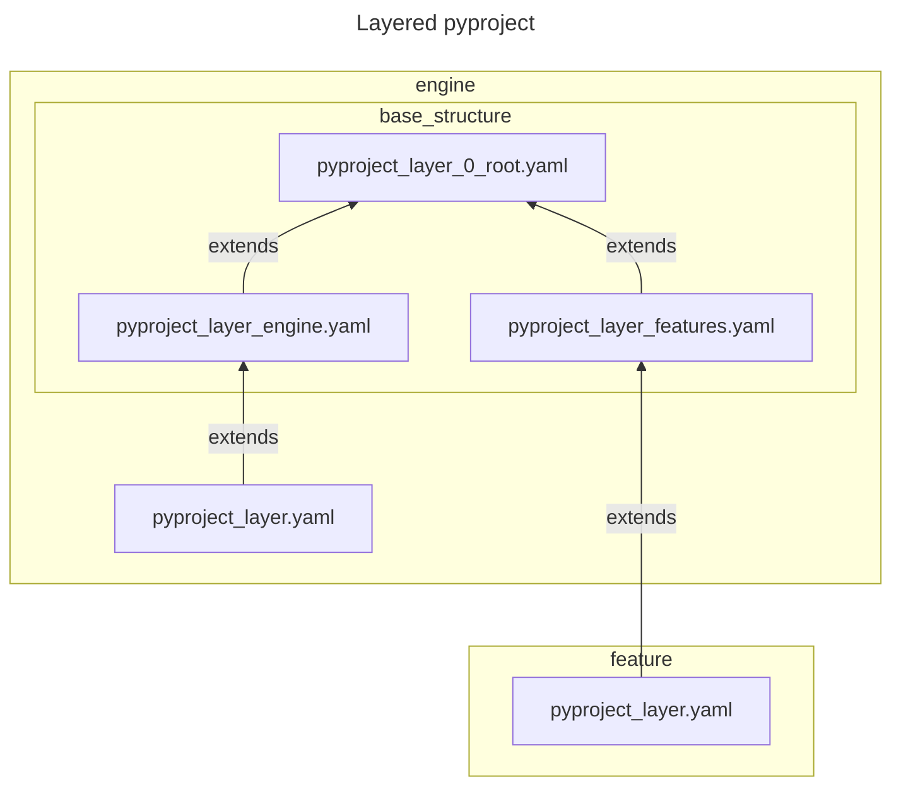

<!-- TOC -->
* [`pyproject.toml` Layers](#pyprojecttoml-layers)
  * [Structure](#structure)
<!-- TOC -->

---

# `pyproject.toml` Layers

https://github.com/michimussato/OpenStudioLandscapesUtil-VersionBumper

Detailed information: todo

Make sure to check the `pyproject_layer.yaml` for Features that depend
on other Features, like:
- `OpenStudioLandscapes-Watchtower` which depends on `OpenStudioLandscapes-Kitsu`
- `OpenStudioLandscapes-Deadline-10-2-Worker` which depends on `OpenStudioLandscapes-Deadline-10-2-Worker`
- `OpenStudioLandscapes-Flamenco-Worker` which depends on `OpenStudioLandscapes-Flamenco-Worker`
- etc.

## Structure

