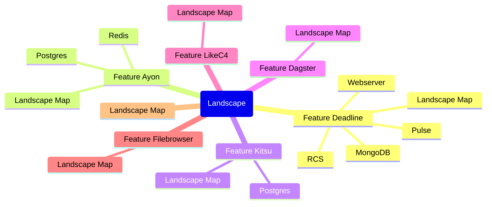
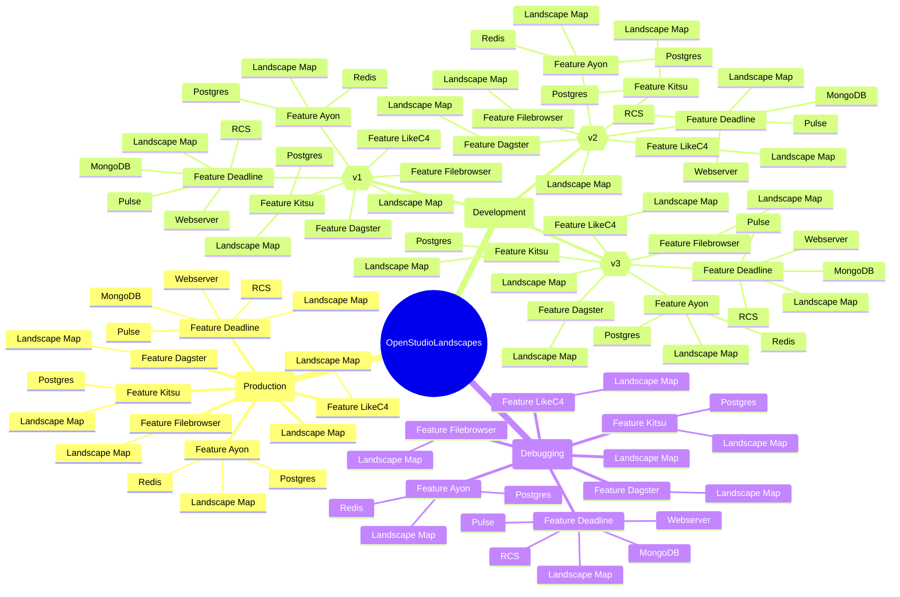
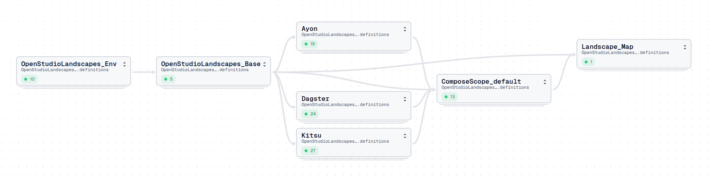
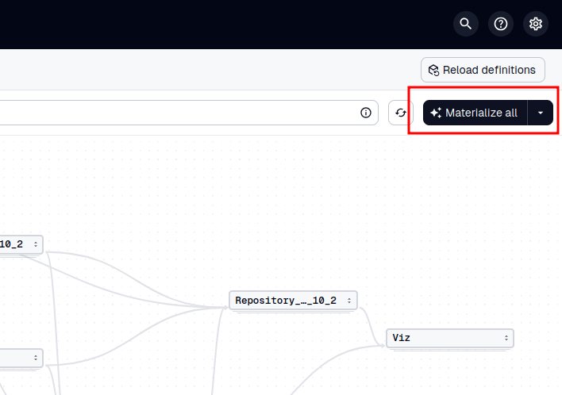
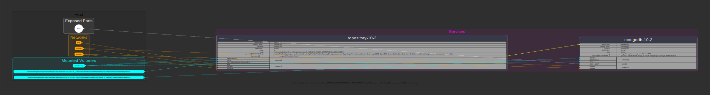
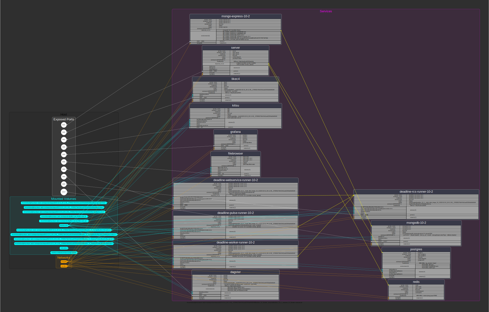

# Table Of Contents

<!-- TOC -->
* [Table Of Contents](#table-of-contents)
* [A Word about Documentation](#a-word-about-documentation)
* [Installation Methods](#installation-methods)
* [Community](#community)
* [Structure](#structure)
  * [Single Landscape](#single-landscape)
  * [Multiple Landscapes](#multiple-landscapes)
* [Usage](#usage)
  * [Configure Features](#configure-features)
  * [Run OpenStudioLandscapes](#run-openstudiolandscapes)
    * [Blue Pill Method](#blue-pill-method)
    * [Red Pill Method](#red-pill-method)
    * [Create Landscape](#create-landscape)
  * [Docker Compose Graph](#docker-compose-graph)
* [Contributors](#contributors)
* [References](#references)
<!-- TOC -->

---

* [Disclaimer](disclaimer.md#table-of-contents)
* [About the Author](about_the_author.md#table-of-contents)

---

 
> [!TIP]
> This Wiki can be easily interacted with in [Obsidian](https://obsidian.md/) after cloning the repository to your local drive.
 

---

# A Word about Documentation

Sphinx and ReadTheDocs have been abandoned as they created a large overhead (they are 
beasts by themselves) and - on top of that - Sphinx does not easily inspect Dagster
decorators, leaving the autogenerated documentation pretty much useless.
The decision has been therefore made to simply continue with Markdown formatted
files aggregated in this Wiki - which is a constant work in progress.

We might come back to Sphinx/ReadTheDocs at some point.

---

# Installation Methods

| Method                                                                        | Status           | Potential Frustration Level | Type     | Info                                                                         |
|-------------------------------------------------------------------------------|------------------|-----------------------------|----------|------------------------------------------------------------------------------|
| [Red Pill](installation/basic_installation.md#table-of-contents)              | Work-in-Progress | **High**                    | Manual   | The advanced option for most Linux distros                                   |
| [Blue Pill](installation/basic_installation_from_script.md#table-of-contents) | Functional       | **Low**                     | Scripted | The best, easiest and safest (for now) option for a **vanilla Ubuntu 22.04** |

```mermaid
graph TB
    installation_methods(Installation Methods)
    manual((Manual))
    click manual href "https://github.com/michimussato/OpenStudioLandscapes/blob/main/wiki/installation/basic_installation.md#basic-installation"
    %% docker((Docker))
    %% click docker href "https://github.com/michimussato/OpenStudioLandscapes/blob/main/wiki/installation/basic_installation.md#install-docker"
    script((Installer))
    click script href "https://github.com/michimussato/OpenStudioLandscapes/blob/main/wiki/installation/basic_installation_from_script.md"
    
    classDef clone_repo fill:#004f00;
    clone_repo_manual[Clone OpenStudioLandscapes Repository]
    click clone_repo_manual href "https://github.com/michimussato/OpenStudioLandscapes/blob/main/wiki/installation/basic_installation.md#clone-repository"
    %% clone_repo_docker[Clone OpenStudioLandscapes Repository]
    %% click clone_repo_docker href "https://github.com/michimussato/OpenStudioLandscapes/blob/main/wiki/installation/basic_installation.md#clone-repository"
    class clone_repo_manual,clone_repo_docker clone_repo;
    
    classDef landscapes_root fill:#4c4c00;
    landscapes_root_manual[Create Landscapes Root Directory]
    click landscapes_root_manual href "https://github.com/michimussato/OpenStudioLandscapes/blob/main/wiki/installation/basic_installation.md#create-landscapes-root-directory"
    %% landscapes_root_docker[Create Landscapes Root Directory]
    %% click landscapes_root_docker href "https://github.com/michimussato/OpenStudioLandscapes/blob/main/wiki/installation/basic_installation.md#create-landscapes-root-directory"
    landscapes_root_script[Create Landscapes Root Directory]
    click landscapes_root_script href "https://github.com/michimussato/OpenStudioLandscapes/blob/main/wiki/installation/basic_installation.md#create-landscapes-root-directory"
    class landscapes_root_manual,landscapes_root_docker,landscapes_root_script landscapes_root
    
    classDef install_python fill:#004c4c;
    install_python_manual[Install Python 3.11]
    click install_python_manual href "https://github.com/michimussato/OpenStudioLandscapes/blob/main/wiki/installation/basic_installation.md#install-python311"
    %% install_python_docker[Install Python 3.11]
    %% click install_python_docker href "https://github.com/michimussato/OpenStudioLandscapes/blob/main/wiki/installation/basic_installation.md#install-python311"
    class install_python_manual,install_python_docker install_python

    classDef install_docker fill:#007cbc;
    install_docker_manual[Install Docker]
    click install_docker_manual href "https://github.com/michimussato/OpenStudioLandscapes/blob/main/wiki/installation/basic_installation.md#install-docker"
    %% install_docker_docker[Install Docker]
    %% click install_docker_docker href "https://github.com/michimussato/OpenStudioLandscapes/blob/main/wiki/installation/basic_installation.md#install-docker"
    class install_docker_manual,install_docker_docker install_docker
    
    classDef install_harbor fill:#a07cbc;
    install_harbor_manual[Install Harbor]
    click install_harbor_manual href "https://github.com/michimussato/OpenStudioLandscapes/blob/main/wiki/installation/basic_installation.md#harbor"
    %% install_harbor_docker[Install Harbor]
    %% click install_harbor_docker href "https://github.com/michimussato/OpenStudioLandscapes/blob/main/wiki/installation/basic_installation.md#harbor"
    class install_harbor_manual,install_harbor_docker install_harbor
    
    classDef run_harbor fill:#5049a7;
    run_harbor_manual[Run Harbor]
    click run_harbor_manual href "https://github.com/michimussato/OpenStudioLandscapes/blob/main/wiki/run/run_harbor.md#up"
    %% run_harbor_docker[Run Harbor]
    %% click run_harbor_docker href "https://github.com/michimussato/OpenStudioLandscapes/blob/main/wiki/run/run_harbor.md#up"
    class run_harbor_manual,run_harbor_docker run_harbor
    
    classDef clone_features fill:#123456;
    clone_features_manual[Clone Features]
    click clone_features_manual href "https://github.com/michimussato/OpenStudioLandscapes/blob/main/wiki/installation/install_features.md#clone-features"
    class clone_features_manual clone_features
    
    classDef install_features fill:#654321;
    install_features_manual[Install Features]
    click install_features_manual href "https://github.com/michimussato/OpenStudioLandscapes/blob/main/wiki/installation/install_features.md#install-features-1"
    class install_features_manual install_features
    
    classDef run fill:#142536;
    run_manual(Run OpenStudioLandscapes)
    click run_manual href "https://github.com/michimussato/OpenStudioLandscapes/blob/main/wiki/run_openstudiolandscapes/from_manual.md#up"
    %% run_docker(Run OpenStudioLandscapes)
    %% click run_docker href "https://github.com/michimussato/OpenStudioLandscapes/blob/main/wiki/run_openstudiolandscapes/from_docker_image.md"
    run_script(Run OpenStudioLandscapes)
    click run_script href "https://github.com/michimussato/OpenStudioLandscapes/blob/main/wiki/run_openstudiolandscapes/from_script.md#up-and-down"
    class run_manual,run_docker,run_script run
    
    subgraph block_manual[Red Pill]
        direction TB
        manual --> clone_repo_manual --> landscapes_root_manual --> install_python_manual --> install_docker_manual --> install_harbor_manual --> run_harbor_manual --> clone_features_manual --> install_features_manual --> run_manual
    end
    style block_manual fill:#550000
    
    %% subgraph block_docker[Docker]
    %%     direction TB
    %%     docker --> clone_repo_docker --> landscapes_root_docker --> install_python_docker --> install_docker_docker --> install_harbor_docker --> run_harbor_docker --> run_docker
    %% end
    
    subgraph block_installer[Blue Pill]
        direction TB
        script --> landscapes_root_script --> run_script
    end
    style block_installer fill:#000055
    
    installation_methods --> block_manual
    %% installation_methods --> block_docker
    installation_methods --> block_installer
```

---

# Community

- [YouTube](https://youtube.com/@openstudiolandscapes)
- [LinkedIn](https://www.linkedin.com/company/106731439/)
  - [#OpenStudioLandscapes](https://www.linkedin.com/search/results/all/?keywords=%23openstudiolandscapes)
- [Discord](https://discord.com/channels/1357343453364748419/1357343454065328202)

---

# Structure

## Single Landscape

## Multiple Landscapes
  
The hierarchy of multiple Landscapes  
in the context of `OpenStudioLandscapes`:  
  

---

# Usage

## Configure Features

By default, only

- [OpenStudioLandscapes-Ayon](https://github.com/michimussato/OpenStudioLandscapes-Ayon)
- [OpenStudioLandscapes-Dagster](https://github.com/michimussato/OpenStudioLandscapes-Dagster)
- [OpenStudioLandscapes-Kitsu](https://github.com/michimussato/OpenStudioLandscapes-Kitsu)

are enabled. Others (once they have been released
publicly) might need individual configuration 
and do not work out of the box. More info in the 
`README.md` files of the Feature.

  
Nevertheless, whether a Feature is enabled or not can be 
specified in `OpenStudioLandscapes.engine.features` or in the `OpenStudioLandscapes/.env` file
(if you choose to use one - see `OpenStudioLandscapes/EXAMPLE.env` for more information). 

## Run OpenStudioLandscapes

### [Blue Pill Method](installation/basic_installation_from_script.md#table-of-contents)

[Run from scripted installation](run_openstudiolandscapes/from_script.md#up)

and open the Dagster UI: 

[http://<ip_openstudiolandscapes_host>:3000/asset-groups]()  

### [Red Pill Method](installation/basic_installation.md#table-of-contents)

[Run from manual installation](run_openstudiolandscapes/from_manual.md#up)

and open the Dagster UI: 

[http://<ip_openstudiolandscapes_host>:3000/asset-groups]()  

### Create Landscape

Materialize ([Dagster term](https://docs.dagster.io/etl-pipeline-tutorial/create-and-materialize-assets))
Landscape

## Docker Compose Graph

Dynamic Docker Compose documentation:
[docker-compose-graph](https://github.com/michimussato/docker-compose-graph) creates a visual representation of
`docker-compose.yml` files for every individual
Landscape for quick reference and context.

For individual elements of a Landscape (Features)

as well as for the complete Landscape

They are accessible from the Dagster UI.

---

# Contributors

- Jonas Juhl Nielsen
- Jean First
- Lucerne University of Applied Sciences and Arts

---

# References

* [Terminology](terminology.md#table-of-contents)
* [nox](nox.md#table-of-contents)
