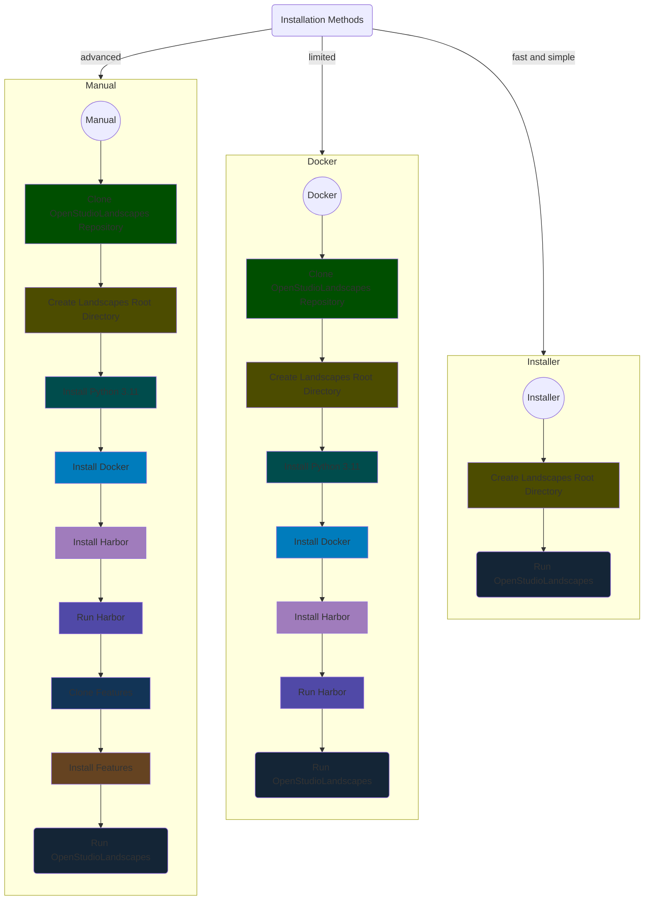

> [!TIP]
> This Wiki can be easily interacted with in [Obsidian](https://obsidian.md/) after cloning the repository to your local drive.
 
---

* [Disclaimer](disclaimer.md#table-of-contents)
* [About the Author](about_the_author.md#table-of-contents)

---

# Installation Methods

```mermaid
graph TB
    installation_methods(Installation Methods)
    manual((Manual))
    click manual href "https://github.com/michimussato/OpenStudioLandscapes/blob/main/wiki/installation/basic_installation.md#basic-installation"
    docker((Docker))
    click docker href "https://github.com/michimussato/OpenStudioLandscapes/blob/main/wiki/installation/basic_installation.md#install-docker"
    script((Installer))
    click script href "https://github.com/michimussato/OpenStudioLandscapes/blob/main/wiki/installation/basic_installation_from_script.md"
    
    classDef clone_repo fill:#004f00;
    clone_repo_manual[Clone OpenStudioLandscapes Repository]
    click clone_repo_manual href "https://github.com/michimussato/OpenStudioLandscapes/blob/main/wiki/installation/basic_installation.md#clone-repository"
    clone_repo_docker[Clone OpenStudioLandscapes Repository]
    click clone_repo_docker href "https://github.com/michimussato/OpenStudioLandscapes/blob/main/wiki/installation/basic_installation.md#clone-repository"
    class clone_repo_manual,clone_repo_docker clone_repo;
    
    classDef landscapes_root fill:#4c4c00;
    landscapes_root_manual[Create Landscapes Root Directory]
    click landscapes_root_manual href "https://github.com/michimussato/OpenStudioLandscapes/blob/main/wiki/installation/basic_installation.md#create-landscapes-root-directory"
    landscapes_root_docker[Create Landscapes Root Directory]
    click landscapes_root_docker href "https://github.com/michimussato/OpenStudioLandscapes/blob/main/wiki/installation/basic_installation.md#create-landscapes-root-directory"
    landscapes_root_script[Create Landscapes Root Directory]
    click landscapes_root_script href "https://github.com/michimussato/OpenStudioLandscapes/blob/main/wiki/installation/basic_installation.md#create-landscapes-root-directory"
    class landscapes_root_manual,landscapes_root_docker,landscapes_root_script landscapes_root
    
    classDef install_python fill:#004c4c;
    install_python_manual[Install Python 3.11]
    click install_python_manual href "https://github.com/michimussato/OpenStudioLandscapes/blob/main/wiki/installation/basic_installation.md#install-python311"
    install_python_docker[Install Python 3.11]
    click install_python_docker href "https://github.com/michimussato/OpenStudioLandscapes/blob/main/wiki/installation/basic_installation.md#install-python311"
    class install_python_manual,install_python_docker install_python

    classDef install_docker fill:#007cbc;
    install_docker_manual[Install Docker]
    click install_docker_manual href "https://github.com/michimussato/OpenStudioLandscapes/blob/main/wiki/installation/basic_installation.md#install-docker"
    install_docker_docker[Install Docker]
    click install_docker_docker href "https://github.com/michimussato/OpenStudioLandscapes/blob/main/wiki/installation/basic_installation.md#install-docker"
    class install_docker_manual,install_docker_docker install_docker
    
    classDef install_harbor fill:#a07cbc;
    install_harbor_manual[Install Harbor]
    click install_harbor_manual href "https://github.com/michimussato/OpenStudioLandscapes/blob/main/wiki/installation/basic_installation.md#harbor"
    install_harbor_docker[Install Harbor]
    click install_harbor_docker href "https://github.com/michimussato/OpenStudioLandscapes/blob/main/wiki/installation/basic_installation.md#harbor"
    class install_harbor_manual,install_harbor_docker install_harbor
    
    classDef run_harbor fill:#5049a7;
    run_harbor_manual[Run Harbor]
    click run_harbor_manual href "https://github.com/michimussato/OpenStudioLandscapes/blob/main/wiki/run/run_harbor.md#up"
    run_harbor_docker[Run Harbor]
    click run_harbor_docker href "https://github.com/michimussato/OpenStudioLandscapes/blob/main/wiki/run/run_harbor.md#up"
    class run_harbor_manual,run_harbor_docker run_harbor
    
    classDef clone_features fill:#123456;
    clone_features_manual[Clone Features]
    click clone_features_manual href "https://github.com/michimussato/OpenStudioLandscapes/blob/main/wiki/installation/install_features.md#clone-features"
    class clone_features_manual clone_features
    
    classDef install_features fill:#654321;
    install_features_manual[Install Features]
    click install_features_manual href "https://github.com/michimussato/OpenStudioLandscapes/blob/main/wiki/installation/install_features.md#install-features-1"
    class install_features_manual install_features
    
    classDef run fill:#142536;
    run_manual(Run OpenStudioLandscapes)
    click run_manual href "https://github.com/michimussato/OpenStudioLandscapes/blob/main/wiki/run_openstudiolandscapes/from_manual.md#up"
    run_docker(Run OpenStudioLandscapes)
    click run_docker href "https://github.com/michimussato/OpenStudioLandscapes/blob/main/wiki/run_openstudiolandscapes/from_docker_image.md"
    run_script(Run OpenStudioLandscapes)
    click run_script href "https://github.com/michimussato/OpenStudioLandscapes/blob/main/wiki/run_openstudiolandscapes/from_script.md#up-and-down"
    class run_manual,run_docker,run_script run
    
    subgraph block_manual[Manual]
        direction TB
        manual --> clone_repo_manual --> landscapes_root_manual --> install_python_manual --> install_docker_manual --> install_harbor_manual --> run_harbor_manual --> clone_features_manual --> install_features_manual --> run_manual
    end
    
    subgraph block_docker[Docker]
        direction TB
        docker --> clone_repo_docker --> landscapes_root_docker --> install_python_docker --> install_docker_docker --> install_harbor_docker --> run_harbor_docker --> run_docker
    end
    
    subgraph block_installer[Installer]
        direction TB
        script --> landscapes_root_script --> run_script
    end
    
    installation_methods -- advanced --> block_manual
    installation_methods -- limited --> block_docker
    installation_methods -- fast and simple --> block_installer
```

* Installation Methods
  * [Manual](installation/basic_installation.md#table-of-contents)
    * The generalistic option
  * [Installer Script](installation/basic_installation_from_script.md#table-of-contents)
    * The best option for a vanilla Ubuntu OS
  * [Docker](installation/basic_installation_from_script.md#table-of-contents)
    * A simple, yet generalistic option with limited configurability
* [Install Features](installation/install_features.md#table-of-contents)

---

* [Community](community.md)
* [Quickstart](quickstart.md)
* [Terminology](terminology.md)
* [Structure of a Landscape](structure.md)
* [Limitations](limitations.md)
* [Overview](overview.md)
* [nox](nox.md)
* [Jump Start with Kitsu](jump_start_kitsu.md)
* [Roadmap/Todo](roadmap_todo.md)
* [Dagster](dagster.md)
* [Requirements](requirements.md)
* [Sphinx](sphinx.md)
