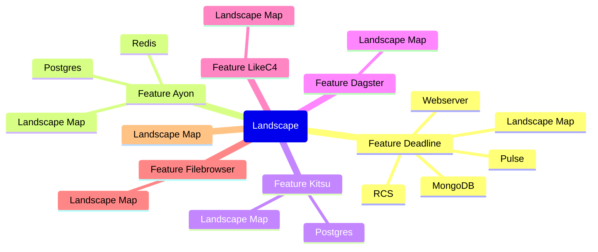
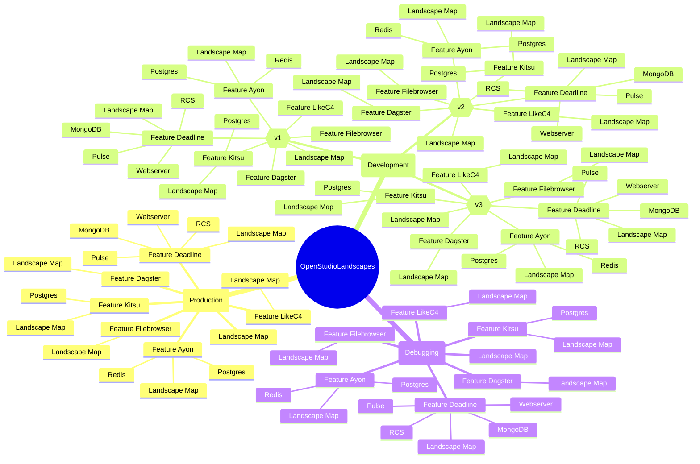
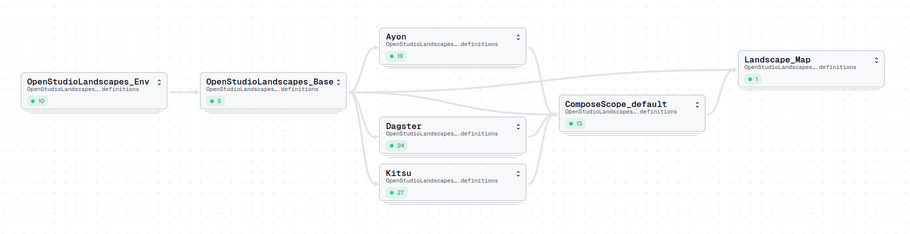
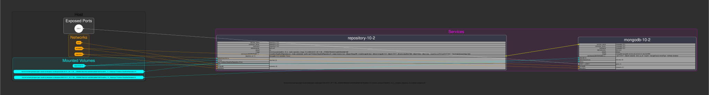
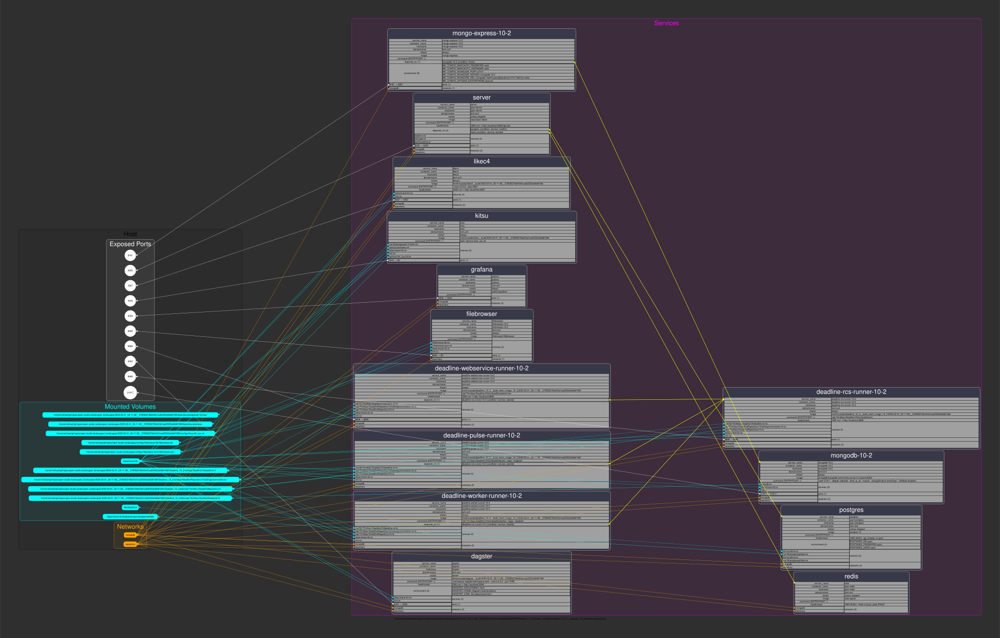

# Table Of Contents

<!-- TOC -->
* [Table Of Contents](#table-of-contents)
* [A Word about Documentation](#a-word-about-documentation)
  * [Question: What's worse than having no Documentation?](#question-whats-worse-than-having-no-documentation)
* [Structure](#structure)
  * [Single Landscape](#single-landscape)
  * [Multiple Landscapes](#multiple-landscapes)
* [Dependencies](#dependencies)
* [Usage](#usage)
  * [Configure Features](#configure-features)
  * [Run OpenStudioLandscapes](#run-openstudiolandscapes)
    * [Create Landscape](#create-landscape)
  * [Docker Compose Graph](#docker-compose-graph)
* [Contributors](#contributors)
* [References](#references)
<!-- TOC -->

---

* [Disclaimer](disclaimer.md#table-of-contents)
* [About the Author](about_the_author.md#table-of-contents)

---

> [!TIP]
> 
> This Wiki can be easily interacted with in [Obsidian](https://obsidian.md/) after cloning the repository to your local drive.

---

# A Word about Documentation

Sphinx and ReadTheDocs have been abandoned as they created a large overhead (they are
beasts by themselves) and - on top of that - Sphinx does not easily inspect Dagster
decorators, leaving the autogenerated documentation pretty much useless.
The decision has been therefore made to simply continue with Markdown formatted
files aggregated in this Wiki - which is a constant work in progress.

> [!NOTE]
> 
> We might come back to Sphinx/ReadTheDocs at some point.
 
This might state the obvious: OpenStudioLandscapes documentation aims to
reflect the truth as close and as quickly as possible using 
*my limited resources*.

> [!IMPORTANT]
> 
> Wherever possible, this project is documented
> - dynamically
> - using Dagster built-in Asset descriptions
> - where it matters
> - scripted (`nox -s readme`)
> - graphically (images, [graphs & diagrams](https://mermaid.js.org/intro/))

## Question: What's worse than having no Documentation?

Answer (from my own experience):
- **Outdated Documentation**
- **Parallel Documentation** (The same thing documented in multiple places - I'm sure there's an official term for this...)

These are deceiving because they *pretend* to be reliable as a source of truth.

---

# Structure

## Single Landscape

```mermaid
%% https://mermaid-js.github.io/mermaid-live-editor
mindmap
  root(Landscape)
    Feature Deadline
      Landscape Map
      RCS
      Webserver
      Pulse
      MongoDB
    Feature Ayon
      Landscape Map
      Redis
      Postgres
    Feature Kitsu
      Landscape Map
      Postgres
    Feature Dagster
      Landscape Map
    Feature LikeC4
      Landscape Map
    Feature Filebrowser
      Landscape Map
    Landscape Map
```

## Multiple Landscapes

The hierarchy of multiple Landscapes
in the context of `OpenStudioLandscapes`:

```mermaid
%% https://mermaid-js.github.io/mermaid-live-editor
mindmap
root((OpenStudioLandscapes))
  Landscape(Production)
    Feature Deadline
      Landscape Map
      RCS
      Webserver
      Pulse
      MongoDB
    Feature Ayon
      Landscape Map
      Redis
      Postgres
    Feature Kitsu
      Landscape Map
      Postgres
    Feature Dagster
      Landscape Map
    Feature LikeC4
      Landscape Map
    Feature Filebrowser
      Landscape Map
    Landscape Map
  Landscape(Development)
    Version{{v1}}
      Feature Deadline
        Landscape Map
        RCS
        Webserver
        Pulse
        MongoDB
      Feature Ayon
        Landscape Map
        Redis
        Postgres
      Feature Kitsu
        Landscape Map
        Postgres
      Feature Dagster
      Feature LikeC4
      Feature Filebrowser
      Landscape Map
    Version{{v2}}
      Feature Deadline
        Landscape Map
        RCS
        Webserver
        Pulse
        MongoDB
      Feature Ayon
        Landscape Map
        Redis
        Postgres
      Feature Kitsu
        Landscape Map
        Postgres
      Feature Dagster
        Landscape Map
      Feature LikeC4
        Landscape Map
      Feature Filebrowser
        Landscape Map
      Landscape Map
    Version{{v3}}
      Feature Deadline
        Landscape Map
        RCS
        Webserver
        Pulse
        MongoDB
      Feature Ayon
        Landscape Map
        Redis
        Postgres
      Feature Kitsu
        Landscape Map
        Postgres
      Feature Dagster
        Landscape Map
      Feature LikeC4
        Landscape Map
      Feature Filebrowser
        Landscape Map
      Landscape Map
  Landscape(Debugging)
    Feature Deadline
      Landscape Map
      RCS
      Webserver
      Pulse
      MongoDB
    Feature Ayon
      Landscape Map
      Redis
      Postgres
    Feature Kitsu
      Landscape Map
      Postgres
    Feature Dagster
      Landscape Map
    Feature LikeC4
      Landscape Map
    Feature Filebrowser
      Landscape Map
    Landscape Map
```

---

# Dependencies

See
- [Reference System](installation/reference_system.md)
- [Dependencies Overview](dependencies.md)

# Usage

## Configure Features

By default, these Features (among others) are enabled
and will be displayed in the Dagster node graph:

- [OpenStudioLandscapes-Ayon](https://github.com/michimussato/OpenStudioLandscapes-Ayon)
- [OpenStudioLandscapes-Dagster](https://github.com/michimussato/OpenStudioLandscapes-Dagster)
- [OpenStudioLandscapes-Kitsu](https://github.com/michimussato/OpenStudioLandscapes-Kitsu)

are enabled. Others (once they have been released
publicly) might need individual configuration
and do not work out of the box. More info in the
`README.md` files of the Feature.

Nevertheless, whether a Feature is enabled or not can be
specified in its `config.yml` file located (by default) at
`~/.config/OpenStudioLandscapes/OpenStudioLandscapes-<Feature>/`.

## Run OpenStudioLandscapes

### Create Landscape

Materialize ([Dagster term](https://docs.dagster.io/etl-pipeline-tutorial/create-and-materialize-assets))
Landscape

## Docker Compose Graph

Dynamic Docker Compose documentation:
[docker-compose-graph](https://github.com/michimussato/docker-compose-graph) creates a visual representation of
`docker-compose.yml` files for every individual
Landscape for quick reference and context.

For individual elements of a Landscape (Features)

as well as for the complete Landscape

They are accessible from the Dagster UI.

---

# Contributors

- Jonas Juhl Nielsen
- Jean First
- Lucerne University of Applied Sciences and Arts
- Francesco Faranna

---

# References

* [Terminology](terminology.md#table-of-contents)
* [nox](nox.md#table-of-contents)
