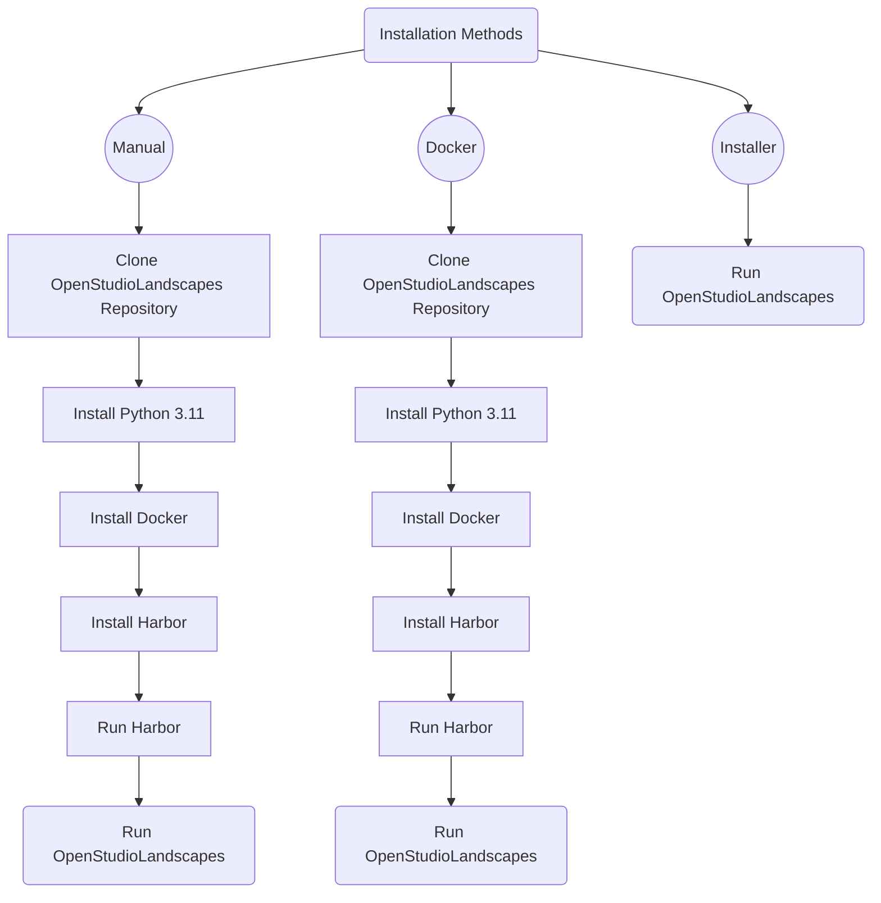

> [!TIP]
> This Wiki can be easily interacted with in [Obsidian](https://obsidian.md/) after cloning the repository to your local drive.
 
---

* [Disclaimer](disclaimer.md#table-of-contents)
* [About the Author](about_the_author.md#table-of-contents)

---

# Installation Methods

* Installation Methods
  * [Manual](installation/basic_installation.md#table-of-contents)
  * [Installer Script](installation/basic_installation_from_script.md#table-of-contents)
  * [Docker](installation/basic_installation_from_script.md#table-of-contents)

---

* [Community](community.md)
* [Quickstart](quickstart.md)
* [Terminology](terminology.md)
* [Structure of a Landscape](structure.md)
* [Limitations](limitations.md)
* [Overview](overview.md)
* [nox](nox.md)
* [Jump Start with Kitsu](jump_start_kitsu.md)
* [Roadmap/Todo](roadmap_todo.md)
* [Dagster](dagster.md)
* [Requirements](requirements.md)
* [Sphinx](sphinx.md)
