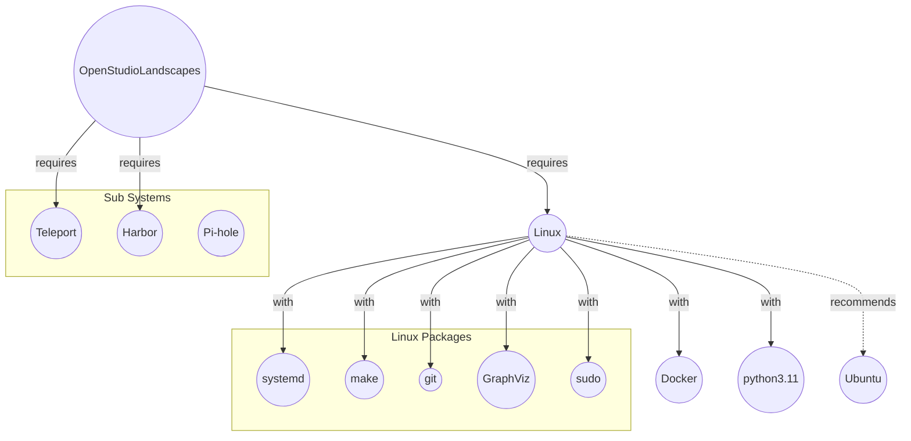

---

# Dependencies

```mermaid
%% https://mermaid-js.github.io/mermaid-live-editor
flowchart TB
    root((OpenStudioLandscapes))
    docker((Docker))
    python((python3.11))
    utuntu((Ubuntu))
    linux((Linux))
    
    subgraph Linux Packages 
        direction TB
        systemd((systemd))
        make((make))
        git((git))
        graphviz((GraphViz))
        sudo((sudo))
    end
    
    subgraph Sub Systems 
        direction TB
        teleport((Teleport))
        harbor((Harbor))
        pihole((Pi-hole))
    end
    
    
    root -- requires --> harbor
    root -- requires --> teleport
%%    root -- requires --> docker
%%    root -- requires --> python
%%    root -- requires --> systemd
%%    root -- requires --> make
%%    root -- requires --> git
%%    root -- requires --> sudo
    root -- requires --> linux
%%    git -- requires --> linux
%%    sudo -- requires --> linux
%%    make -- requires --> linux
    
    linux -- with --> git
    linux -- with --> systemd
    linux -- with --> make
    linux -- with --> graphviz
    linux -- with --> sudo
    linux -- with --> python
    linux -- with --> docker
    linux -. recommends .-> utuntu
    
    
    
%%    root -. recommends .-> utuntu
%%    root -. recommends .-> pihole
```