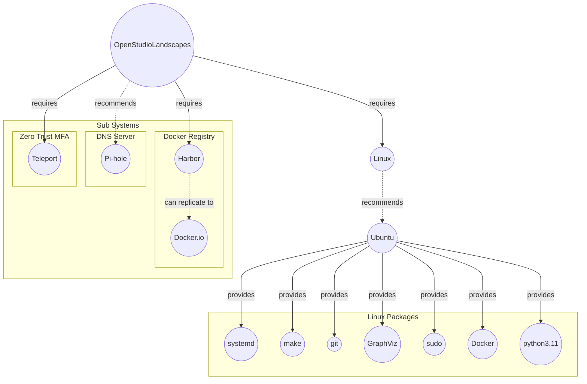

---

# Dependencies

```mermaid
%% https://mermaid-js.github.io/mermaid-live-editor
flowchart TB
    root((OpenStudioLandscapes))
    utuntu((Ubuntu))
    linux((Linux))
    
    subgraph Linux Packages 
        direction TB
        systemd((systemd))
        make((make))
        git((git))
        graphviz((GraphViz))
        sudo((sudo))
        docker((Docker))
        python((python3.11))
    end
    
    subgraph Sub Systems 
        direction TB
        
        subgraph Docker Registry
            direction TB
            harbor((Harbor))
            dockerio((Docker.io))
            
        end
        
        subgraph DNS Server
            direction TB
            pihole((Pi-hole))
        end
        
        subgraph Zero Trust MFA
            direction TB
        teleport((Teleport))
        end
        
    end
    
    
    root -- requires --> harbor
    harbor -. can replicate to .-> dockerio
    root -- requires --> teleport
%%    root -- requires --> docker
%%    root -- requires --> python
%%    root -- requires --> systemd
%%    root -- requires --> make
%%    root -- requires --> git
%%    root -- requires --> sudo
    root -- requires --> linux
    root -. recommends .-> pihole
%%    git -- requires --> linux
%%    sudo -- requires --> linux
%%    make -- requires --> linux
    
    utuntu -- provides --> git
    utuntu -- provides --> systemd
    utuntu -- provides --> make
    utuntu -- provides --> graphviz
    utuntu -- provides --> sudo
    utuntu -- provides --> python
    utuntu -- provides --> docker
    linux -. recommends .-> utuntu
    
    
    
%%    root -. recommends .-> utuntu
%%    root -. recommends .-> pihole
```