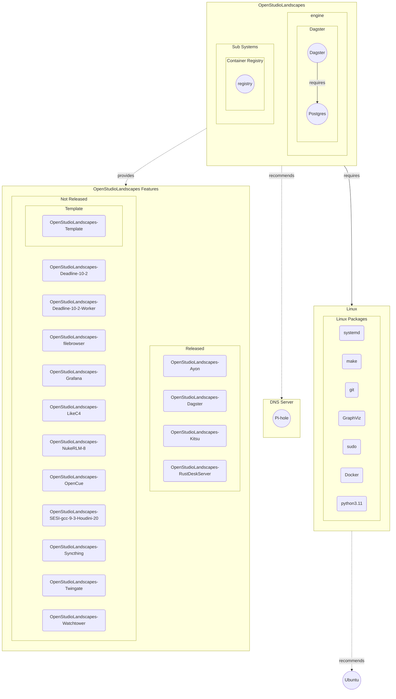

<!-- TOC -->
* [Dependency Overview (schematic)](#dependency-overview-schematic)
<!-- TOC -->

---

# Dependency Overview (schematic)

```mermaid
%% https://mermaid-js.github.io/mermaid-live-editor
flowchart TB
    ubuntu((Ubuntu))

    subgraph osl[OpenStudioLandscapes]
        direction TB

        subgraph engine[engine]
            direction TB

            subgraph dagstersubgraph[Dagster]
                direction TB
                dagster((Dagster))
                dagster-postgres((Postgres))
            end
        end

        subgraph Sub Systems
            direction TB

            subgraph local-registry[Container Registry]
                direction TB
                    registry((registry))
            end
        end
    end

    dagster -- requires --> dagster-postgres

    subgraph linux[Linux]
        direction TB

        subgraph linuxpkgs[Linux Packages]
            direction LR
            systemd(systemd)
            make(make)
            git(git)
            graphviz(GraphViz)
            sudo(sudo)
            docker(Docker)
            python(python3.11)
        end
    end

    subgraph dns[DNS Server]
        direction TB
        pihole((Pi-hole))
    end

    subgraph features[OpenStudioLandscapes Features]
        direction TB

        subgraph public[Released]
            direction LR
            osl-ayon(OpenStudioLandscapes-Ayon)
            osl-dagster(OpenStudioLandscapes-Dagster)
            osl-kitsu(OpenStudioLandscapes-Kitsu)
            osl-rustdeskserver(OpenStudioLandscapes-RustDeskServer)
        end

        subgraph private[Not Released]
            direction LR

            subgraph template[Template]
                direction LR
                osl-template(OpenStudioLandscapes-Template)
            end
            osl-deadline-10-2(OpenStudioLandscapes-Deadline-10-2)
            osl-deadline-10-2-worker(OpenStudioLandscapes-Deadline-10-2-Worker)
%%            osl-deadline-10-2-worker -- requires --> osl-deadline-10-2
            osl-filebrowser(OpenStudioLandscapes-filebrowser)
            osl-grafana(OpenStudioLandscapes-Grafana)
            osl-likec4(OpenStudioLandscapes-LikeC4)
            osl-nukerlm-8(OpenStudioLandscapes-NukeRLM-8)
            osl-opencue(OpenStudioLandscapes-OpenCue)
            osl-sesi-gcc-9-3-houdini-20(OpenStudioLandscapes-SESI-gcc-9-3-Houdini-20)
            osl-syncthing(OpenStudioLandscapes-Syncthing)
            osl-twingate(OpenStudioLandscapes-Twingate)
            osl-watchtower(OpenStudioLandscapes-Watchtower)
        end
    end


    osl -- requires --> linux
    osl -. recommends .-> dns
    osl -. provides .-> features

    linux -. recommends .-> ubuntu
```
