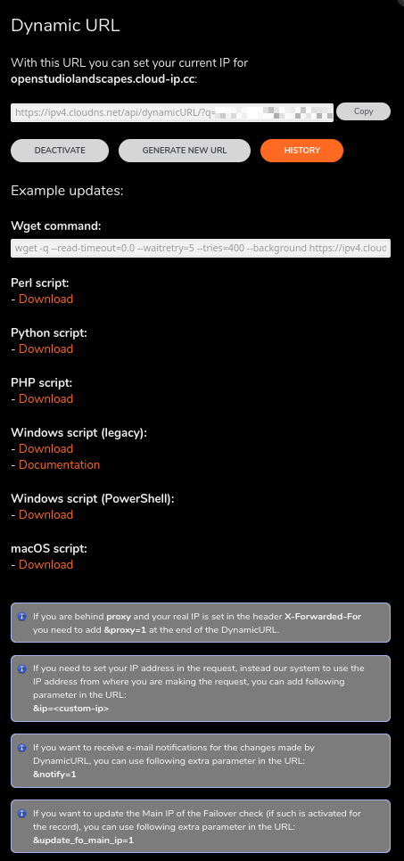

<!-- TOC -->
* [CloudDNS](#clouddns)
  * [Zones](#zones)
    * [evil-farmer.cloud-ip.cd](#evil-farmercloud-ipcd)
    * [openstudiolandscapes.cloud-ip.cc](#openstudiolandscapescloud-ipcc)
  * [Dynamic DNS Update](#dynamic-dns-update)
<!-- TOC -->

---

# CloudDNS

For development reasons a DNS service has been set up.
This might differ from your setup.

## Zones

### evil-farmer.cloud-ip.cd

Status: `inactive`

```
$ORIGIN evil-farmer.cloud-ip.cc.
@	3600	IN	SOA	ns71.cloudns.net. support.cloudns.net. <SERIAL> 7200 1800 1209600 3600
@	3600	IN	NS	ns71.cloudns.net.
@	3600	IN	NS	ns72.cloudns.com.
@	3600	IN	NS	ns73.cloudns.net.
@	3600	IN	NS	ns74.cloudns.uk.
@	3600	IN	A	<PUBLIC_IP>
teleport	3600	IN	CNAME	evil-farmer.cloud-ip.cc.
kitsu.teleport	3600	IN	CNAME	evil-farmer.cloud-ip.cc.
*.teleport	3600	IN	CNAME	teleport.evil-farmer.cloud-ip.cc.
```

### openstudiolandscapes.cloud-ip.cc

Status: `active`

```
$ORIGIN openstudiolandscapes.cloud-ip.cc.
@	3600	IN	SOA	ns71.cloudns.net. support.cloudns.net. <SERIAL> 7200 1800 1209600 3600
@	3600	IN	NS	ns71.cloudns.net.
@	3600	IN	NS	ns72.cloudns.com.
@	3600	IN	NS	ns73.cloudns.net.
@	3600	IN	NS	ns74.cloudns.uk.
@	3600	IN	NS	pns71.cloudns.net.
@	3600	IN	NS	pns72.cloudns.com.
@	3600	IN	NS	pns73.cloudns.net.
@	3600	IN	NS	pns74.cloudns.uk.
@	3600	IN	A	<PUBLIC_IP>
teleport	3600	IN	CNAME	openstudiolandscapes.cloud-ip.cc.
*.teleport	3600	IN	CNAME	teleport.openstudiolandscapes.cloud-ip.cc.
```

## Dynamic DNS Update



