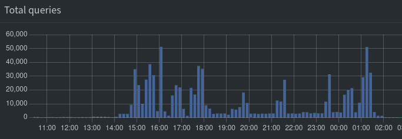
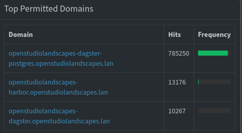
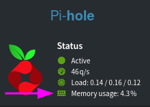
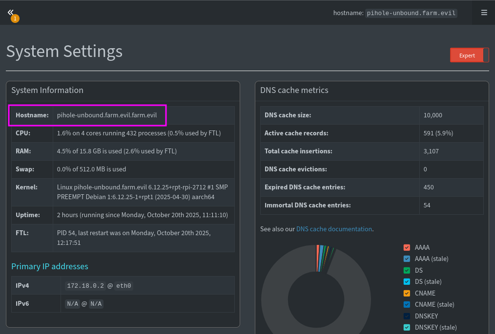

<!-- TOC -->
* [Pi-hole](#pi-hole)
  * [Container Interaction](#container-interaction)
    * [`bash`](#bash)
    * [Logs](#logs)
  * [DNS](#dns)
  * [DNS Records](#dns-records)
    * [A-Records](#a-records)
    * [CNAME-Records](#cname-records)
  * [DNS Rate Limits](#dns-rate-limits)
    * [Removing the default limits](#removing-the-default-limits)
    * [Keep Pi-hole alive](#keep-pi-hole-alive)
<!-- TOC -->

---

# Pi-hole

## Container Interaction

### `bash`

```shell
docker exec -it pihole-unbound bash
```

### Logs

```shell
docker logs pihole-unbound --follow --details --timestamps
```

## DNS

Maybe set `dns.domain` to `openstudiolandscapes.lan` instead of
`lan` (default)?

Maybe set `` to `pihole.openstudiolandscapes.lan` instead of
current setting ``?

## DNS Records

### A-Records

```
192.168.178.195 openstudiolandscapes.lan
```

### CNAME-Records

For some reason, wildcards don't seem to work

```
*.openstudiolandscapes.lan,openstudiolandscapes.lan
```

Therefore, all records are manual for now.

To batch add records, switch to `Expert` and add
needed records to `dns.cnameRecords` (see `All Settings`).

Core records:

```
openstudiolandscapes-dagster.openstudiolandscapes.lan,openstudiolandscapes.lan
openstudiolandscapes-dagster-postgres.openstudiolandscapes.lan,openstudiolandscapes.lan
openstudiolandscapes-harbor.openstudiolandscapes.lan,openstudiolandscapes.lan
openstudiolandscapes-teleport.openstudiolandscapes.lan,openstudiolandscapes.lan
```

Feature records:

```
ayon.openstudiolandscapes.lan,openstudiolandscapes.lan
dagster.openstudiolandscapes.lan,openstudiolandscapes.lan
deadline-10-2.openstudiolandscapes.lan,openstudiolandscapes.lan
deadline-10-2-worker.openstudiolandscapes.lan,openstudiolandscapes.lan
filebrowser.openstudiolandscapes.lan,openstudiolandscapes.lan
grafana.openstudiolandscapes.lan,openstudiolandscapes.lan
kitsu.openstudiolandscapes.lan,openstudiolandscapes.lan
nuke-rlm-8.openstudiolandscapes.lan,openstudiolandscapes.lan
sesi-gcc-9-3-houdini-20.openstudiolandscapes.lan,openstudiolandscapes.lan
syncthing.openstudiolandscapes.lan,openstudiolandscapes.lan
watchtower.openstudiolandscapes.lan,openstudiolandscapes.lan
```

Inactive records:

```
likec4.openstudiolandscapes.lan,openstudiolandscapes.lan
opencue-web.openstudiolandscapes.lan,openstudiolandscapes.lan
twingate.openstudiolandscapes.lan,openstudiolandscapes.lan
template.openstudiolandscapes.lan,openstudiolandscapes.lan
```

To check:
- [ ] OpenStudioLandscapes-RustDeskServer

## DNS Rate Limits

Postgres seems to perform _a lot_ of queries.

That can lead to two situations:
1. Postgres (or the host it's running on rather) hits
   rate limits and gets blocked.
2. Pi-hole is physically incapable to handle the sheer
   amount of queries and stops handling queries (and,
   as a consequence, dies).

### Removing the default limits

- Set `dns.rateLimit.count` to `0`
- Set `dns.rateLimit.interval` to `0`

### Keep Pi-hole alive





This problem is yet to be solved.

What we know is that the problem seems related to processing
Docker build commands (`OpenStudioLandscapes.engine.utils.docker.docker_process_cmds`)
with `context.log` events.

A workaround could be to `/etc/hosts` handle the resolution locally.

It seems to be related with `shm_size` if the container -
the default (if not explicitly specified) `shm_size` is `64mb`:

```
[...]
pihole-unbound  | 2025-10-20 11:54:27.265 CEST [58M] INFO:   800000 queries parsed...
pihole-unbound  | 2025-10-20 11:54:27.271 CEST [58M] WARNING: Shared memory shortage (/dev/shm) ahead: 91% is used (61.3MB used, 67.1MB total, FTL uses 61.2MB)
pihole-unbound  | 2025-10-20 11:54:27.291 CEST [58M] INFO:   810000 queries parsed...
pihole-unbound  | 2025-10-20 11:54:27.309 CEST [58M] WARNING: Shared memory shortage (/dev/shm) ahead: 93% is used (62.4MB used, 67.1MB total, FTL uses 62.4MB)
pihole-unbound  | 2025-10-20 11:54:27.312 CEST [58M] INFO:   820000 queries parsed...
pihole-unbound  | 2025-10-20 11:54:27.331 CEST [58M] INFO:   830000 queries parsed...
pihole-unbound  | 2025-10-20 11:54:27.342 CEST [58M] WARNING: Shared memory shortage (/dev/shm) ahead: 94% is used (63.6MB used, 67.1MB total, FTL uses 63.6MB)
pihole-unbound  | 2025-10-20 11:54:27.352 CEST [58M] INFO:   840000 queries parsed...
pihole-unbound  | 2025-10-20 11:54:27.372 CEST [58M] INFO:   850000 queries parsed...
pihole-unbound  | 2025-10-20 11:54:27.376 CEST [58M] WARNING: Shared memory shortage (/dev/shm) ahead: 96% is used (64.8MB used, 67.1MB total, FTL uses 64.7MB)
pihole-unbound  | 2025-10-20 11:54:27.394 CEST [58M] INFO:   860000 queries parsed...
pihole-unbound  | 2025-10-20 11:54:27.416 CEST [58M] WARNING: Shared memory shortage (/dev/shm) ahead: 98% is used (66.0MB used, 67.1MB total, FTL uses 65.9MB)
pihole-unbound  | 2025-10-20 11:54:27.417 CEST [58M] WARNING: Shared memory shortage (/dev/shm) ahead: 98% is used (66.0MB used, 67.1MB total, FTL uses 65.9MB)
pihole-unbound  | 2025-10-20 11:54:27.418 CEST [58M] WARNING: Could not fallocate() in realloc_shm() (/app/src/shmem.c:838): No space left on device
pihole-unbound  | 2025-10-20 11:54:27.418 CEST [58M] CRIT: realloc_shm(): Failed to resize "/FTL-58-queries" (10) to 63700992: No space left on device (28)
pihole-unbound  |
pihole-unbound  |   [i] pihole-FTL exited with status 1
pihole-unbound  |
pihole-unbound  |   [i] Container will now stop or restart depending on your restart policy
pihole-unbound  |       https://docs.docker.com/engine/containers/start-containers-automatically/#use-a-restart-policy
pihole-unbound  |
pihole-unbound exited with code 0
```

```
$ docker exec -it pihole-unbound df /dev/shm
Filesystem     1K-blocks  Used Available Use% Mounted on
shm                65536 64448      1088  99% /dev/shm
```

After increasing `shm_size` to `1gb`
(see [pi-hole `docker-compose.yml`](https://github.com/michimussato/server/blob/e30fcff4e2f712a0390d938865f99c10972c8c3e/pi-hole/docker-compose.yml#L11):

```
[...]
pihole-unbound  | 2025-10-20T09:29:54.188910080Z  2025-10-20 11:29:51.470 CEST [57M] INFO:   790000 queries parsed...
pihole-unbound  | 2025-10-20T09:29:54.188912191Z  2025-10-20 11:29:51.489 CEST [57M] INFO:   800000 queries parsed...
pihole-unbound  | 2025-10-20T09:29:54.188914376Z  2025-10-20 11:29:51.509 CEST [57M] INFO:   810000 queries parsed...
pihole-unbound  | 2025-10-20T09:29:54.188916525Z  2025-10-20 11:29:51.529 CEST [57M] INFO:   820000 queries parsed...
pihole-unbound  | 2025-10-20T09:29:54.188918636Z  2025-10-20 11:29:51.548 CEST [57M] INFO:   830000 queries parsed...
pihole-unbound  | 2025-10-20T09:29:54.188920765Z  2025-10-20 11:29:51.568 CEST [57M] INFO:   840000 queries parsed...
pihole-unbound  | 2025-10-20T09:29:54.188922877Z  2025-10-20 11:29:51.588 CEST [57M] INFO:   850000 queries parsed...
pihole-unbound  | 2025-10-20T09:29:54.188925599Z  2025-10-20 11:29:51.608 CEST [57M] INFO:   860000 queries parsed...
pihole-unbound  | 2025-10-20T09:29:54.188927803Z  2025-10-20 11:29:51.632 CEST [57M] INFO: Imported 868618 queries from the long-term database
pihole-unbound  | 2025-10-20T09:29:54.188930080Z  2025-10-20 11:29:51.632 CEST [57M] INFO:  -> Total DNS queries: 868618
pihole-unbound  | 2025-10-20T09:29:54.188932414Z  2025-10-20 11:29:51.632 CEST [57M] INFO:  -> Cached DNS queries: 851203
pihole-unbound  | 2025-10-20T09:29:54.188934636Z  2025-10-20 11:29:51.632 CEST [57M] INFO:  -> Forwarded DNS queries: 13778
pihole-unbound  | 2025-10-20T09:29:54.188936840Z  2025-10-20 11:29:51.632 CEST [57M] INFO:  -> Blocked DNS queries: 1600
pihole-unbound  | 2025-10-20T09:29:54.188939044Z  2025-10-20 11:29:51.632 CEST [57M] INFO:  -> Unknown DNS queries: 4
pihole-unbound  | 2025-10-20T09:29:54.188941210Z  2025-10-20 11:29:51.632 CEST [57M] INFO:  -> Unique domains: 1539
pihole-unbound  | 2025-10-20T09:29:54.188945433Z  2025-10-20 11:29:51.632 CEST [57M] INFO:  -> Unique clients: 12
pihole-unbound  | 2025-10-20T09:29:54.188947748Z  2025-10-20 11:29:51.632 CEST [57M] INFO:  -> DNS cache records: 244
pihole-unbound  | 2025-10-20T09:29:54.188949914Z  2025-10-20 11:29:51.632 CEST [57M] INFO:  -> Known forward destinations: 1
[...]
```

```
$ docker exec -it pihole-unbound df /dev/shm
Filesystem     1K-blocks  Used Available Use% Mounted on
shm              1048576 66752    981824   7% /dev/shm
```

Maybe keep an eye on this:



Other issues:

`WARNING in dnsmasq core: Maximum number of concurrent DNS queries reached (max: 150)`


