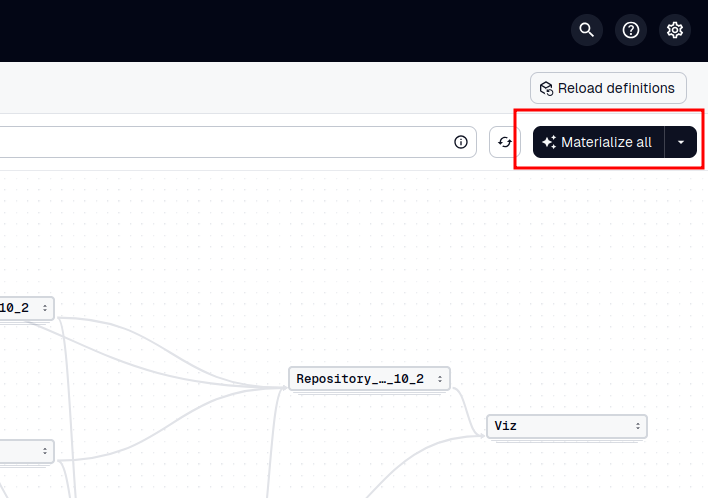

### Create Landscape

#### Launch Dagster

```shell
nox --session dagster_mysql
```

#### Launch Dagster Postgres

This could be useful in case you're hitting a
SQLite concurrency issue like this:

```
sqlalchemy.exc.OperationalError: (sqlite3.OperationalError) database is locked
  [...]
The above exception was caused by the following exception:
sqlite3.OperationalError: database is locked
  [...]
```

So, launching Dagster in this way __should__ be the default.

Resources:
- https://docs.dagster.io/guides/deploy/dagster-instance-configuration
- https://docs.dagster.io/api/python-api/libraries/dagster-postgres
- https://docs.dagster.io/guides/deploy/deployment-options/docker
- https://github.com/docker-library/docs/blob/master/postgres/README.md
- https://www.getorchestra.io/guides/dagster-open-source-pipelines-postgresql-integration

```shell
nox --session dagster_postgres
```

http://0.0.0.0:3000

#### Configure Landscape

Clone the Feature into `.features`:

```shell
cd OpenStudioLandscapes
git -C ./.features/ https://github.com/michimussato/OpenStudioLandscapes-<Feature>
```

Install Feature(s) into Engine`venv`:

```shell
cd OpenStudioLandscapes
nox --session install_features_into_engine
```

Edit
- `OpenStudioLandscapes.engine.constants.THIRD_PARTY`
- `OpenStudioLandscapes.<Feature>.constants`
according to your needs.

#### Materialize Landscape



##### Resulting Files and Directories (aka "Landscape")

```shell
$ tree .landscapes/2025-02-28_13-24-43__4ade7f1cc21d4e39bb90b1363f807e79
.landscapes/2025-02-28_13-24-43__4ade7f1cc21d4e39bb90b1363f807e79
├── Ayon__Ayon
│   ├── Ayon__clone_repository
│   │   └── repos
│   │       └── ayon-docker
│   │           └── [...]
│   ├── Ayon__compose_override
│   │   └── docker-compose.override.yml
│   └── Ayon__group_out
│       └── docker_compose
│           ├── Ayon__docker_compose_graph
│           │   ├── Ayon__docker_compose_graph.dot
│           │   ├── Ayon__docker_compose_graph.png
│           │   └── Ayon__docker_compose_graph.svg
│           └── docker-compose.yml
├── Base__Base
│   └── Base__build_docker_image
│       └── Dockerfiles
│           └── Dockerfile
├── Compose__Compose
│   └── Compose__group_out
│       └── docker_compose
│           ├── Compose__docker_compose_graph
│           │   ├── Compose__docker_compose_graph.dot
│           │   ├── Compose__docker_compose_graph.png
│           │   └── Compose__docker_compose_graph.svg
│           └── docker-compose.yml
├── Dagster__Dagster
│   ├── Dagster__build_docker_image
│   │   └── Dockerfiles
│   │       ├── Dockerfile
│   │       └── payload
│   │           ├── dagster.yaml
│   │           └── workspace.yaml
│   └── Dagster__group_out
│       └── docker_compose
│           ├── Dagster__docker_compose_graph
│           │   ├── Dagster__docker_compose_graph.dot
│           │   ├── Dagster__docker_compose_graph.png
│           │   └── Dagster__docker_compose_graph.svg
│           └── docker-compose.yml
├── Deadline_10_2__Deadline_10_2
│   ├── configs
│   │   ├── Deadline10
│   │   │   └── deadline.ini
│   │   └── DeadlineRepository10
│   │       └── settings
│   │           └── connection.ini
│   ├── data
│   │   └── opt
│   │       └── Thinkbox
│   │           └── DeadlineDatabase10
│   ├── Deadline_10_2__build_docker_image
│   │   └── Dockerfiles
│   │       └── Dockerfile
│   ├── Deadline_10_2__build_docker_image_client
│   │   └── Dockerfiles
│   │       └── Dockerfile
│   ├── Deadline_10_2__build_docker_image_repository
│   │   └── Dockerfiles
│   │       └── Dockerfile
│   └── Deadline_10_2__group_out
│       └── docker_compose
│           ├── Deadline_10_2__docker_compose_graph
│           │   ├── Deadline_10_2__docker_compose_graph.dot
│           │   ├── Deadline_10_2__docker_compose_graph.png
│           │   └── Deadline_10_2__docker_compose_graph.svg
│           └── docker-compose.yml
├── filebrowser__filebrowser
│   └── filebrowser__group_out
│       └── docker_compose
│           ├── docker-compose.yml
│           └── filebrowser__docker_compose_graph
│               ├── filebrowser__docker_compose_graph.dot
│               ├── filebrowser__docker_compose_graph.png
│               └── filebrowser__docker_compose_graph.svg
├── Grafana__Grafana
│   └── Grafana__group_out
│       └── docker_compose
│           ├── docker-compose.yml
│           └── Grafana__docker_compose_graph
│               ├── Grafana__docker_compose_graph.dot
│               ├── Grafana__docker_compose_graph.png
│               └── Grafana__docker_compose_graph.svg
├── Kitsu__Kitsu
│   ├── data
│   │   └── kitsu
│   │       ├── postgresql
│   │       └── previews
│   ├── Kitsu__build_docker_image
│   │   └── Dockerfiles
│   │       ├── Dockerfile
│   │       └── scripts
│   │           ├── init_db.sh
│   │           └── postgresql.conf
│   ├── Kitsu__group_out
│   │   └── docker_compose
│   │       ├── docker-compose.yml
│   │       └── Kitsu__docker_compose_graph
│   │           ├── Kitsu__docker_compose_graph.dot
│   │           ├── Kitsu__docker_compose_graph.png
│   │           └── Kitsu__docker_compose_graph.svg
│   └── Kitsu__script_init_db
│       └── init_db.sh
├── LikeC4__LikeC4
│   ├── LikeC4__build_docker_image
│   │   └── Dockerfiles
│   │       ├── Dockerfile
│   │       └── payload
│   │           ├── run.sh
│   │           └── setup.sh
│   └── LikeC4__group_out
│       └── docker_compose
│           ├── docker-compose.yml
│           └── LikeC4__docker_compose_graph
│               ├── LikeC4__docker_compose_graph.dot
│               ├── LikeC4__docker_compose_graph.png
│               └── LikeC4__docker_compose_graph.svg
└── OpenCue__OpenCue
    ├── OpenCue__clone_repository
    │   └── repos
    │       └── OpenCue
    │           └── [...]
    ├── OpenCue__compose_override
    │   └── docker-compose.override.yml
    ├── OpenCue__group_out
    │   └── docker_compose
    │       ├── docker-compose.yml
    │       └── OpenCue__docker_compose_graph
    │           ├── OpenCue__docker_compose_graph.dot
    │           ├── OpenCue__docker_compose_graph.png
    │           └── OpenCue__docker_compose_graph.svg
    └── OpenCue__prepare_volumes
        ├── logs
        └── shots

282 directories, 1310 files
```