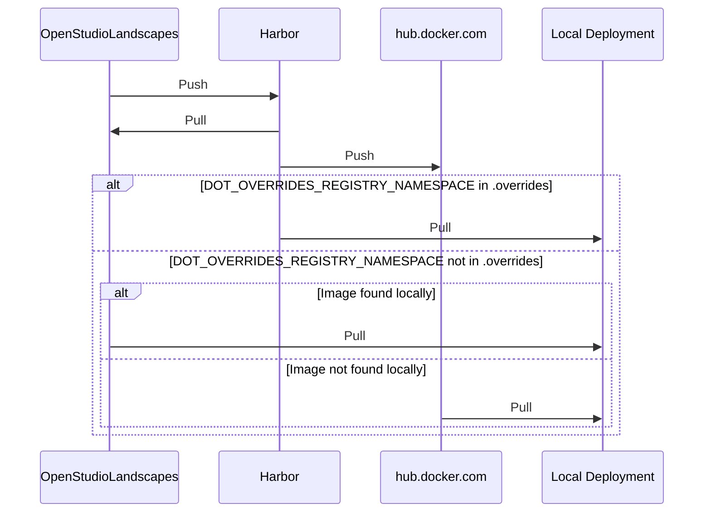
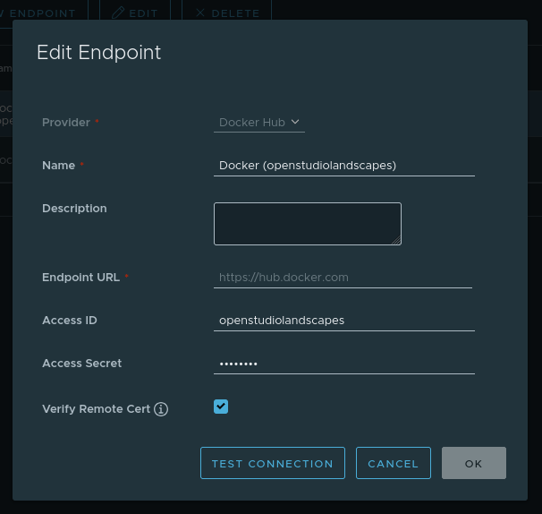
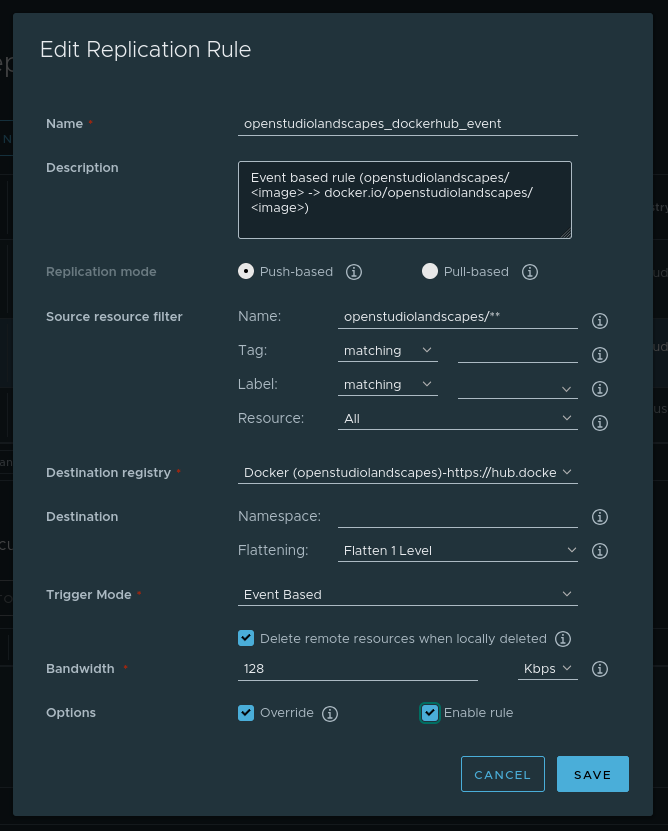
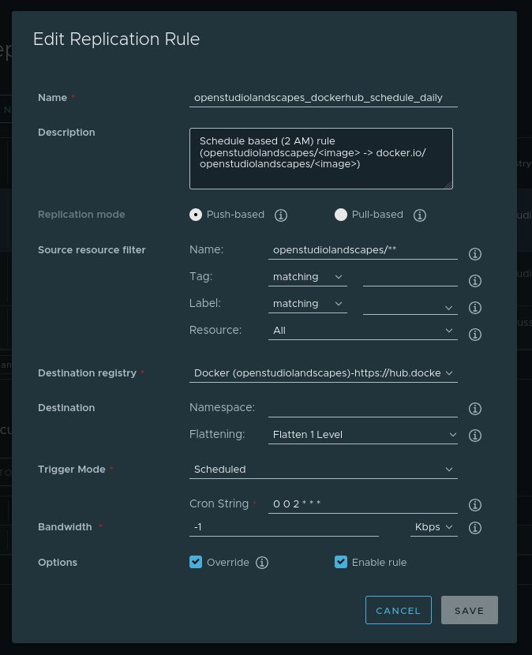
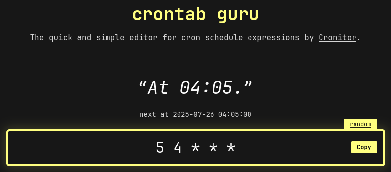
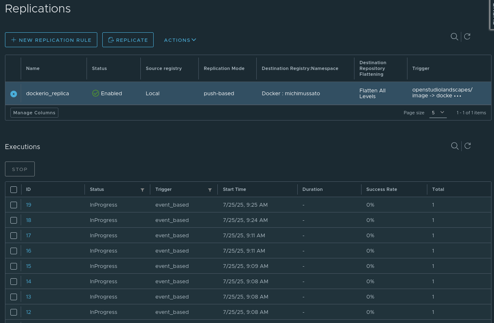
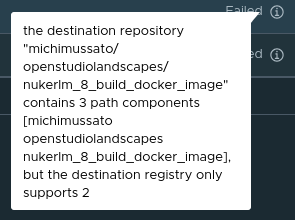

# Table Of Contents

<!-- TOC -->
* [Table Of Contents](#table-of-contents)
* [Harbor](#harbor)
  * [Setup](#setup)
    * [Registry (Replication Endpoint)](#registry-replication-endpoint)
    * [Replications (Rules)](#replications-rules)
  * [Execution](#execution)
  * [Known Issues](#known-issues)
    * [Limited Supported Namespaces](#limited-supported-namespaces)
<!-- TOC -->

---

# Harbor

Harbor is a local Docker image registry and an integral
part of the OpenStudioLandscapes ecosystem. 

OpenStudioLandscapes creates Docker images and pulls/pushes them
(by default) from/to this local instance of Harbor. Harbor,
on the other hand _can_ replicate these images on a remote,
such as (but not limited to) [hub.docker.com](https://hub.docker.com/) so that
your Docker images are accessible by third parties. Furthermore,
having images publicly accessible is a vital element of a
[_Portable Landscape_](https://github.com/michimussato/OpenStudioLandscapes/issues/12).

Here's the
full list of [Harbor Replication Endpoints](https://goharbor.io/docs/1.10/administration/configuring-replication/create-replication-endpoints/)

## Setup

Go to the web UI of your Harbor instance:

- http://localhost:80
- `admin`
- `Harbor12345`

### Registry (Replication Endpoint)

Go to _Administration/Registries_ and set up
your ([hub.docker.com](https://hub.docker.com/) in this example) 
[Harbor Replication Endpoint(s)](https://goharbor.io/docs/1.10/administration/configuring-replication/create-replication-endpoints/):

Testing the connection must result in a green banner
as shown (what else :).

### Replications (Rules)

Go to _Administration/Replications_ and set up
your replication:

([Online Manual](https://goharbor.io/docs/1.10/administration/configuring-replication/create-replication-rules/))

Event based example:

Schedule example:

If you prefer `Scheduled` over `Event Based`, [Crontab Guru](https://crontab.guru/)
can help setting up your schedule.

## Execution

## Known Issues

### Limited Supported Namespaces

[hub.docker.com](https://hub.docker.com/) is known to only support 2 namespace
path components (I don't know about other Docker registries):

Illegal Namespace: `michimussato/openstudiolandscapes`

Legal Namespace: `michimussato`
With Flattening: `Flatten All Levels`

