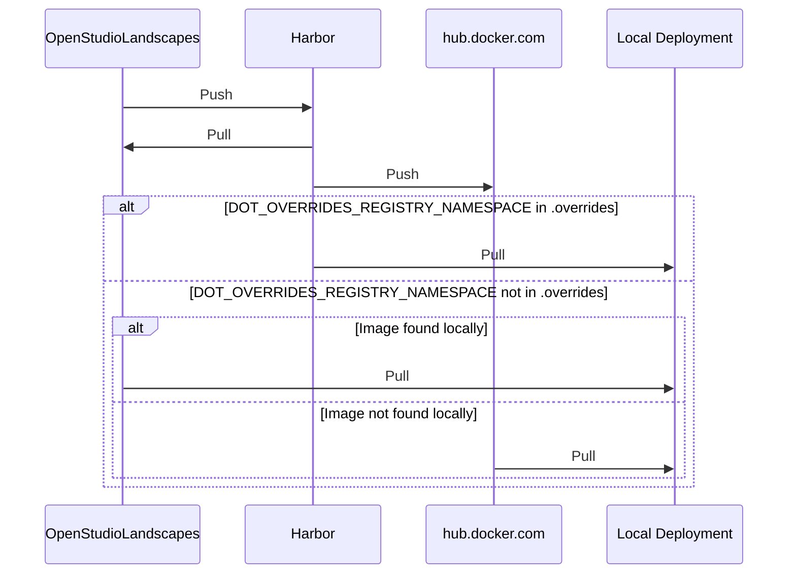

# Table Of Contents

<!-- TOC -->
* [Table Of Contents](#table-of-contents)
* [Harbor](#harbor)
  * [Setup](#setup)
    * [Registry (Replication Endpoint)](#registry-replication-endpoint)
    * [Replications (Rules)](#replications-rules)
  * [Execution](#execution)
  * [Known Issues](#known-issues)
    * [Limited Supported Namespaces](#limited-supported-namespaces)
    * [Build Issues](#build-issues)
      * [`OpenStudioLandscapesDockerException: Command failed returncode = 130`](#openstudiolandscapesdockerexception-command-failed-returncode--130)
<!-- TOC -->

---

# Harbor

Harbor is a local Docker image registry and an integral
part of the OpenStudioLandscapes ecosystem.

OpenStudioLandscapes creates Docker images and pulls/pushes them
(by default) from/to this local instance of Harbor. Harbor,
on the other hand _can_ replicate these images on a remote,
such as (but not limited to) [hub.docker.com](https://hub.docker.com/) so that
your Docker images are accessible by third parties. Furthermore,
having images publicly accessible is a vital element of a
[_Portable Landscape_](https://github.com/michimussato/OpenStudioLandscapes/issues/12).


Here's the
full list of [Harbor Replication Endpoints](https://goharbor.io/docs/1.10/administration/configuring-replication/create-replication-endpoints/)

## Setup

Go to the web UI of your Harbor instance:

- http://localhost:80
- `admin`
- `Harbor12345`

### Registry (Replication Endpoint)

Go to _Administration/Registries_ and set up
your ([hub.docker.com](https://hub.docker.com/) in this example)
[Harbor Replication Endpoint(s)](https://goharbor.io/docs/1.10/administration/configuring-replication/create-replication-endpoints/):


Testing the connection must result in a green banner
as shown (what else :).

### Replications (Rules)

Go to _Administration/Replications_ and set up
your replication:

([Online Manual](https://goharbor.io/docs/1.10/administration/configuring-replication/create-replication-rules/))

Event based example:


Schedule example:


If you prefer `Scheduled` over `Event Based`, [Crontab Guru](https://crontab.guru/)
can help setting up your schedule.

[](https://crontab.guru/)

## Execution


## Known Issues

### Limited Supported Namespaces

[hub.docker.com](https://hub.docker.com/) is known to only support 2 namespace
path components (I don't know about other Docker registries):

Illegal Namespace: `michimussato/openstudiolandscapes`


Legal Namespace: `michimussato`
With Flattening: `Flatten All Levels`

### Build Issues

#### `OpenStudioLandscapesDockerException: Command failed returncode = 130`

```
OpenStudioLandscapes.engine.utils.docker.OpenStudioLandscapesDockerException: Command failed returncode = 130: cmd = ['/usr/local/bin/docker', '--debug', '--config', '/home/michael/git/repos/OpenStudioLandscapes/.landscapes/2025-10-14-11-37-22-326ea250d7c94db1b0361bc2a39b81e5/OpenStudioLandscapes_Base__OpenStudioLandscapes_Base/OpenStudioLandscapes_Base__docker_config_json', 'build', '--progress', 'plain', '--pull', '--file', '/home/michael/git/repos/OpenStudioLandscapes/.landscapes/2025-10-14-11-37-22-326ea250d7c94db1b0361bc2a39b81e5/OpenStudioLandscapes_Base__OpenStudioLandscapes_Base/OpenStudioLandscapes_Base__build_docker_image/Dockerfiles/Dockerfile', '--no-cache', '--tag', 'openstudiolandscapes/openstudiolandscapes_base_build_docker_image:2025-10-14-11-37-22-326ea250d7c94db1b0361bc2a39b81e5', '--tag', 'harbor.openstudiolandscapes.lan:80/openstudiolandscapes/openstudiolandscapes_base_build_docker_image:2025-10-14-11-37-22-326ea250d7c94db1b0361bc2a39b81e5', '/home/michael/git/repos/OpenStudioLandscapes/.landscapes/2025-10-14-11-37-22-326ea250d7c94db1b0361bc2a39b81e5/OpenStudioLandscapes_Base__OpenStudioLandscapes_Base/OpenStudioLandscapes_Base__build_docker_image/Dockerfiles']
Is Harbor running? Try `nox --session harbor_up` or `nox --session harbor_up_detach`.
```

```
#38 9.295 running install
#38 9.296 running build
#38 9.296 running build_ext
ERROR: failed to build: failed to receive status: rpc error: code = Canceled desc = context canceled
487399 0.28.0 /usr/lib/docker/cli-plugins/docker-buildx --debug --config /home/michael/git/repos/OpenStudioLandscapes/.landscapes/2025-10-14-11-37-22-326ea250d7c94db1b0361bc2a39b81e5/OpenStudioLandscapes_Base__OpenStudioLandscapes_Base/OpenStudioLandscapes_Base__docker_config_json buildx build --progress plain --pull --file /home/michael/git/repos/OpenStudioLandscapes/.landscapes/2025-10-14-11-37-22-326ea250d7c94db1b0361bc2a39b81e5/OpenStudioLandscapes_Base__OpenStudioLandscapes_Base/OpenStudioLandscapes_Base__build_docker_image/Dockerfiles/Dockerfile --no-cache --tag openstudiolandscapes/openstudiolandscapes_base_build_docker_image:2025-10-14-11-37-22-326ea250d7c94db1b0361bc2a39b81e5 --tag harbor.openstudiolandscapes.lan:80/openstudiolandscapes/openstudiolandscapes_base_build_docker_image:2025-10-14-11-37-22-326ea250d7c94db1b0361bc2a39b81e5 /home/michael/git/repos/OpenStudioLandscapes/.landscapes/2025-10-14-11-37-22-326ea250d7c94db1b0361bc2a39b81e5/OpenStudioLandscapes_Base__OpenStudioLandscapes_Base/OpenStudioLandscapes_Base__build_docker_image/Dockerfiles
github.com/docker/buildx/commands.runBuildWithOptions
	github.com/docker/buildx/commands/build.go:452
github.com/docker/buildx/commands.runBuild
	github.com/docker/buildx/commands/build.go:374
github.com/docker/buildx/commands.buildCmd.func1
	github.com/docker/buildx/commands/build.go:488
github.com/docker/cli/cli-plugins/plugin.RunPlugin.func1.1.2
	github.com/docker/cli@v28.3.3+incompatible/cli-plugins/plugin/plugin.go:65
github.com/spf13/cobra.(*Command).execute
	github.com/spf13/cobra@v1.9.1/command.go:1015
github.com/spf13/cobra.(*Command).ExecuteC
	github.com/spf13/cobra@v1.9.1/command.go:1148
github.com/spf13/cobra.(*Command).Execute
	github.com/spf13/cobra@v1.9.1/command.go:1071
github.com/docker/cli/cli-plugins/plugin.RunPlugin
	github.com/docker/cli@v28.3.3+incompatible/cli-plugins/plugin/plugin.go:80
main.runPlugin
	github.com/docker/buildx/cmd/buildx/main.go:64
main.run
	github.com/docker/buildx/cmd/buildx/main.go:78
main.main
	github.com/docker/buildx/cmd/buildx/main.go:88
runtime.main
	runtime/proc.go:285
runtime.goexit
	runtime/asm_amd64.s:1693

487399 0.28.0 /usr/lib/docker/cli-plugins/docker-buildx --debug --config /home/michael/git/repos/OpenStudioLandscapes/.landscapes/2025-10-14-11-37-22-326ea250d7c94db1b0361bc2a39b81e5/OpenStudioLandscapes_Base__OpenStudioLandscapes_Base/OpenStudioLandscapes_Base__docker_config_json buildx build --progress plain --pull --file /home/michael/git/repos/OpenStudioLandscapes/.landscapes/2025-10-14-11-37-22-326ea250d7c94db1b0361bc2a39b81e5/OpenStudioLandscapes_Base__OpenStudioLandscapes_Base/OpenStudioLandscapes_Base__build_docker_image/Dockerfiles/Dockerfile --no-cache --tag openstudiolandscapes/openstudiolandscapes_base_build_docker_image:2025-10-14-11-37-22-326ea250d7c94db1b0361bc2a39b81e5 --tag harbor.openstudiolandscapes.lan:80/openstudiolandscapes/openstudiolandscapes_base_build_docker_image:2025-10-14-11-37-22-326ea250d7c94db1b0361bc2a39b81e5 /home/michael/git/repos/OpenStudioLandscapes/.landscapes/2025-10-14-11-37-22-326ea250d7c94db1b0361bc2a39b81e5/OpenStudioLandscapes_Base__OpenStudioLandscapes_Base/OpenStudioLandscapes_Base__build_docker_image/Dockerfiles
github.com/moby/buildkit/client.(*Client).solve.func4
	github.com/moby/buildkit@v0.24.0/client/solve.go:338
golang.org/x/sync/errgroup.(*Group).Go.func1
	golang.org/x/sync@v0.16.0/errgroup/errgroup.go:93
runtime.goexit
	runtime/asm_amd64.s:1693
```

Fix:

Restart Harbor:

```shell
sudo systemctl restart harbor.service
```
