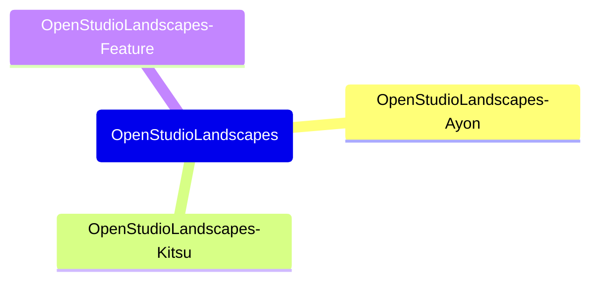

### Hard Links: Sync Files and Directories across Repositories (De-Duplication)

While syncing files across directories may
seem like a sound thing to do, it could be 
easier to hardlink files across repositories
that are always identical. While the GitHub
repository still treats them as separate files,
on the local file system, both files (inodes)
are pointing to the exact same data. 
Say, if you edit OpenStudioLandscapes/noxfile.py,
that would mean that OpenStudioLandscapes-Ayon/noxfile.py
(which are both hard links) will also receive the edits - 
both inodes reference the exact same data on disk.
Less work to do.
While this works well for files on the same physical drive,
that does neither work for directories in general nor
for inodes that want to point to data which lives on 
a different physical drive.

Example:

```shell
cd .features/OpenStudioLandscapes-Ayon
ln ../../../OpenStudioLandscapes/noxfile.py noxfile.py
# to force if noxfile.py already exists:
# ln -f ../../../OpenStudioLandscapes/noxfile.py  noxfile.py
```

I'm doing that for the following list of files:

```python
LINKED_FILES = [
    ".obsidian/plugins/obsidian-excalidraw-plugin/main.js",
    ".obsidian/plugins/obsidian-excalidraw-plugin/manifest.json",
    ".obsidian/plugins/obsidian-excalidraw-plugin/styles.css",
    ".obsidian/plugins/templater-obsidian/data.json",
    ".obsidian/plugins/templater-obsidian/main.js",
    ".obsidian/plugins/templater-obsidian/manifest.json",
    ".obsidian/plugins/templater-obsidian/styles.css",
    ".obsidian/app.json",
    ".obsidian/appearance.json",
    ".obsidian/canvas.json",
    ".obsidian/community-plugins.json",
    ".obsidian/core-plugins.json",
    ".obsidian/core-plugins-migration.json",
    ".obsidian/daily-notes.json",
    ".obsidian/graph.json",
    # ".obsidian/hotkeys.json",
    ".obsidian/templates.json",
    ".obsidian/types.json",
    # ".obsidian/workspace.json",
    # ".obsidian/workspaces.json",
    ".gitattributes",
    ".sbom/.gitkeep",
    ".payload/bin/.gitkeep",
    ".payload/config/.gitkeep",
    ".payload/data/.gitkeep",
    "media/images/.gitkeep",
    ".gitignore",
    ".pre-commit-config.yaml",
    ".readthedocs.yml",
    "noxfile.py",
    "LICENSE",
    "AUTHORS.rst",
    "CONTRIBUTING.rst",
    "docs/readme_md.rst",
    "docs/license.rst",
    "docs/authors.rst",
    "docs/contributing.rst",
]
```

From `OpenStudioLandscapes` into every Feature, except:
- `OpenStudioLandscapes-Template`



```shell
nox --session fix_hardlinks_in_features
```