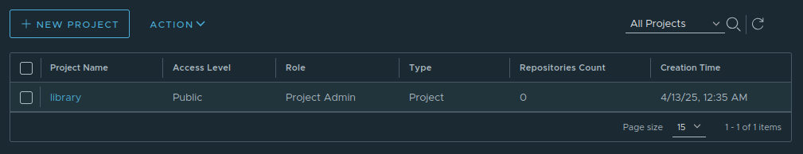

<!-- TOC -->
* [Basic Installation](#basic-installation)
  * [Requirements](#requirements)
    * [Install Python3.11](#install-python311)
    * [Install Docker](#install-docker)
      * [Ubuntu 22.04 (LTS)](#ubuntu-2204-lts)
        * [Installation](#installation)
        * [Post-Installation](#post-installation)
          * [Add `$USER` to group `docker`](#add-user-to-group-docker)
          * [Activate `systemd` Unit](#activate-systemd-unit)
  * [OpenStudioLandscapes](#openstudiolandscapes)
  * [Harbor](#harbor)
    * [Setup](#setup)
      * [Create Project](#create-project)
        * [Manual](#manual)
        * [With `curl`](#with-curl)
    * [Reset](#reset)
<!-- TOC -->

---

# Basic Installation

## Requirements

> [!NOTE]
> Additional requirements may vary based on the flavor of 
> OpenStudioLandscapes.

- `python3.11`
- `docker`
- [Harbor](https://goharbor.io/)

### Install Python3.11

> [!WARNING]
> **Todo**

### Install Docker

> [!TIP]
> Reference: [https://docs.docker.com/engine/install/]()

The installation of Docker varies based on your Linux distro.

As an example that might work for most of us, I'm including the setup
routine for Ubuntu (Server or Desktop Editions based on your preference):

- Ubuntu Jammy 22.04 (LTS) (Recommended)
- Ubuntu Noble 24.04 (LTS)
- Ubuntu Jammy 22.04 (LTS)

#### Ubuntu 22.04 (LTS)

This guide assumes that Ubuntu has been installed using the following options:
- Server 
- Desktop 

> [!TIP]
> Reference: [https://docs.docker.com/engine/install/ubuntu/]()

> [!NOTE]
> Although Docker has a [_convenience installation script_](https://docs.docker.com/engine/install/ubuntu/#install-using-the-convenience-script)
> I'm going to describe the manual way here.

Let's get started...

##### Installation

```shell
for pkg in docker.io docker-doc docker-compose docker-compose-v2 podman-docker containerd runc; do 
  sudo apt-get remove $pkg; 
done
```

```shell
# Add Docker's official GPG key:
sudo apt-get update
sudo apt-get install ca-certificates curl
sudo install -m 0755 -d /etc/apt/keyrings
sudo curl -fsSL https://download.docker.com/linux/ubuntu/gpg -o /etc/apt/keyrings/docker.asc
sudo chmod a+r /etc/apt/keyrings/docker.asc

# Add the repository to Apt sources:
echo \
  "deb [arch=$(dpkg --print-architecture) signed-by=/etc/apt/keyrings/docker.asc] https://download.docker.com/linux/ubuntu \
  $(. /etc/os-release && echo "${UBUNTU_CODENAME:-$VERSION_CODENAME}") stable" | \
  sudo tee /etc/apt/sources.list.d/docker.list > /dev/null
sudo apt-get update
```

```shell
sudo apt-get install docker-ce docker-ce-cli containerd.io docker-buildx-plugin docker-compose-plugin
```

> [!WARNING]
> **Todo**
> Might want to use a specific Docker version because
> the Docker image is mounting the hosts `/var/run/docker.sock`.
> Equal versions across all pieces of the puzzle could
> prevent issues.

##### Post-Installation

> [!TIP]
> Reference: [https://docs.docker.com/engine/install/linux-postinstall/]()

###### Add `$USER` to group `docker`

```shell
sudo groupadd docker
```

It is advisable in order for the Docker image to work properly 
on different machines to set the `GID` for group `docker` to 
a specific `GID`:

```shell
sudo groupadd --gid 959 docker
```

```shell
sudo usermod -aG docker $USER
newgrp docker  # or reboot
```

###### Activate `systemd` Unit

```shell
sudo systemctl enable --now docker.service
sudo systemctl enable --now containerd.service
```

## OpenStudioLandscapes

This step is required for all flavors of OpenStudioLandscapes.

```shell
git clone https://github.com/michimussato/OpenStudioLandscapes.git
cd OpenStudioLandscapes
python3.11 -m venv .venv
source .venv/bin/activate
python -m pip install --upgrade pip setuptools
pip install -e ".[dev]"
```

## Harbor

> [!IMPORTANT]
> These commands will only work with the activated `.venv`
> from the [previous step](#openstudiolandscapes):
> ```shell
> source .venv/bin/activate
> ```

### Setup

```shell
nox --session harbor_prepare
```

#### Create Project

> [!IMPORTANT]
> Harbor must be [running](../run/run_harbor.md#up) in order to perform these steps.

##### Manual

Go to the [Harbor Web UI](../run/run_harbor.md#web-interface) and
create project `openstudiolandscapes` (default project `library`
can be deleted):




##### With `curl`

Create project `openstudiolandscapes`:

> [!NOTE]
> Assuming that the Harbor admin credentials are as follows:
> - URL: `http://localhost:80`
> - Username: `admin`
> - Password: `Harbor12345`
> Change the next block according to your credentials.

```shell
HARBOR_URL="http://localhost:80"
HARBOR_ADMIN="admin"
HARBOR_ADMIN_PASSWORD="Harbor12345"
```

```shell
curl -v -X 'POST' \
  "$HARBOR_URL/api/v2.0/projects" \
  -H "accept: application/json" \
  -H "X-Resource-Name-In-Location: false" \
  -H "authorization: Basic $(echo -n $HARBOR_ADMIN:$HARBOR_ADMIN_PASSWORD | base64)" \
  -H "Content-Type: application/json" \
  -d \
  '{
    "project_name": "openstudiolandscapes",
    "public": true
  }'
```

Delete default project `library`:

```shell
curl -v -X 'DELETE' \
  "$HARBOR_URL/api/v2.0/projects/library" \
  -H "accept: application/json" \
  -H "X-Is-Resource-Name: false" \
  -H "authorization: Basic $(echo -n $HARBOR_ADMIN:$HARBOR_ADMIN_PASSWORD | base64)"
```

### Reset

Clear (prune) the Harbor installation with all its configurations.

> [!WARNING]
> This is a destructive, non-recoverable action (data loss).

```shell
nox --session harbor_clear
```
