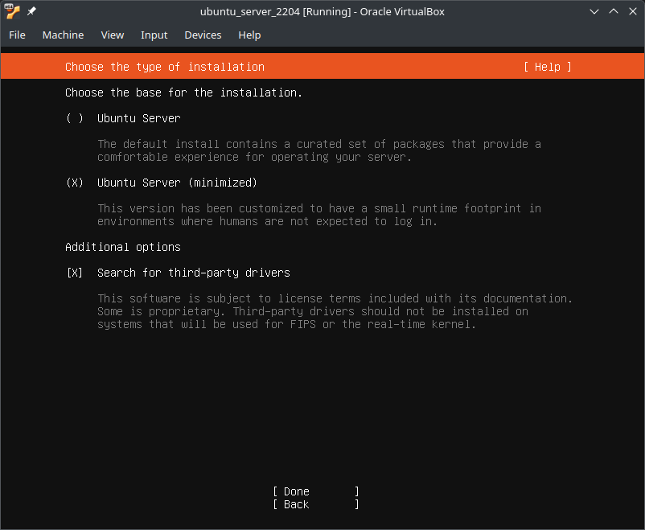

# Table Of Contents

<!-- TOC -->
* [Table Of Contents](#table-of-contents)
* [Basic Installation](#basic-installation)
  * [Requirements](#requirements)
    * [Install Python3.11](#install-python311)
      * [Ubuntu 22.04 (LTS)](#ubuntu-2204-lts)
    * [Install Docker](#install-docker)
      * [Ubuntu 22.04 (LTS)](#ubuntu-2204-lts-1)
        * [Installation](#installation)
        * [Post-Installation](#post-installation)
          * [Add `$USER` to group `docker`](#add-user-to-group-docker)
          * [Activate `systemd` Unit](#activate-systemd-unit)
  * [OpenStudioLandscapes](#openstudiolandscapes)
    * [Clone Repository](#clone-repository)
    * [Create Landscapes Root Directory](#create-landscapes-root-directory)
  * [Harbor](#harbor)
    * [Setup](#setup)
      * [Create Project](#create-project)
        * [Manual](#manual)
        * [With `curl`](#with-curl)
    * [Reset](#reset)
<!-- TOC -->

---

# Basic Installation

## Requirements

- [`python3.11`](#install-python311)
- [`docker`](#install-docker)
- [Harbor](https://goharbor.io/)

> [!NOTE]
> Additional requirements may vary based on the flavor of 
> OpenStudioLandscapes.

> [!TIP]
> The installation of the requirements varies based on your Linux distro.
> 
> As an example that might work for most of us, I'm including the setup
> routine for Ubuntu (Server or Desktop Editions based on your preference), 
> however, OpenStudioLandscapes has been successfully set up on an Arch based
> distro already (my personal preference: 
> [Manjaro Linux](https://manjaro.org/products/download/x86)):
> 
> - Ubuntu Jammy 22.04 (LTS) (Recommended)
> - Ubuntu Noble 24.04 (LTS)
> 
> This guide assumes that Ubuntu Jammy 22.04 (LTS) has been installed using 
> one of the following variants:
> 
> | Image   | Installer Options                                                                  |
> |---------|------------------------------------------------------------------------------------|
> | Desktop |  |
> | Server  |    |

### Install Python3.11

#### Ubuntu 22.04 (LTS)

This will build Python 3.11.11 from source and install.

```shell
#!/bin/env bash


PYTHON_MAJ=3
PYTHON_MIN=11
PYTHON_PAT=11


if which python${PYTHON_MAJ}.${PYTHON_MIN}; then
    echo "python${PYTHON_MAJ}.${PYTHON_MIN} is already installed"
    exit 0
fi


while ! sudo apt-get upgrade -y; do
    echo "Update in progress in the background..."
    sleep 5
done;

sudo apt-get install \
    --no-install-recommends \
    -y \
    build-essential \
    zlib1g-dev \
    libncurses5-dev \
    libgdbm-dev \
    libnss3-dev \
    libssl-dev \
    libreadline-dev \
    libffi-dev \
    pkg-config \
    liblzma-dev \
    libbz2-dev \
    libsqlite3-dev \
    curl

pushd "$(mktemp -d)" || exit

curl -v "https://www.python.org/ftp/python/${PYTHON_MAJ}.${PYTHON_MIN}.${PYTHON_PAT}/Python-${PYTHON_MAJ}.${PYTHON_MIN}.${PYTHON_PAT}.tgz" \
    -o Python-${PYTHON_MAJ}.${PYTHON_MIN}.${PYTHON_PAT}.tgz
tar -xvf Python-${PYTHON_MAJ}.${PYTHON_MIN}.${PYTHON_PAT}.tgz
cd Python-${PYTHON_MAJ}.${PYTHON_MIN}.${PYTHON_PAT} || exit

./configure --enable-optimizations
make -j "$(nproc)"
sudo make altinstall

popd || exit

exit 0
```

### Install Docker

> [!TIP]
> Reference: [https://docs.docker.com/engine/install/]()

#### Ubuntu 22.04 (LTS)

> [!TIP]
> Reference: [https://docs.docker.com/engine/install/ubuntu/]()

> [!NOTE]
> Although Docker has a [_convenience installation script_](https://docs.docker.com/engine/install/ubuntu/#install-using-the-convenience-script)
> I'm going to describe the manual way here.

Let's get started...

##### Installation

```shell
#!/bin/env bash


# Documentation:
# https://docs.docker.com/engine/install/ubuntu/

for pkg in docker.io docker-doc docker-compose docker-compose-v2 podman-docker containerd runc; do
    sudo apt-get remove $pkg
done

sudo apt autoremove -y

sudo apt-get update

sudo apt-get install --no-install-recommends -y ca-certificates curl

sudo install -m 0755 -d /etc/apt/keyrings
sudo curl -fsSL https://download.docker.com/linux/ubuntu/gpg -o /etc/apt/keyrings/docker.asc
sudo chmod a+r /etc/apt/keyrings/docker.asc

sudo -s << EOF
mkdir -p /etc/docker
touch /etc/docker/daemon.json
cat > /etc/docker/daemon.json
{
  "insecure-registries": [
    "http://harbor.farm.evil:80"
  ],
  "max-concurrent-uploads": 1
}
EOF

echo \
  "deb [arch=$(dpkg --print-architecture) signed-by=/etc/apt/keyrings/docker.asc] https://download.docker.com/linux/ubuntu \
  $(. /etc/os-release && echo "${UBUNTU_CODENAME:-$VERSION_CODENAME}") stable" | \
  sudo tee /etc/apt/sources.list.d/docker.list > /dev/null
sudo apt-get update

sudo apt-get install --no-install-recommends -y docker-ce docker-ce-cli containerd.io docker-buildx-plugin docker-compose-plugin

# https://docs.docker.com/engine/install/linux-postinstall/

sudo groupadd --force docker
sudo usermod --append --groups docker "user"

sudo systemctl daemon-reload
sudo systemctl restart docker

sudo rm -rf /home/user/git/repos/OpenStudioLandscapes/.landscapes/.harbor/bin/*
sudo rm -rf /home/user/git/repos/OpenStudioLandscapes/.landscapes/.harbor/data/*

echo "Your /etc/docker/daemon.json file looks like:"
cat /etc/docker/daemon.json

exit 0
```

```shell
for pkg in docker.io docker-doc docker-compose docker-compose-v2 podman-docker containerd runc; do 
  sudo apt-get remove $pkg; 
done
```

```shell
# Add Docker's official GPG key:
sudo apt-get update
sudo apt-get install ca-certificates curl
sudo install -m 0755 -d /etc/apt/keyrings
sudo curl -fsSL https://download.docker.com/linux/ubuntu/gpg -o /etc/apt/keyrings/docker.asc
sudo chmod a+r /etc/apt/keyrings/docker.asc

# Add the repository to Apt sources:
echo \
  "deb [arch=$(dpkg --print-architecture) signed-by=/etc/apt/keyrings/docker.asc] https://download.docker.com/linux/ubuntu \
  $(. /etc/os-release && echo "${UBUNTU_CODENAME:-$VERSION_CODENAME}") stable" | \
  sudo tee /etc/apt/sources.list.d/docker.list > /dev/null
sudo apt-get update
```

```shell
sudo apt-get install docker-ce docker-ce-cli containerd.io docker-buildx-plugin docker-compose-plugin
```

> [!WARNING]
> **Todo**
> Might want to use a specific Docker version because
> the Docker image is mounting the hosts `/var/run/docker.sock`.
> Equal versions across all pieces of the puzzle could
> prevent issues.

##### Post-Installation

> [!TIP]
> Reference: [https://docs.docker.com/engine/install/linux-postinstall/]()

###### Add `$USER` to group `docker`

```shell
sudo groupadd docker
```

It is advisable in order for the Docker image to work properly 
on different machines to set the `GID` for group `docker` to 
a specific `GID`:

```shell
sudo groupadd --gid 959 docker
```

```shell
sudo usermod -aG docker $USER
newgrp docker  # or reboot
```

###### Activate `systemd` Unit

```shell
sudo systemctl enable --now docker.service
sudo systemctl enable --now containerd.service
```

## OpenStudioLandscapes

These steps are required for all flavors of OpenStudioLandscapes.

### Clone Repository

```shell
git clone https://github.com/michimussato/OpenStudioLandscapes.git
cd OpenStudioLandscapes
python3.11 -m venv .venv
source .venv/bin/activate
python -m pip install --upgrade pip setuptools
pip install -e ".[dev]"
```

### Create Landscapes Root Directory

```shell
LANDSCAPES_DIR=/opt/openstudiolandscapes

sudo mkdir -p ${LANDSCAPES_DIR}/.landscapes && sudo chmod -R a+rw ${LANDSCAPES_DIR}
# Optional:
# If you want to create a shortcut to ${LANDSCAPES_DIR}
# for easy access from within the repository, run:
#
# ln -sfn ${LANDSCAPES_DIR}/.landscapes docker/.landscapes
```
 
## Harbor

> [!IMPORTANT]
> These commands will only work with the activated `.venv`
> from the [previous step](#openstudiolandscapes):
> ```shell
> source .venv/bin/activate
> ```

### Setup

```shell
nox --session harbor_prepare
```

#### Create Project

> [!IMPORTANT]
> Harbor must be [running](../run/run_harbor.md#up) in order to perform these steps.

##### Manual

Go to the [Harbor Web UI](../run/run_harbor.md#web-interface) and
create project `openstudiolandscapes` (default project `library`
can be deleted):


##### With `curl`

Create project `openstudiolandscapes`:

> [!NOTE]
> Assuming that the Harbor admin credentials are as follows:
> - URL: `http://localhost:80`
> - Username: `admin`
> - Password: `Harbor12345`
> Change the next block according to your credentials.

```shell
HARBOR_URL="http://localhost:80"
HARBOR_ADMIN="admin"
HARBOR_ADMIN_PASSWORD="Harbor12345"
```

```shell
curl -v -X 'POST' \
  "$HARBOR_URL/api/v2.0/projects" \
  -H "accept: application/json" \
  -H "X-Resource-Name-In-Location: false" \
  -H "authorization: Basic $(echo -n $HARBOR_ADMIN:$HARBOR_ADMIN_PASSWORD | base64)" \
  -H "Content-Type: application/json" \
  -d \
  '{
    "project_name": "openstudiolandscapes",
    "public": true
  }'
```

Delete default project `library`:

```shell
curl -v -X 'DELETE' \
  "$HARBOR_URL/api/v2.0/projects/library" \
  -H "accept: application/json" \
  -H "X-Is-Resource-Name: false" \
  -H "authorization: Basic $(echo -n $HARBOR_ADMIN:$HARBOR_ADMIN_PASSWORD | base64)"
```

### Reset

Clear (prune) the Harbor installation with all its configurations.

> [!WARNING]
> This is a destructive, non-recoverable action (data loss).

```shell
nox --session harbor_clear
```
