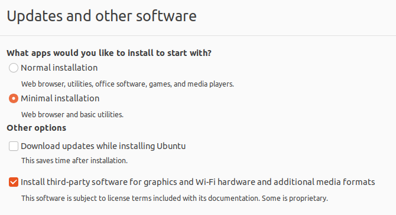
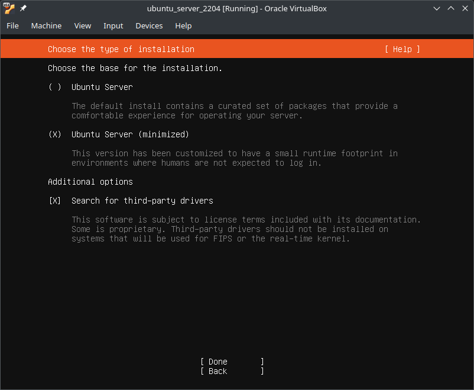

# Table Of Contents
<!-- TOC -->
* [Table Of Contents](#table-of-contents)
* [Basic Installation from Installer Script](#basic-installation-from-installer-script)
  * [Requirements](#requirements)
  * [Run the Installer Script](#run-the-installer-script)
    * [Ubuntu](#ubuntu)
      * [22.04](#2204)
<!-- TOC -->

---

# Basic Installation from Installer Script

An easy way to get yourself up and running is 
installing OpenStudioLandscapes via installer script.

As of now, the installer is tested and supported for
these Linux distros/versions:
- Ubuntu
  - [22.04 LTS (Jammy Jellyfish)](https://www.releases.ubuntu.com/22.04/)
    - ✅ Server
    - ✅ Desktop

> [!TIP]
> Install Ubuntu as a VM to play around with OpenStudioLandscapes.
> Personally, I've been working with [VirtualBox](https://www.virtualbox.org/)
> but any compatible hypervisor should do.
> Here's a good [overview](https://en.wikipedia.org/wiki/Comparison_of_platform_virtualization_software).

> [!CAUTION]
> The installer script **WILL** modify your system.

## Requirements

- `curl`
- `python3`
- `sudo`

## Run the Installer Script

The Installer Script will guide you through the process
and installs all requirements for
OpenStudioLandscapes to work. Ideally, you want to
run it on a vanilla OS installation. However, 
if you run it multiple times, it will create backups
of previous installations if there were any.

> [!IMPORTANT]
> As a first step, the script will create the group `docker` 
> and add the user `$USER` to it. After that, it will ask for a reboot.
> **JUST DO IT** - subsequent steps depend on it! 
> Re-run the script again afterwards.

> [!WARNING]
> **Todo**
> A possible workaround to avoid the reboot could be to run
> `sudo newgroup docker` to activate the changes dynamically. 
> But, to stay on the safe side, I didn't mess around with that
> so far.

> [!IMPORTANT]
> Executing the script as `root` is not allowed.
> Reference: https://github.com/michimussato/OpenStudioLandscapes/issues/2

### Ubuntu

#### 22.04

| Image   | Installer Options                                                                  |
|---------|------------------------------------------------------------------------------------|
| Desktop |  |
| Server  |    |

Source: [`install_ubuntu_2204.py`](https://github.com/michimussato/OpenStudioLandscapes/blob/main/installer/ubuntu/22.04/install_ubuntu_2204.py)

Install requirements:

```shell
sudo apt-get update
sudo apt-get install -y --no-install-recommends curl python3 sudo
```

Run installer (reboot if being asked for)

```shell
python3 <(curl --header 'Cache-Control: no-cache, no-store' --silent https://raw.githubusercontent.com/michimussato/OpenStudioLandscapes/refs/heads/main/installer/ubuntu/22.04/install_ubuntu_2204.py)
```
