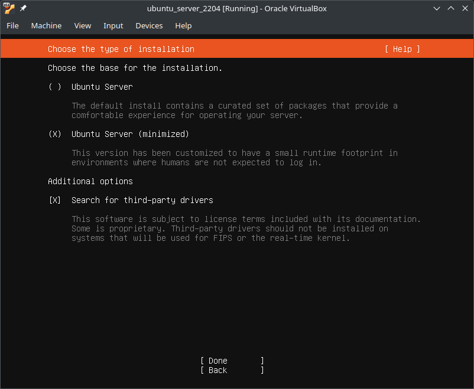

# Table Of Contents
<!-- TOC -->
* [Table Of Contents](#table-of-contents)
* [Basic Installation from Installer Script](#basic-installation-from-installer-script)
  * [Requirements](#requirements)
  * [Run the Installer Script](#run-the-installer-script)
    * [Ubuntu](#ubuntu)
      * [22.04](#2204)
      * [Add `${USER}` to Group `docker`](#add-user-to-group-docker)
      * [Create `/etc/docker/daemon.json`](#create-etcdockerdaemonjson)
      * [Install basic Requirements](#install-basic-requirements)
      * [Setup Process](#setup-process)
<!-- TOC -->

---

# Basic Installation from Installer Script

An easy way to get yourself up and running is
installing OpenStudioLandscapes via installer script.

As of now, the installer is tested and supported for
these Linux distros/versions:
- Ubuntu
  - [22.04 LTS (Jammy Jellyfish)](https://www.releases.ubuntu.com/22.04/)
    - ✅ Server
    - ✅ Desktop

> [!TIP]
> Install Ubuntu as a VM to play around with OpenStudioLandscapes.
> Personally, I've been working with [VirtualBox](https://www.virtualbox.org/)
> but any compatible hypervisor should do.
> Here's a good [overview](https://en.wikipedia.org/wiki/Comparison_of_platform_virtualization_software).

> [!CAUTION]
> The process outlined below **WILL** modify your system.

## Requirements

- `sudo`

## Run the Installer Script

The Installer Script will guide you through the process
and installs all requirements for
OpenStudioLandscapes to work. Ideally, you want to
run it on a vanilla OS installation. However,
if you run it multiple times, it will create backups
of previous installations if there were any.

> [!IMPORTANT]
> As a first step, the script will create the group `docker`
> and add the user `$USER` to it. After that, it will ask for a reboot.
> **JUST DO IT** - subsequent steps depend on it!
> Re-run the script again afterwards.

> [!WARNING]
> **Todo**
> A possible workaround to avoid the reboot could be to run
> `sudo newgroup docker` to activate the changes dynamically.
> But, to stay on the safe side, I didn't mess around with that
> so far.

> [!IMPORTANT]
> Executing the commands as `root` is not allowed!
> Reference: https://github.com/michimussato/OpenStudioLandscapes/issues/2

### Ubuntu

#### 22.04

| Image   | Installer Options                                                                  |
|---------|------------------------------------------------------------------------------------|
| Desktop |  |
| Server  |    |

> [!IMPORTANT]
> Reboot after the following step!

#### Add `${USER}` to Group `docker`

```shell
sudo groupadd --force --gid 959 docker
sudo usermod --append --groups docker ${USER}

sudo systemctl reboot
```

#### Create `/etc/docker/daemon.json`

```bash
# export OPENSTUDIOLANDSCAPES__HARBOR_HOSTNAME=harbor.openstudiolandscapes.lan
# export OPENSTUDIOLANDSCAPES__HARBOR_PORT=80

source .env

sudo --preserve-env=OPENSTUDIOLANDSCAPES__HARBOR_HOSTNAME,OPENSTUDIOLANDSCAPES__HARBOR_PORT bash -c 'cat << EOF > /etc/docker/daemon.json
{
  "features": {
    "buildkit": true
  },
  "max-concurrent-uploads": 1,
  "insecure-registries": [
    "http://${OPENSTUDIOLANDSCAPES__HARBOR_HOSTNAME}:{OPENSTUDIOLANDSCAPES__HARBOR_PORT}"
  ]
}
EOF'
```

#### Install basic Requirements

```shell
sudo apt-get update
sudo apt-get upgrade -y
sudo apt-get install -y git make
```

#### Setup Process

```shell
export REPO_DIR=~/git/repos/OpenStudioLandscapes
mkdir -p ${REPO_DIR}
cd ${REPO_DIR}


git clone --tags https://github.com/michimussato/OpenStudioLandscapes.git .
```

Checkout Tag:
```shell
export REPO_DIR=~/git/repos/OpenStudioLandscapes
mkdir -p ${REPO_DIR}
cd ${REPO_DIR}


git pull --tags
# list tags:
clear
PS3="Select Tag to checkout please: "
select tag_ in $(git tag) main; do
   GIT_TAG="${tag_}"
   break
done
```

Checkout branch:
```shell
# Todo: find a way to not only checkout tags
# but also branches
export REPO_DIR=~/git/repos/OpenStudioLandscapes
mkdir -p ${REPO_DIR}
cd ${REPO_DIR}


if [ ${GIT_TAG} == "main" ]; then
    git checkout main
else
    export OPENSTUDIOLANDSCAPES_VERSION_TAG=${GIT_TAG}
    git checkout tags/"${OPENSTUDIOLANDSCAPES_VERSION_TAG}" -B "${OPENSTUDIOLANDSCAPES_VERSION_TAG}"
fi
```


```shell
export REPO_DIR=~/git/repos/OpenStudioLandscapes
mkdir -p ${REPO_DIR}
cd ${REPO_DIR}


make disable_unattended
make install_deps
make install_gh_cli
make install_python
# Requires:
# - `export OPENSTUDIOLANDSCAPES__DOMAIN_LAN=`
make edit_hosts_file
make install_docker
make openstudiolandscapes_install
# Requires
# - `export OPENSTUDIOLANDSCAPES_VERSION_TAG=`
make openstudiolandscapes_features_clone
make openstudiolandscapes_features_install

# Requires
# - `export OPENSTUDIOLANDSCAPES__DOT_ENV=`
# - `export OPENSTUDIOLANDSCAPES__HARBOR_ADMIN=`
# - `export OPENSTUDIOLANDSCAPES__HARBOR_PASSWORD=`
# - `export OPENSTUDIOLANDSCAPES__HARBOR_HOSTNAME=`
# - `export OPENSTUDIOLANDSCAPES__HARBOR_PORT=`
# - `export OPENSTUDIOLANDSCAPES__HARBOR_ROOT_DIR=`
make harbor_prepare
make harbor_up
make harbor_init_projects
# To actually execute the two returned commands
# (Todo: which does not work yet), 
# we could theoretically run:
# eval $(make -s harbor_init_projects)
```

```shell
export REPO_DIR=~/git/repos/OpenStudioLandscapes
cd ${REPO_DIR} || exit 1

# Start
make up

# Stop
make down

# Restart
make restart
```
