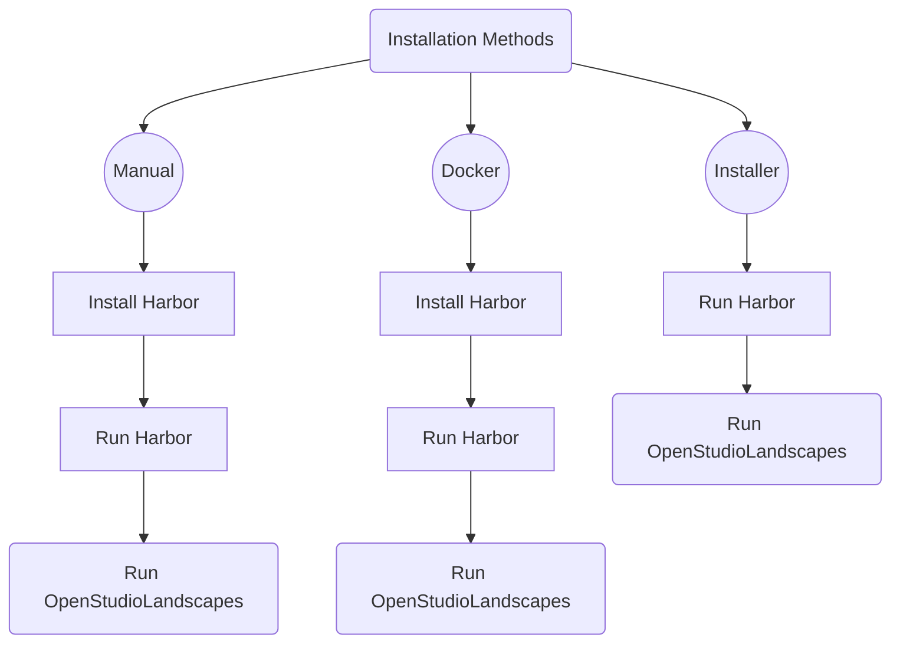

# Table Of Contents
<!-- TOC -->
* [Table Of Contents](#table-of-contents)
* [Installation Methods](#installation-methods)
<!-- TOC -->

---

# Installation Methods

```mermaid
graph TB
    installation_methods(Installation Methods)
    manual((Manual))
    click manual href "https://github.com/michimussato/OpenStudioLandscapes/blob/main/wiki/installation/basic_installation.md#basic-installation"
    docker((Docker))
    %% click docker href ""
    installer_script((Installer))
    click installer_script href "https://github.com/michimussato/OpenStudioLandscapes/blob/main/wiki/installation/basic_installation_from_script.md"
    installation_methods --> manual
    installation_methods --> docker
    installation_methods --> installer_script
    
    install_harbor_manual[Install Harbor]
    click install_harbor_manual href "https://github.com/michimussato/OpenStudioLandscapes/blob/main/wiki/installation/basic_installation.md#harbor"
    install_harbor_docker[Install Harbor]
    click install_harbor_docker href "https://github.com/michimussato/OpenStudioLandscapes/blob/main/wiki/installation/basic_installation.md#harbor"
    %% install_harbor_script[Install Harbor]
    %% click install_harbor_script href "https://github.com/michimussato/OpenStudioLandscapes/blob/main/wiki/installation/basic_installation.md#harbor"
    
    run_harbor_manual[Run Harbor]
    click run_harbor_docker href "https://github.com/michimussato/OpenStudioLandscapes/blob/main/wiki/run/run_harbor.md#up"
    run_harbor_docker[Run Harbor]
    click run_harbor_docker href "https://github.com/michimussato/OpenStudioLandscapes/blob/main/wiki/run/run_harbor.md#up"
    run_harbor_script[Run Harbor]
    click run_harbor_docker href "https://github.com/michimussato/OpenStudioLandscapes/blob/main/wiki/run/run_harbor.md#up"
    
    run_manual(Run OpenStudioLandscapes)
    %% click run_docker href ""
    run_docker(Run OpenStudioLandscapes)
    click run_docker href "https://github.com/michimussato/OpenStudioLandscapes/blob/main/wiki/run_openstudiolandscapes/from_docker_image.md"
    run_installer(Run OpenStudioLandscapes)
    %% click run_docker href ""
    
    manual --> install_harbor_manual 
    install_harbor_manual --> run_harbor_manual --> run_manual
    
    docker --> install_harbor_docker
    install_harbor_docker --> run_harbor_docker --> run_docker
    
    installer_script --> run_harbor_script --> run_installer
```