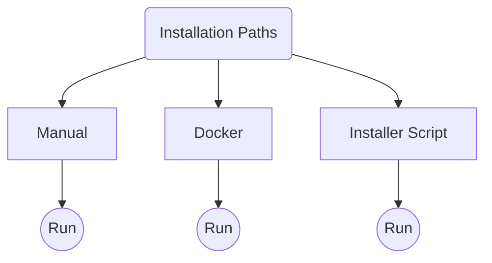

# Table Of Contents
<!-- TOC -->
* [Table Of Contents](#table-of-contents)
* [Installation Overview](#installation-overview)
<!-- TOC -->

---

# Installation Overview

```mermaid
graph TB
    installation_paths(Installation Paths)
    manual[Manual]
    click manual href "https://github.com/michimussato/OpenStudioLandscapes/blob/main/wiki/installation/basic_installation.md#basic-installation"
    docker[Docker]
    click docker href "https://github.com/michimussato/OpenStudioLandscapes/blob/main/wiki/installation/basic_installation_from_script.md"
    installer_script[Installer Script]
    click docker href "https://github.com/michimussato/OpenStudioLandscapes/blob/main/wiki/installation/basic_installation_from_script.md"
    installation_paths --> manual
    installation_paths --> docker
    installation_paths --> installer_script
    
    run_manual((Run))
    %% click run_docker href ""
    run_docker((Run))
    click run_docker href "https://github.com/michimussato/OpenStudioLandscapes/blob/main/wiki/run_openstudiolandscapes/from_docker_image.md"
    run_installer((Run))
    %% click run_docker href ""
    manual --> run_manual
    docker --> run_docker
    installer_script --> run_installer
```