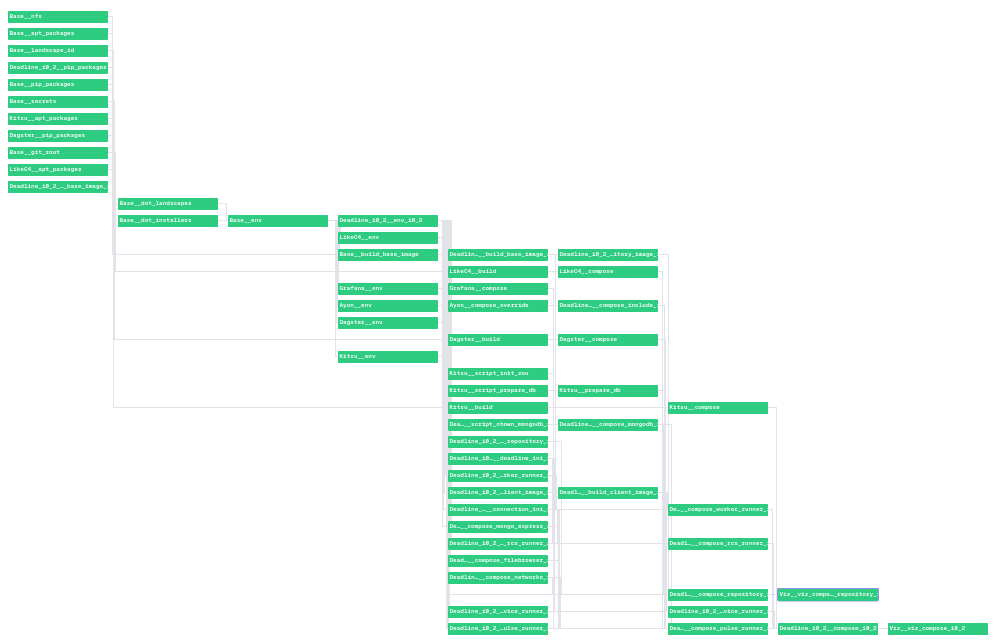
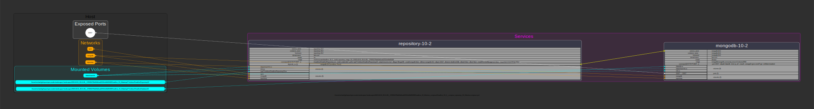
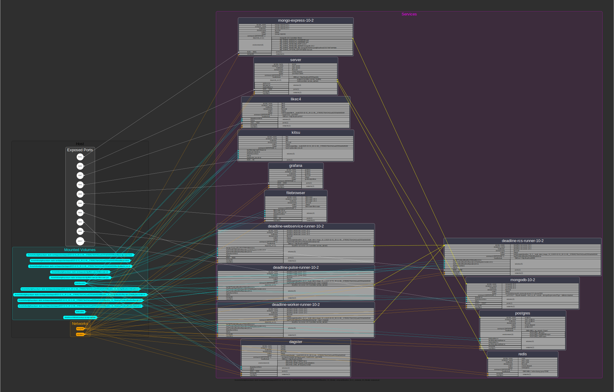
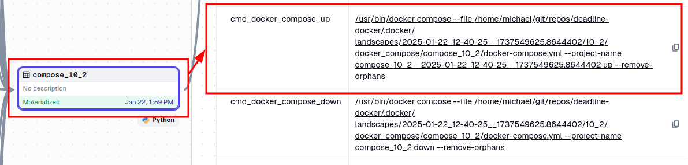
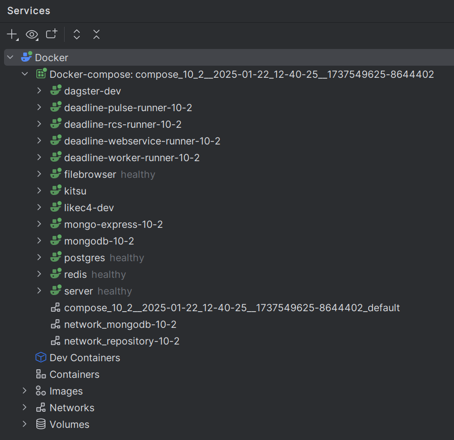
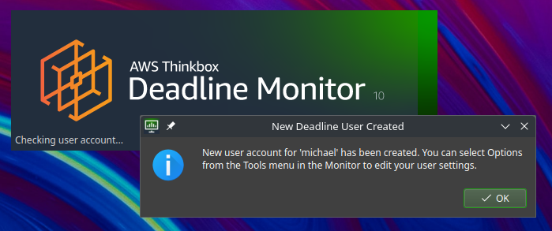

### Features

| Feature                                      | Repository                                                                       | Vendor                                                                                               |
|----------------------------------------------|----------------------------------------------------------------------------------|------------------------------------------------------------------------------------------------------|
| OpenStudiolandscapes-Ayon                    | [https://github.com/michimussato/OpenStudioLandscapes-Ayon]()                    | [Ayon](https://ayon.ynput.io/)                                                                       |
| OpenStudiolandscapes-Dagster                 | [https://github.com/michimussato/OpenStudioLandscapes-Dagster]()                 | [Dagster](https://dagster.io/)                                                                       |
| OpenStudiolandscapes-Deadline-10-2           | [https://github.com/michimussato/OpenStudioLandscapes-Deadline-10-2]()           | [Deadline 10.2](https://docs.thinkboxsoftware.com/products/deadline/10.2/1_User%20Manual/index.html) |
| OpenStudiolandscapes-Deadline-10-2-Worker    | [https://github.com/michimussato/OpenStudioLandscapes-Deadline-10-2-Worker]()    | [Deadline 10.2](https://docs.thinkboxsoftware.com/products/deadline/10.2/1_User%20Manual/index.html) |
| OpenStudiolandscapes-filebrowser             | [https://github.com/michimussato/OpenStudioLandscapes-filebrowser]()             | [filebrodockerwser/filebrowser](https://hub.docker.com/r/filebrowser/filebrowser)                    |
| OpenStudiolandscapes-Grafana                 | [https://github.com/michimussato/OpenStudioLandscapes-Grafana]()                 | [Grafana](https://grafana.com/)                                                                      |
| OpenStudiolandscapes-Kitsu                   | [https://github.com/michimussato/OpenStudioLandscapes-Kitsu]()                   | [Kitsu](https://kitsu.cg-wire.com/)                                                                  |
| OpenStudiolandscapes-LikeC4                  | [https://github.com/michimussato/OpenStudioLandscapes-LikeC4]()                  | [LikeC4](https://likec4.dev/)                                                                        |
| OpenStudiolandscapes-NukeRLM-8               | [https://github.com/michimussato/OpenStudioLandscapes-NukeRLM-8]()               | [NukeRLM-8](https://learn.foundry.com/licensing/Content/local-licensing.html)                        |
| OpenStudiolandscapes-OpenCue                 | [https://github.com/michimussato/OpenStudioLandscapes-OpenCue]()                 | [OpenCue](https://www.opencue.io/)                                                                   |
| OpenStudiolandscapes-SESI-gcc-9-3-Houdini-20 | [https://github.com/michimussato/OpenStudioLandscapes-SESI-gcc-9-3-Houdini-20]() | [SESI Houdini 20](https://www.sidefx.com/docs/houdini/ref/utils/sesinetd.html)                       |
| OpenStudiolandscapes-Syncthing               | [https://github.com/michimussato/OpenStudioLandscapes-Syncthing]()               | [Syncthing](https://github.com/syncthing/syncthing/blob/main/README-Docker.md)                       |
| OpenStudiolandscapes-Watchtower              | [https://github.com/michimussato/OpenStudioLandscapes-Watchtower]()              | [Watchtower](https://watchtower.blender.org/)                                                        |

#### Render Manager

There are a multitude of managers available
and I had to make a decision to begin with.
In general, `OpenStudioLandscapes` has the
capability to support arbitrary managers,
however, as of now, only Deadline is considered
integrated. The decision to go with Deadline
was based on the following specs:

- Cross Platform
- Feature rich
- Production proven
- Freely available (not necessarily OSS)
- Scalability (locally and into the cloud)
- Active Development
- Local (no exclusive cloud rendering)
- Python (Python API)
- DCC agnostic

Here's a non-exhaustive list of managers in
comparison:

| Render Manager | Feature Available | Cross Platform | Freely Available | Scalability (local and cloud) | Active Development | Local | Python API | DCC agnostic |
|----------------|-------------------|----------------|------------------|-------------------------------|--------------------|-------|------------|--------------|
| Deadline 10.x  | ✅                 | ✅              | ✅                | ✅                             | ❌                  | ✅     | ✅          | ✅            |
| OpenCue        | ✅                 | ☐              | ✅                | ☐                             | ❌                  | ✅     | ✅          | ✅            |
| Tractor        | ❌                 | ☐              | ❌                | ☐                             | ☐                  | ☐     | ☐          | ☐            |
| Flamenco       | ❌                 | ☐              | ☐                | ☐                             | ☐                  | ☐     | ☐          | ❌            |
| RoyalRender    | ❌                 | ☐              | ☐                | ☐                             | ☐                  | ☐     | ☐          | ☐            |
| Qube!          | ❌                 | ☐              | ❌                | ☐                             | ☐                  | ☐     | ☐          | ☐            |
| AFANASY        | ❌                 | ☐              | ☐                | ☐                             | ☐                  | ☐     | ☐          | ☐            |
| Muster         | ❌                 | ☐              | ☐                | ☐                             | ☐                  | ☐     | ☐          | ☐            |

### Dagster Lineage

### Docker Compose Graph

Dynamic Docker Compose documentation:
[docker-compose-graph](https://github.com/michimussato/docker-compose-graph) creates a visual representation of
`docker-compose.yml` files for every individual
Landscape for quick reference and context.

For individual elements of a Landscape (Features)

`.landscapes/2025-02-01_00-11-08__578595276b424d1ea62550cb0b6f166f/Deadline_10_2/docker_compose/Deadline_10_2__compose_repository_10_2/docker-compose.yml`

as well as for the entire Landscape

`.landscapes/2025-02-01_00-11-08__578595276b424d1ea62550cb0b6f166f/Deadline_10_2/docker_compose/Deadline_10_2__compose_10_2/docker-compose.yml`

### Create Landscape

#### Materialize Landscape

### Run Deadline Farm

Together with:
- Kitsu
- Ayon
- Dagster
- LikeC4
- ...

Copy/Paste command and execute:

### Client

#### Deadline Monitor

