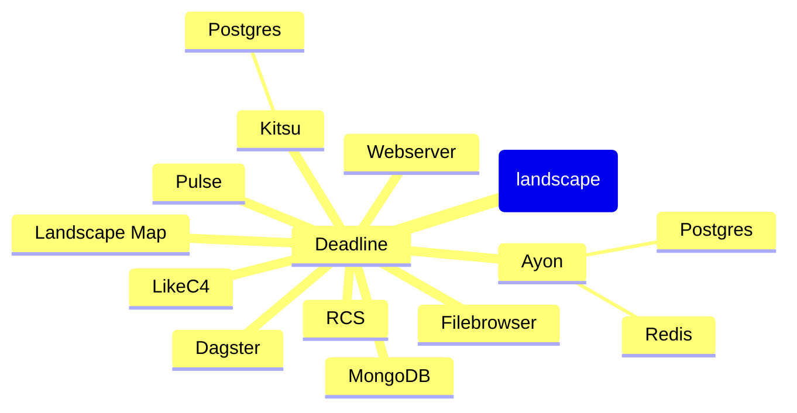
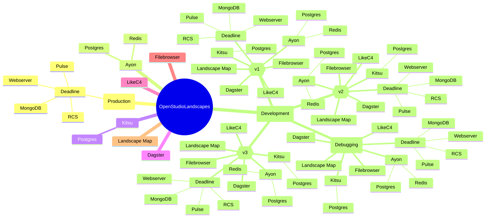

The structure of a Landscape:  
  

```mermaid  
%% https://mermaid-js.github.io/mermaid-live-editor  
mindmap
root(landscape)
	Deadline
        RCS
        Webserver
        Pulse
        MongoDB
    Ayon
        Redis
        Postgres
    Kitsu
        Postgres
    Dagster
    LikeC4
    Filebrowser
    Landscape Map  
```  
  
The hierarchy of multiple Landscapes  
in the context of `OpenStudioLandscapes`:  
  

```mermaid  
%% https://mermaid-js.github.io/mermaid-live-editor  
mindmap
root((OpenStudioLandscapes))  
    Landscape(Production)
	    Deadline
		    RCS
		    Webserver
		    Pulse
		    MongoDB
		Ayon
			Redis
			Postgres
		Kitsu
			Postgres
		Dagster
		LikeC4
		Filebrowser
		Landscape Map
	Landscape(Development)
		Version{{v1}}
			Deadline
				RCS
				Webserver
				Pulse
				MongoDB
			Ayon
				Redis
				Postgres
			Kitsu
				Postgres
			Dagster
			LikeC4
			Filebrowser
			Landscape Map
		Version{{v2}}
			Deadline
				RCS
				Webserver
				Pulse
				MongoDB
			Ayon
				Redis
				Postgres
			Kitsu
				Postgres
			Dagster
			LikeC4
			Filebrowser
			Landscape Map
		Version{{v3}}
			Deadline
				RCS
				Webserver
				Pulse
				MongoDB
			Ayon
				Redis
				Postgres
			Kitsu
				Postgres
			Dagster
			LikeC4
			Filebrowser
			Landscape Map
		Landscape(Debugging)
			Deadline
				RCS
				Webserver
				Pulse
				MongoDB
			Ayon
				Redis
				Postgres
			Kitsu
				Postgres
			Dagster
			LikeC4
			Filebrowser
			Landscape Map  
```